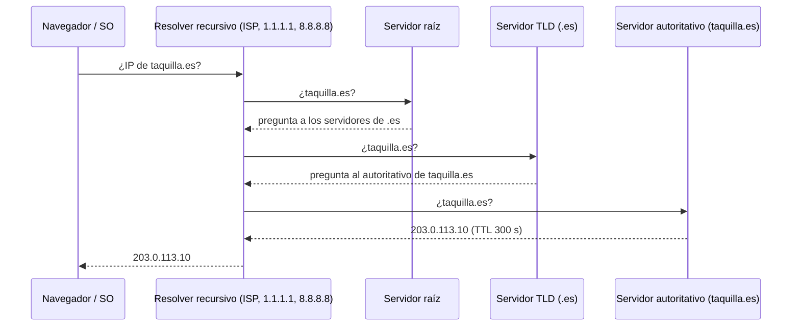

**Objetivo:** poder narrar con precisión qué pasa entre escribir una URL y recibir la respuesta, y saber qué problema resuelve cada versión de HTTP.
**Tiempo:** 3 h
**Lecturas:** HPBN, *Transport Layer Security*, *HTTP/1.X* y *HTTP/2* · Primer, *Domain name system* · Cloudflare Learning Center, artículos sobre DNS y HTTP/3 (opcional).

## Antes de leer: predice

1. Cambias la IP de `taquilla.es` en tu proveedor de DNS. ¿Todos los usuarios empiezan a usar la nueva IP en ese mismo momento?
2. HTTP/2 permite enviar muchas peticiones a la vez por una sola conexión. ¿Por qué hizo falta después un HTTP/3?

```respuesta id="f0-02-predice" titulo="Mis predicciones"
Antes de leer: responde con lo que sepas o intuyas. No importa acertar.
```

## DNS: la guía telefónica distribuida

DNS traduce nombres (`taquilla.es`) a direcciones IP. Es jerárquico y está muy cacheado:



Cada respuesta lleva un **TTL**: cuánto tiempo puede cachearse. Hay cachés en el navegador, en el sistema operativo y en el resolver. Casi nunca se recorre la jerarquía entera.

Registros que verás: `A` (IPv4), `AAAA` (IPv6), `CNAME` (alias a otro nombre), `NS` (servidores autoritativos), `MX` (correo), `TXT` (verificaciones, SPF…).

Respuesta a la primera predicción: **no**. Cada caché mantiene la IP vieja hasta que vence su TTL, y algunos clientes lo ignoran y la guardan más tiempo. Consecuencias de diseño:

- DNS sirve para **repartir carga** (varias IPs, geo-DNS que responde según la ubicación del usuario) y para **failover**, pero es un mecanismo **lento y poco preciso**.
- Antes de una migración, baja el TTL con antelación (a 60 s, por ejemplo).
- Por eso el balanceo fino se hace con balanceadores de carga (Fase 2), no con DNS.

## HTTP/1.1

Protocolo de texto: petición (método, ruta, cabeceras, cuerpo) y respuesta (código, cabeceras, cuerpo).

- **Keep-alive:** la conexión se reutiliza entre peticiones (lección 1: ahorra handshakes).
- **Limitación:** en la práctica, **una petición en curso por conexión**. El *pipelining* existió, pero sufría head-of-line blocking y casi nadie lo activó. Los navegadores abren **unas 6 conexiones por dominio** para paralelizar.

Métodos y semántica que usarás en todo el temario:

| Método | Seguro (no modifica) | Idempotente (repetirlo = hacerlo una vez) |
|---|---|---|
| `GET` | Sí | Sí |
| `PUT` | No | Sí |
| `DELETE` | No | Sí |
| `POST` | No | **No** |
| `PATCH` | No | No (en general) |

Los códigos de estado que un diseñador debe distinguir: `200`, `201`, `204`, `301/302`, `304` (no modificado: caché), `400`, `401` vs `403`, `404`, `409` (conflicto), `429` (demasiadas peticiones), `500`, `502` vs `503` vs `504`.

## HTTP/2: multiplexación

- **Binario**, con **streams** multiplexados sobre **una sola conexión TCP**: muchas peticiones y respuestas intercaladas a la vez.
- **Compresión de cabeceras** (HPACK): las cabeceras repetidas en cada petición se envían una vez.

Pero todos esos streams viajan dentro del mismo flujo TCP, que entrega en orden. Si se pierde **un** paquete, TCP retiene **todo** lo que viene detrás, sea del stream que sea. Es el head-of-line blocking de la lección 1, ahora a nivel de transporte.

## HTTP/3: QUIC sobre UDP

Respuesta a la segunda predicción: HTTP/3 existe para eliminar ese bloqueo. Usa **QUIC**, un transporte sobre UDP que:

- implementa fiabilidad **por stream**: un paquete perdido solo retiene a su stream;
- integra TLS 1.3 en el handshake: conexión y cifrado en **1 RTT**, y **0-RTT** al reconectar con un servidor conocido;
- sobrevive a cambios de red (**migración de conexión**: de Wi-Fi a 4G sin reconectar).

Donde más se nota es en redes móviles con pérdidas.

## TLS: cifrado, integridad y autenticidad

TLS garantiza que nadie lee ni altera el tráfico y que hablas con quien crees (certificado firmado por una autoridad de certificación en la que confía tu sistema).

- **TLS 1.2:** 2 RTT de handshake.
- **TLS 1.3:** 1 RTT; 0-RTT al reanudar sesión.

:::caution[0-RTT tiene trampa]
Los datos enviados en 0-RTT pueden ser **repetidos por un atacante** (*replay*). Solo son seguros para peticiones idempotentes. Un `POST /pagos` en 0-RTT podría ejecutarse dos veces.
:::

**Terminación TLS:** en muchas arquitecturas el cifrado termina en el balanceador o en el CDN, y de ahí al servidor interno va en claro o con otro TLS interno (mTLS). Lo verás en la Fase 2.

## Tiempo real: más allá de petición-respuesta

HTTP clásico es "el cliente pregunta, el servidor responde". Para que el servidor empuje datos:

- **Polling / long polling:** el cliente pregunta cada poco, o deja la petición abierta hasta que haya novedades.
- **Server-Sent Events (SSE):** una respuesta HTTP que no termina y por la que el servidor va enviando eventos. Unidireccional y sencillo.
- **WebSockets:** canal bidireccional persistente, tras un *upgrade* de HTTP.

Se comparan en la Fase 2.

## Ejercicios

### Ejercicio 1 · Anatomía de una petición real

Ejecuta:

```bash
dig +trace example.com
curl -so /dev/null -w "dns:%{time_namelookup} tcp:%{time_connect} tls:%{time_appconnect} ttfb:%{time_starttransfer} total:%{time_total}\n" https://example.com
curl -v --http2 https://example.com -o /dev/null
```

1. En `dig +trace`, identifica cada nivel de la jerarquía.
2. Con los tiempos de `curl` (acumulados desde el inicio), calcula cuánto duró cada fase. ¿Cuántos RTT ves entre `dns` y `tls`?
3. Ejecuta el `curl` dos veces seguidas. ¿Qué cambia en `dns` y por qué?

```respuesta id="f0-02-ej1" titulo="Anatomía de una petición real"
Escribe aquí tu razonamiento antes de abrir las pistas.
```

<details>
<summary>Pista</summary>

Los tiempos de `curl -w` son acumulados. `tcp - dns` es el handshake TCP (1 RTT); `tls - tcp` es el handshake TLS.

</details>

### Ejercicio 2 · Diagnóstico de códigos

Un usuario de Taquilla ve errores. Para cada código, ¿qué componente sospechas y qué harías?

1. `502 Bad Gateway`
2. `503 Service Unavailable`
3. `504 Gateway Timeout`
4. `429 Too Many Requests`

```respuesta id="f0-02-ej2" titulo="Diagnóstico de códigos"
Escribe aquí tu razonamiento antes de abrir las pistas.
```

<details>
<summary>Solución</summary>

1. **502:** el proxy o balanceador recibió una respuesta inválida del servidor de detrás, o la conexión se cerró de forma abrupta (proceso caído, crash). Revisar los servidores de aplicación.
2. **503:** el servicio dice que no puede atender ahora (sobrecarga, mantenimiento, sin instancias sanas). Revisar capacidad y health checks. Suele ir con `Retry-After`.
3. **504:** el proxy esperó al backend y venció su timeout. El backend va **lento**, no necesariamente caído. Revisar latencia de la app y de sus dependencias (BD).
4. **429:** el cliente superó un límite de peticiones (rate limiting, Fase 7). Es un comportamiento intencionado, no un fallo.

</details>

### Ejercicio 3 · Idempotencia

Clasifica como idempotentes o no, y propón cómo hacer idempotente las que no lo sean:

1. `PUT /usuarios/42/email` con `{"email": "a@b.c"}`
2. `POST /pedidos` con el contenido del carrito
3. `DELETE /reservas/99`
4. `POST /cuentas/42/saldo` con `{"sumar": 10}`

```respuesta id="f0-02-ej3" titulo="Idempotencia"
Escribe aquí tu razonamiento antes de abrir las pistas.
```

<details>
<summary>Pista</summary>

Pregúntate: si el cliente no recibe respuesta y reintenta, ¿el resultado final es el mismo que si lo hubiera hecho una vez?

</details>

<details>
<summary>Solución</summary>

1. **Idempotente:** poner el email a `a@b.c` dos veces deja el mismo estado.
2. **No:** dos pedidos. Solución: una **clave de idempotencia** generada por el cliente (`Idempotency-Key: <uuid>`); el servidor guarda la clave con el resultado y, si se repite, devuelve el mismo resultado sin crear otro pedido.
3. **Idempotente:** borrar lo ya borrado deja el mismo estado. La respuesta puede diferir (`204` y luego `404`), pero el estado no.
4. **No:** sumaría 20. Soluciones: clave de idempotencia, o cambiar el modelo a "registrar el movimiento con ID `m-123`" (y el saldo se deriva de los movimientos; un ID repetido se ignora).

</details>

## Autorrevisión

- [ ] Explico la resolución DNS y el efecto del TTL en migraciones y failover.
- [ ] Sé qué problema resolvió HTTP/2 y cuál HTTP/3.
- [ ] Sé qué métodos HTTP son idempotentes y por qué importa para los reintentos.
- [ ] Distingo 502, 503 y 504.

## Para la sesión de tutor

Vuelve a la pregunta de la lección 1: explícame por qué un paquete perdido en HTTP/2 frena todas las peticiones de la página y cómo lo evita HTTP/3.
