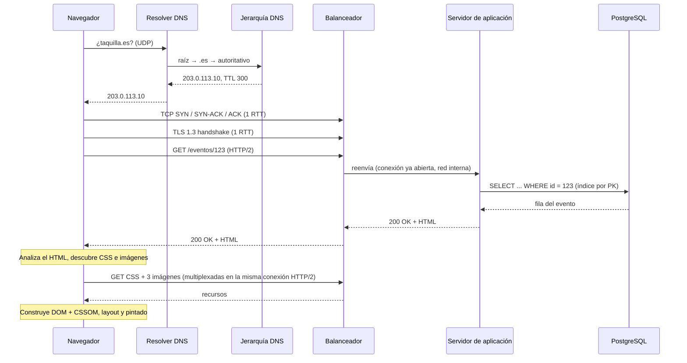

## Kata · ¿Qué pasa cuando escribo `https://taquilla.es/eventos/123` y pulso Enter?

**Tiempo:** 45 minutos, cronometrados. Sin mirar las lecciones hasta terminar.

**Enunciado:** describe con el máximo detalle útil todo lo que ocurre desde que el usuario pulsa Enter hasta que ve la página del evento. Suponemos:

- El usuario no ha visitado nunca Taquilla; nada está en caché.
- Taquilla tiene un balanceador de carga delante de varios servidores de aplicación y una base de datos PostgreSQL.
- La página es HTML generado en el servidor con un CSS y tres imágenes.

**Entrega:**

1. Un **diagrama de secuencia** (Mermaid o papel) con los participantes: navegador, resolver DNS, jerarquía DNS, balanceador, servidor de aplicación y base de datos.
2. Una **estimación del tiempo total** para un usuario a 30 ms de RTT del centro de datos, desglosada por fases.
3. Tres **optimizaciones** que reducirían ese tiempo, ordenadas por impacto.

### Guía de tiempos

| Minutos | Qué |
|---|---|
| 0–5 | Lista las fases a alto nivel |
| 5–25 | Diagrama de secuencia con detalle |
| 25–35 | Estimación de tiempos |
| 35–45 | Optimizaciones y repaso |

```respuesta id="f0-cierre-kata" titulo="¿Qué pasa cuando escribo `https://taquilla.es/eventos/123` y pulso Enter?"
Tu diseño: requisitos, estimación, API, datos, C4, profundizar, fallos. Puedes seguir la plantilla de kata de los anexos.
```

<details>
<summary>Pista (solo si llevas 20 minutos bloqueado)</summary>

Fases: resolución DNS → conexión TCP → handshake TLS → petición HTTP → balanceador → servidor de aplicación → consulta a la base de datos (¿usa índice?) → respuesta → el navegador analiza el HTML y descubre el CSS y las imágenes → más peticiones (¿por la misma conexión?) → renderizado.

</details>

<details>
<summary>Solución de referencia</summary>



**Estimación** (RTT 30 ms):

| Fase | Tiempo |
|---|---|
| DNS sin caché (varios saltos del resolver; muy variable) | ~50–100 ms |
| TCP | 30 ms (1 RTT) |
| TLS 1.3 | 30 ms (1 RTT) |
| Petición HTML + proceso en servidor (balanceador + app + BD por PK: pocos ms) | ~35 ms |
| CSS e imágenes por la misma conexión (1–2 RTT según tamaño y ventana de congestión) | ~30–60 ms |
| Renderizado | decenas de ms |
| **Total** | **~200–300 ms** |

**Optimizaciones por impacto:**

1. **CDN** para CSS e imágenes (y quizás para el HTML si es cacheable): acerca el contenido y reduce el RTT de todas las fases de conexión.
2. **DNS con TTL razonable y proveedor rápido/anycast**: la primera visita paga el DNS completo; las siguientes, no.
3. **Reutilizar conexiones y HTTP/2 o HTTP/3**: ya incluido arriba; sin él, cada recurso podría pagar conexiones nuevas. HTTP/3 además ahorra un RTT (transporte y TLS combinados).

Otros detalles que suman puntos: HSTS (evita la redirección de HTTP a HTTPS), que el balanceador termine TLS y reutilice conexiones con los backends, índice por clave primaria en la consulta, compresión (gzip/brotli), `preload` del CSS.

</details>

### Autoevaluación de la kata

En esta fase solo aplican algunas dimensiones del [panel de revisión](/guia/panel-de-revision/):

| Dimensión | Qué se evalúa aquí |
|---|---|
| Arquitectura | El diagrama de secuencia es correcto y completo |
| Estimación | Los tiempos están desglosados, son razonables y cuadran con el RTT |
| Escalabilidad | Las optimizaciones atacan lo que más pesa |
| Comunicación | Se entiende sin explicaciones adicionales |

Guarda tu autoevaluación en `docs/katas/fase-0-url.md`.

## Preguntas de repaso

Respóndelas sin mirar. Mezclan temas de toda la fase a propósito.

1. ¿Por qué un servicio que hace 20 llamadas secuenciales a Redis puede ser lento aunque Redis responda en microsegundos?
2. Un compañero propone hacer `fsync` después de cada escritura de log de depuración "por seguridad". ¿Qué le dirías?
3. ¿Qué tienen en común el head-of-line blocking de TCP y un lock que protege todo un map?
4. Cambias de proveedor de hosting y actualizas el DNS. Una hora después, algunos usuarios siguen llegando al servidor viejo. ¿Por qué? ¿Qué deberías haber hecho?
5. ¿Por qué un índice en `(evento_id, estado)` no ayuda a buscar todos los asientos con `estado = 'libre'` de cualquier evento?

```respuesta id="f0-cierre-repaso" titulo="Preguntas de repaso"
Responde sin mirar las lecciones.
```

<details>
<summary>Respuestas</summary>

1. Cada llamada cuesta un round trip de red (~0,5 ms): 20 × 0,5 = 10 ms solo en red. La solución es agrupar (*pipelining*, `MGET`) o paralelizar.
2. Que el `fsync` cuesta órdenes de magnitud más que el `write`, y un log de depuración no necesita durabilidad garantizada. `fsync` para lo que no puede perderse (transacciones), no para todo.
3. Un elemento lento o perdido bloquea a todos los demás, aunque no tengan relación con él. La solución en ambos casos es **reducir la granularidad** del bloqueo: streams independientes (QUIC) o locks más finos.
4. Por las cachés DNS con el TTL antiguo (y clientes que lo ignoran). Había que bajar el TTL días antes de la migración y mantener el servidor viejo funcionando (o redirigiendo) durante la transición.
5. Por la regla del prefijo por la izquierda: el índice está ordenado primero por `evento_id`; sin filtrar por él, `estado` está desperdigado por todo el índice.

</details>

## Criterios de dominio

Marca solo lo que puedas demostrar. Si algo no está, repite la **práctica** correspondiente.

- [ ] Explico por qué HTTP/2 mejora sobre HTTP/1.1 y qué problema resuelve HTTP/3.
- [ ] Sé cuántos órdenes de magnitud separan leer de RAM, de SSD y de otra región.
- [ ] Explico qué hace un índice B-tree y cuándo no ayuda.
- [ ] Sé qué garantiza `fsync` y por qué las bases de datos usan un log secuencial.
- [ ] Sé qué operaciones HTTP son idempotentes y por qué importa.
- [ ] He completado el mini-curso de Go, con el KV store HTTP funcionando y pasando `-race`.
- [ ] La kata puntúa al menos "sólido" (3) en Arquitectura y Estimación.

## Siguiente

[Fase 1 · Pensar como arquitecto](/fase-1/): empiezas a diseñar de verdad, y nace Taquilla.
