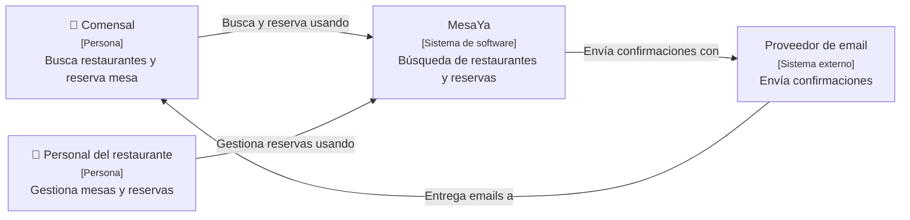
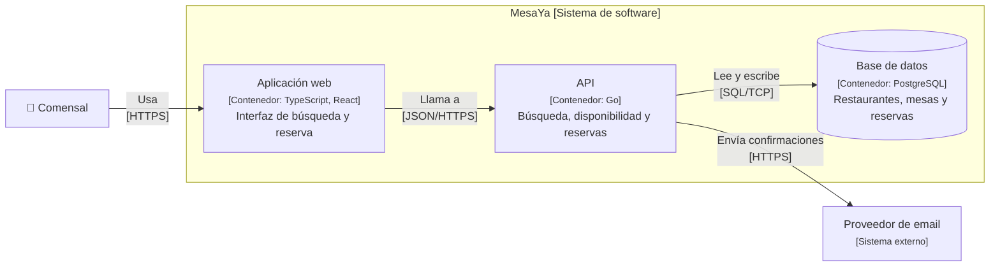
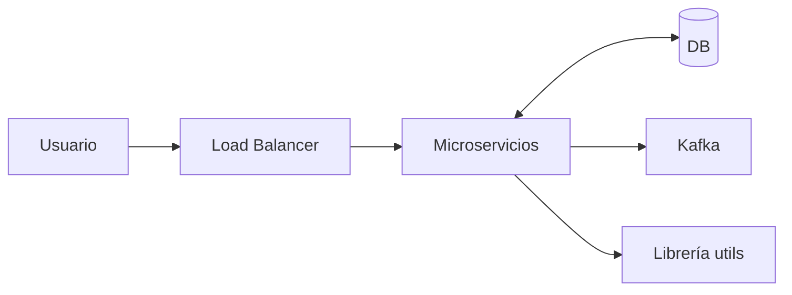

**Objetivo:** dibujar diagramas de arquitectura que se entiendan sin que estés delante, a distintos niveles de zoom.
**Tiempo:** 3 h
**Lecturas:** c4model.com completo · FoSA, capítulo de diagramar y presentar arquitectura.

## Antes de leer: predice

1. Piensa en el último diagrama de "cajas y flechas" que viste en una wiki. ¿Qué preguntas te quedaron sin responder?
2. ¿Tiene sentido un único diagrama que sirva a la vez para un director de producto y para un desarrollador nuevo?

```respuesta id="f1-04-predice" titulo="Mis predicciones"
Antes de leer: responde con lo que sepas o intuyas. No importa acertar.
```

## El problema de las cajas y flechas

Respuesta a la primera predicción, probablemente: *¿qué es esta caja (un servicio, una librería, un servidor)? ¿Qué significa esta flecha (llamada, flujo de datos, dependencia)? ¿Qué tecnología hay? ¿Qué significan los colores?*

C4, de Simon Brown, resuelve esto con dos ideas:

1. **Un conjunto pequeño de abstracciones** con significado preciso.
2. **Varios niveles de zoom**, como un mapa: cada diagrama para un público distinto. Esto responde a la segunda predicción: no, un diagrama no sirve para todos.

## Las abstracciones

| Abstracción | Qué es | Ejemplo |
|---|---|---|
| **Persona** | Un usuario humano del sistema (un rol, no una persona concreta) | Comprador, Organizador |
| **Sistema de software** | Lo más alto: algo que entrega valor, propiedad de un equipo | Taquilla, el proveedor de pagos |
| **Contenedor** | Una **unidad que se ejecuta o almacena datos** por separado: una app web, una SPA, una app móvil, una API, una base de datos, un bucket, una cola, una función serverless | "API de reservas (Go)", "BD de pedidos (PostgreSQL)" |
| **Componente** | Una agrupación de funcionalidad tras una interfaz, **dentro** de un contenedor | "Módulo de reservas", "Cliente del PSP" |
| **Código** | Clases, funciones, tablas | Normalmente no se dibuja: lo genera el IDE |

:::caution[Contenedor ≠ Docker]
En C4, "contenedor" significa **cualquier cosa que se ejecuta o almacena datos por separado**. Es anterior a Docker y no tiene nada que ver. Una base de datos es un contenedor; una librería, no.
:::

## Los cuatro niveles

1. **Contexto del sistema:** el sistema como una caja, sus usuarios y los sistemas externos con los que habla. Para *todo el mundo*, también para gente no técnica.
2. **Contenedores:** zoom dentro del sistema: las aplicaciones y almacenes de datos, sus responsabilidades, tecnologías y cómo se comunican. Para desarrolladores y operaciones. **Es el diagrama más útil en diseño de sistemas.**
3. **Componentes:** zoom dentro de **un** contenedor: sus partes internas. Solo cuando aporta.
4. **Código:** casi nunca a mano.

Diagramas complementarios:

- **Paisaje de sistemas** (*system landscape*): todos los sistemas de una organización.
- **Dinámico:** cómo colaboran los elementos en un escenario concreto, con pasos numerados (similar a un diagrama de secuencia).
- **Despliegue:** cómo se mapean los contenedores a la infraestructura (regiones, zonas, clústeres, instancias).

## Ejemplo · MesaYa, un sistema de reservas de restaurantes

(Es un sistema paralelo a Taquilla, a propósito: el de Taquilla lo haces tú.)

**Nivel 1 · Contexto**



**Nivel 2 · Contenedores**



Fíjate en lo que tiene cada elemento: **nombre, tipo, tecnología (en contenedores) y responsabilidad**. Y cada relación: **un verbo y un protocolo**.

## Buenas prácticas (lista de verificación)

- [ ] Cada diagrama tiene **título** que dice qué nivel y qué sistema muestra.
- [ ] Hay **leyenda** si usas colores, formas o estilos de línea con significado.
- [ ] Cada elemento indica su **tipo** (persona, sistema, contenedor, componente) y una **descripción** de su responsabilidad.
- [ ] Los contenedores y componentes indican su **tecnología**.
- [ ] Las flechas son **unidireccionales**, con un **verbo** ("lee de", "publica en") y, en contenedores, el **protocolo**.
- [ ] Se explican los acrónimos.
- [ ] El diagrama se entiende **sin ti**.

Errores típicos: mezclar niveles (un componente dentro del diagrama de contexto), flechas sin etiqueta, "caja llamada Microservicios" sin detalle, dibujar la infraestructura (balanceadores, máquinas) en el de contenedores (eso va en el de despliegue).

## Diagramas como código

Dibujar a mano está bien para pensar. Para mantener, mejor **diagramas como código**, versionados junto al repositorio:

- **Structurizr DSL:** el formato "oficial" de C4. Defines el **modelo** una vez y generas varias **vistas** a partir de él.
- **Mermaid:** se renderiza en GitHub, GitLab y en este sitio. Tiene sintaxis C4 experimental; con `flowchart` como en los ejemplos de arriba basta.
- **PlantUML** con la librería C4-PlantUML.

MesaYa en Structurizr DSL:

```text
workspace "MesaYa" "Reservas de restaurantes" {

    model {
        comensal = person "Comensal" "Busca restaurantes y reserva mesa"
        personal = person "Personal del restaurante" "Gestiona mesas y reservas"

        mesaya = softwareSystem "MesaYa" "Búsqueda de restaurantes y reservas" {
            spa = container "Aplicación web" "Interfaz de búsqueda y reserva" "TypeScript, React"
            api = container "API" "Búsqueda, disponibilidad y reservas" "Go"
            db = container "Base de datos" "Restaurantes, mesas y reservas" "PostgreSQL" {
                tags "Database"
            }
        }

        email = softwareSystem "Proveedor de email" "Envía confirmaciones" {
            tags "Externo"
        }

        comensal -> spa "Busca y reserva usando" "HTTPS"
        personal -> spa "Gestiona reservas usando" "HTTPS"
        spa -> api "Llama a" "JSON/HTTPS"
        api -> db "Lee y escribe" "SQL/TCP"
        api -> email "Envía confirmaciones con" "HTTPS"
        email -> comensal "Entrega emails a"
    }

    views {
        systemContext mesaya "Contexto" {
            include *
            autolayout lr
        }
        container mesaya "Contenedores" {
            include *
            autolayout lr
        }
        styles {
            element "Person" {
                shape person
            }
            element "Database" {
                shape cylinder
            }
            element "Externo" {
                background #999999
            }
        }
    }
}
```

Para visualizarlo, usa las herramientas de structurizr.com; la edición local se ejecuta con Docker montando la carpeta del `workspace.dsl`.

## Ejercicios

### Ejercicio 1 · Encuentra los errores

Este diagrama pretende ser de **contenedores**. Encuentra al menos cinco problemas.



```respuesta id="f1-04-ej1" titulo="Encuentra los errores"
Escribe aquí tu razonamiento antes de abrir las pistas.
```

<details>
<summary>Solución</summary>

1. Sin **título** ni **leyenda**.
2. Ningún elemento indica **tipo**, **tecnología** ni **responsabilidad**.
3. **Flechas sin etiqueta:** ¿qué hace cada relación y con qué protocolo?
4. "Microservicios" es una caja que esconde lo importante: ¿qué contenedores hay?
5. Flecha **bidireccional** con la BD: ¿quién inicia? Con verbo ("lee y escribe") y en una dirección.
6. El **balanceador** es infraestructura: va en el diagrama de despliegue, no en el de contenedores.
7. Una **librería** no es un contenedor: no se ejecuta por separado.
8. ¿Qué publica en Kafka y quién consume? Falta el otro lado.

</details>

### Ejercicio 2 · Diagrama un sistema que conozcas

Elige una app que uses mucho (Spotify, Wallapop, tu banco…) y dibuja sus diagramas de **Contexto** y **Contenedores** tal como te los imaginas. Pasa la lista de verificación. Lo importante no es acertar la arquitectura real, sino que el diagrama sea **claro y coherente**.

```respuesta id="f1-04-ej2" titulo="Diagrama un sistema que conozcas"
Escribe aquí tu razonamiento antes de abrir las pistas.
```

## Taquilla

Crea `docs/c4/` con el diagrama de **Contexto de Taquilla** (Structurizr DSL o Mermaid). Tiene que incluir todas las personas y todos los sistemas externos del [enunciado](/guia/taquilla/#actores). Pasa la lista de verificación.

Todavía **no** dibujes contenedores: eso llega en la Fase 2, cuando conozcas las piezas.

## Autorrevisión

- [ ] Sé qué es un contenedor en C4 (y qué no lo es).
- [ ] Sé qué nivel de diagrama usar para cada público.
- [ ] Mis diagramas pasan la lista de verificación.
- [ ] Tengo el Contexto de Taquilla como código en el repositorio.

## Para la sesión de tutor

Trae tu Contexto de Taquilla. Se lo enseñaré a un "director de producto" imaginario y veremos qué no entiende.
