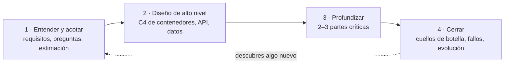

**Objetivo:** documentar decisiones de forma útil y seguir un método repetible para cualquier problema de diseño.
**Tiempo:** 2,5 h
**Lecturas:** Michael Nygard, *Documenting Architecture Decisions* · FoSA, capítulo de decisiones de arquitectura · Primer, *How to approach a system design interview question* · Alex Xu vol. 1, *A framework for system design interviews*.

## Antes de leer: predice

1. Llegas a un equipo y ves que usan MongoDB para datos muy relacionales. Nadie de los que lo decidieron sigue allí. ¿Qué opciones tienes?
2. Te dan 45 minutos para diseñar un sistema. ¿Cuánto tiempo dedicarías a *entender el problema* antes de dibujar la primera caja?

```respuesta id="f1-05-predice" titulo="Mis predicciones"
Antes de leer: responde con lo que sepas o intuyas. No importa acertar.
```

## ADRs: el porqué, por escrito

Respuesta a la primera predicción: sin registro, tienes dos malas opciones. **Aceptar a ciegas** la decisión (quizás era buena por razones que desconoces) o **revertirla a ciegas** (quizás por razones que volverán a morderte). Un **Architecture Decision Record** evita este dilema: un documento corto, uno por decisión, que registra el contexto, la decisión y sus consecuencias.

El formato original de Nygard:

```markdown
# ADR-0007: Usar PostgreSQL como base de datos principal

## Estado
Aceptado (2026-10-12)

## Contexto
Qué fuerzas están en juego: requisitos, restricciones, características prioritarias,
lo que sabemos y lo que no. Escrito de forma neutral, sin la decisión todavía.

## Decisión
"Usaremos X." En voz activa, clara.

## Consecuencias
Qué pasa después de decidir: lo bueno, lo malo y lo que queda por resolver.
Incluye el trade-off que asumimos.
```

FoSA recomienda además:

- Una sección de **alternativas consideradas** con el motivo del descarte (muchos equipos la añaden; formatos como MADR la incluyen).
- Poner énfasis en la **justificación**: el porqué es más importante que el cómo.
- Estados: *Propuesto → Aceptado → Reemplazado por ADR-00XX*. **Los ADRs no se editan: se reemplazan.** El historial también cuenta la historia.

**Cuándo escribir uno:** cuando la decisión es estructural, cara de revertir, o cuando alguien preguntará "¿por qué hicimos esto?" dentro de un año. No para elegir el nombre de una variable.

## Antipatrones de decisión (FoSA)

| Antipatrón | Síntoma | Remedio |
|---|---|---|
| **Cubrirse las espaldas** | No decidir por miedo a equivocarse | Decidir en el último momento *responsable*, con la información disponible |
| **Día de la marmota** | Se discute la misma decisión una y otra vez | Documentarla con su justificación (ADR) |
| **Arquitectura por email** | La decisión se pierde en un hilo o se malinterpreta | Un único registro, enlazado desde donde se comunique |

## El proceso de diseño en 4 pasos

Respuesta a la segunda predicción: más de lo que crees. Lanzarse a dibujar es el error más común. Un método que funciona tanto en una entrevista de 45 minutos como en un diseño real de dos semanas (las proporciones cambian, los pasos no):



**1. Entender y acotar** (~10–15 % del tiempo)

- Preguntas de clarificación (lección 1). Alcance: qué *no* haces.
- Características de arquitectura prioritarias.
- Estimación (lección 3), con conclusiones.

**2. Diseño de alto nivel** (~25 %)

- C4 de Contenedores (lección 4).
- Las **APIs** principales (endpoints o mensajes clave).
- El **modelo de datos** a alto nivel.
- Recorrer uno o dos **flujos principales** sobre el diagrama para comprobar que funciona.

**3. Profundizar** (~40 %)

- Elige las 2–3 partes **más difíciles o más arriesgadas**. En Taquilla, seguro que el inventario de asientos.
- Aquí aparecen los trade-offs de verdad. Cada decisión, con alternativa descartada.

**4. Cerrar** (~20 %)

- ¿Qué se rompe primero a 10×? ¿Qué pasa si cae cada componente?
- Operación: qué mediríamos, cómo desplegaríamos.
- Lo que harías con más tiempo.

:::tip[La regla de oro]
Di en voz alta (o escribe) **por qué** en cada decisión. Un diseño correcto sin justificar vale menos que uno imperfecto con los trade-offs claros.
:::

## Ejercicios

### Ejercicio 1 · Mejora este ADR

```markdown
# Usar Kafka

Vamos a usar Kafka porque es lo que usan las empresas grandes y escala mucho.
```

Reescríbelo como un ADR completo. Inventa un contexto plausible: un sistema de notificaciones que hoy envía emails de forma síncrona dentro de la petición de compra.

```respuesta id="f1-05-ej1" titulo="Mejora este ADR"
Escribe aquí tu razonamiento antes de abrir las pistas.
```

<details>
<summary>Pista</summary>

¿Qué problema concreto hay hoy? ¿Qué alternativas más simples existen (una cola en la base de datos, RabbitMQ, SQS)? ¿Qué cuesta operar Kafka? Y, sobre todo, ¿qué característica de arquitectura se está priorizando?

</details>

<details>
<summary>Una solución posible</summary>

```markdown
# ADR-0004: Enviar notificaciones de forma asíncrona mediante una cola gestionada

## Estado
Aceptado (2026-10-20)

## Contexto
El envío de emails se hace dentro de la petición de compra. Cuando el proveedor
de email responde lento (p99 de 3 s en picos), la compra entera se ralentiza y
en la última salida a la venta provocó timeouts. Los emails no necesitan enviarse
en el mismo instante; un retraso de segundos es aceptable. Volumen: ~5 envíos/s
de media, ~500/s en picos. El equipo (4 personas) no tiene experiencia operando
sistemas de mensajería.

## Decisión
La compra publicará un mensaje "EnviarNotificación" en una cola gestionada (SQS)
y un worker independiente hará el envío con reintentos.

## Alternativas consideradas
- Kafka: su punto fuerte (log reprocesable, alto throughput, múltiples
  consumidores) no es necesario a este volumen, y el coste operativo es alto
  para el equipo.
- Tabla-cola en PostgreSQL: más simple, pero compite con la carga de la BD
  justo en los picos.
- RabbitMQ autogestionado: válido, pero requiere operarlo nosotros.

## Consecuencias
- (+) La compra deja de depender de la latencia del proveedor de email.
- (+) Reintentos automáticos si el proveedor falla.
- (−) Entrega "al menos una vez": el worker debe tolerar duplicados.
- (−) Dependencia de un servicio del proveedor cloud.
- Revisaremos la decisión si aparecen varios consumidores de los mismos eventos
  o si necesitamos reprocesar el histórico (entonces un log como Kafka tendría sentido).
```

</details>

### Ejercicio 2 · Detecta el antipatrón

1. "Llevamos tres reuniones discutiendo si usar GraphQL. Cada vez que viene alguien nuevo, volvemos a empezar."
2. "No podemos elegir base de datos hasta tener todos los requisitos cerrados."
3. "El arquitecto lo decidió en un hilo de Slack de hace dos años."

```respuesta id="f1-05-ej2" titulo="Detecta el antipatrón"
Escribe aquí tu razonamiento antes de abrir las pistas.
```

<details>
<summary>Solución</summary>

1. Día de la marmota.
2. Cubrirse las espaldas: nunca tendrás todos los requisitos. Decide en el último momento responsable y documenta qué haría cambiar la decisión.
3. Arquitectura por email (o chat): la decisión existe pero no se puede encontrar ni entender.

</details>

## Taquilla

Escribe `docs/adr/0001-empezar-con-un-monolito.md`: Taquilla empieza como una única aplicación desplegable (un monolito) en lugar de microservicios. Justifícalo con el contexto: equipo pequeño, dominio aún por descubrir, características prioritarias. Incluye alternativas y consecuencias, y **en qué condiciones revisarías la decisión**.

(Si crees que no deberías empezar con un monolito, escribe el ADR contrario. Lo que importa es el argumento.)

## Autorrevisión

- [ ] Mis ADRs tienen contexto, decisión, alternativas y consecuencias (buenas *y* malas).
- [ ] Sé qué decisiones merecen un ADR y cuáles no.
- [ ] Conozco los cuatro pasos del proceso de diseño y cuánto tiempo darle a cada uno.

## Para la sesión de tutor

Trae el ADR-0001. Lo atacaré desde el punto de vista de alguien que quiere microservicios desde el primer día.
