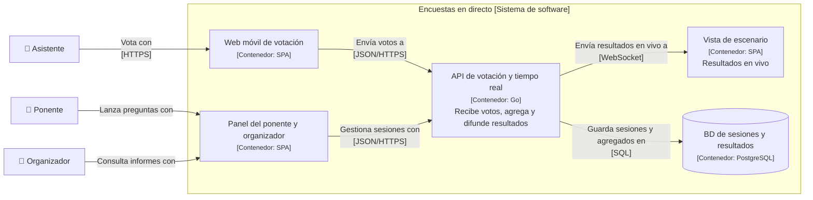

## Kata · Encuestas en directo para conferencias

**Tiempo:** 45 minutos. Aplica los pasos 1 y 2 del [proceso de diseño](/fase-1/05-adr-y-proceso/#el-proceso-de-diseño-en-4-pasos); los pasos 3 y 4 llegarán con las fases siguientes.

**Enunciado:** una empresa quiere una herramienta para que los ponentes de conferencias lancen preguntas al público ("¿Qué base de datos usáis?") y la audiencia vote desde el móvil, escaneando un QR. Los resultados se ven en la pantalla del escenario en tiempo real. También hay preguntas abiertas del público a los ponentes, que se pueden votar.

Clientes: conferencias de 100 a 20.000 asistentes. Unas 300 sesiones activas a la vez en hora punta, en todo el mundo.

**Entrega:**

1. 4–5 preguntas de clarificación, con tu respuesta supuesta y qué cambia según la respuesta.
2. Requisitos funcionales (5–7) y las **3 características de arquitectura** prioritarias, justificadas.
3. Estimación: votos por segundo en pico (en una sesión y en total), almacenamiento a 1 año, conexiones concurrentes. Con conclusiones.
4. C4 de **Contexto** y un primer C4 de **Contenedores** (con lo que sabes hoy: aplicaciones y bases de datos).
5. Un ADR sobre la decisión que te parezca más importante.

### Guía de tiempos

| Minutos | Qué |
|---|---|
| 0–8 | Preguntas, requisitos, características |
| 8–18 | Estimación con conclusiones |
| 18–35 | C4 Contexto y Contenedores |
| 35–45 | ADR y repaso |

```respuesta id="f1-cierre-kata" titulo="Encuestas en directo para conferencias"
Tu diseño: requisitos, estimación, API, datos, C4, profundizar, fallos. Puedes seguir la plantilla de kata de los anexos.
```

<details>
<summary>Pista 1 · Estimación</summary>

El patrón de carga es muy particular: casi nada durante la charla y, cuando el ponente lanza una pregunta, **todos votan en los mismos 10–20 segundos**. ¿Cuántos votos por segundo genera una sala de 20.000 personas si el 70 % vota en 15 s?

</details>

<details>
<summary>Pista 2 · Características</summary>

¿Qué pasa si los resultados en pantalla van 2 segundos por detrás? ¿Y si un voto se pierde? ¿Y si la herramienta cae en mitad de la keynote de 20.000 personas?

</details>

<details>
<summary>Solución de referencia</summary>

**Preguntas de clarificación**

| Pregunta | Supuesto | Qué cambia |
|---|---|---|
| ¿Un voto por persona y pregunta? | Sí, sin registro: identificación por dispositivo | Hace falta deduplicar; sin login, fraude posible pero aceptable |
| ¿Cuánto retraso se tolera en la pantalla? | Hasta 1–2 s | Permite agregar votos en lotes en vez de uno a uno |
| ¿Se guardan los resultados? | Sí, para el informe al organizador | Almacenamiento, pero sin requisitos de latencia |
| ¿Salas sin buena conexión? | Wi-Fi de congresos saturado | Mensajes pequeños, reintentos, tolerancia a latencia alta |
| ¿Varias regiones? | Sí, conferencias en todo el mundo | Latencia: ¿desplegar cerca de la sala? |

**Características prioritarias**

1. **Elasticidad:** picos brutales y cortos, concentrados en una sesión.
2. **Disponibilidad** durante las sesiones: si cae en directo, el daño reputacional es inmediato.
3. **Rendimiento percibido** (resultados "en tiempo real", ~1 s).

Fuera: consistencia fuerte (un recuento aproximado durante 1 s es aceptable, siempre que al final sea exacto), extensibilidad.

**Estimación**

- Sala grande: 20.000 × 0,7 = 14.000 votos en ~15 s → **~1.000 votos/s** en una sola sesión.
- Global: 300 sesiones × 1.000 asistentes de media; si en un instante votan 30 sesiones a la vez → decenas de miles de votos/s como techo.
- Conexiones concurrentes para ver resultados en vivo: la pantalla del escenario más, opcionalmente, los móviles: **hasta 20.000 conexiones en una sesión** y cientos de miles en total.
- Almacenamiento: 300 sesiones × 20 preguntas × 1.000 votos × 100 B ≈ 600 MB/hora punta → decenas de GB al año. **Trivial.**

Conclusiones: el problema no es el volumen de datos sino **el pico concentrado y las conexiones en tiempo real**. Contar voto a voto en la base de datos sería el cuello de botella: hay que **agregar** (contadores en memoria, volcado periódico). Hace falta un mecanismo de *push* (WebSockets o SSE, Fase 2).

**C4**



**ADR:** "Agregar votos en memoria y persistir agregados cada segundo". Contexto: 1.000 votos/s concentrados en una fila (la pregunta activa) generarían contención; se tolera 1 s de retraso. Consecuencia negativa: si cae la instancia se pierde hasta 1 s de votos, a menos que se registren también en un log duradero. Alternativa descartada: `UPDATE ... SET votos = votos + 1` por voto (contención en una fila caliente).

</details>

### Autoevaluación

Usa el [panel de revisión](/guia/panel-de-revision/). En esta fase se evalúan: **Requisitos, Estimación, Arquitectura, Trade-offs y Comunicación**. Las demás aún no se esperan. Guárdala en `docs/katas/fase-1-encuestas.md`.

## Revisión de Taquilla v0

Antes de cerrar la fase, revisa tu entregable con esta lista:

- [ ] `requisitos.md` con preguntas de clarificación que **cambian el diseño**.
- [ ] 3 características prioritarias justificadas, y al menos una descartada a propósito.
- [ ] Parámetro de carga decisivo identificado.
- [ ] Objetivos de rendimiento en percentiles para 3 operaciones.
- [ ] `estimaciones.md` con la salida a la venta estimada aparte, y cada número con su conclusión.
- [ ] C4 de Contexto como código, que pasa la lista de verificación de C4.
- [ ] ADR-0001 con alternativas, consecuencias negativas y condiciones de revisión.

Autoevalúalo con el panel en las mismas cinco dimensiones que la kata.

## Preguntas de repaso

1. ¿Por qué una media de latencia de 80 ms puede esconder un problema grave?
2. Un compañero dice que "Taquilla necesita consistencia fuerte". ¿Qué matizarías?
3. En tu estimación de Taquilla, ¿qué número ha cambiado más tu forma de ver el problema?
4. ¿Qué diferencia hay entre un contenedor C4 y un contenedor Docker? Pon un ejemplo de algo que es lo primero pero no lo segundo.
5. ¿Qué harías si, al revisar un ADR de hace un año, ves que el contexto ha cambiado?
6. (De la Fase 0) Un endpoint hace 15 consultas secuenciales a la base de datos, cada una de 2 ms. ¿Cuál es la latencia mínima y cómo la reducirías?

```respuesta id="f1-cierre-repaso" titulo="Preguntas de repaso"
Responde sin mirar las lecciones.
```

<details>
<summary>Respuestas</summary>

1. Porque la distribución puede tener una cola larga: el p99 puede estar en segundos. Siempre percentiles.
2. Que no todo el sistema la necesita: el **inventario** de asientos sí; el catálogo, las búsquedas o la analítica toleran datos desactualizados. Tratar todo igual encarece el diseño sin necesidad.
3. Respuesta personal. Si no ha cambiado nada, sospecha de la estimación: le faltan conclusiones.
4. Un contenedor C4 es cualquier unidad que se ejecuta o almacena datos por separado. Una base de datos gestionada (RDS), un bucket de S3 o una SPA que corre en el navegador son contenedores C4 y ninguno es un contenedor Docker.
5. No editarlo: escribir un ADR nuevo que lo **reemplace**, explicando qué ha cambiado, y marcar el viejo como reemplazado.
6. 30 ms como mínimo (sin contar la red a la BD, que sumaría ~0,5 ms por consulta). Reducir el número de viajes: una consulta con `JOIN` o `IN`, paralelizar las independientes, o cachear.

</details>

## Criterios de dominio

- [ ] Convierto un enunciado vago en requisitos y preguntas de clarificación.
- [ ] Hago una estimación de QPS y almacenamiento en menos de 5 minutos, sin calculadora.
- [ ] Explico por qué la media de latencia engaña y qué me dice el p99.
- [ ] Mis diagramas C4 se entienden sin que yo los explique.
- [ ] Escribo ADRs con alternativas y consecuencias negativas.
- [ ] La kata puntúa al menos 3 en Requisitos, Estimación y Arquitectura.

## Siguiente

[Fase 2 · Bloques de construcción](/fase-2/): las piezas con las que se construye cualquier sistema.
