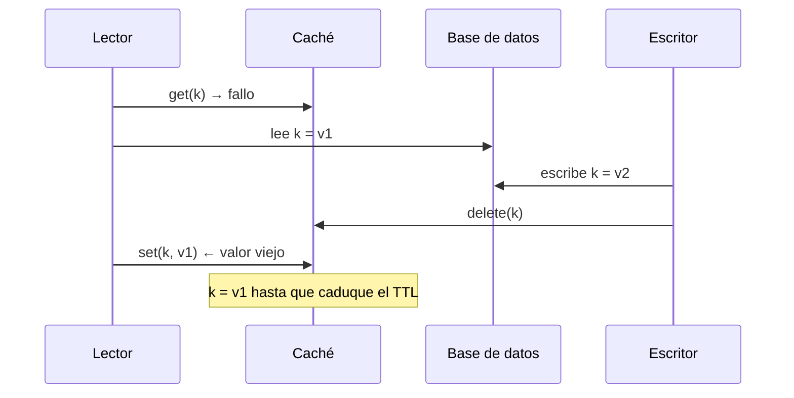

**Objetivo:** elegir dónde y cómo cachear, y anticipar los problemas que una caché **introduce**.
**Tiempo:** 4 h
**Lecturas:** Primer, *Cache* · Amazon Builders' Library, *Caching challenges and strategies* · Opcional: Facebook, *Scaling Memcache at Facebook* (NSDI 2013), secciones 3 y 4.

> *There are only two hard things in Computer Science: cache invalidation and naming things.* (Phil Karlton)

## Antes de leer: predice

1. La caché del catálogo tiene un 95 % de aciertos. Se reinicia el clúster de caché. ¿Qué le pasa a la base de datos en los siguientes segundos?
2. Mil peticiones piden a la vez la misma clave, que acaba de caducar. ¿Cuántas consultas llegan a la base de datos?
3. Si la caché hace el sistema más rápido, ¿puede hacerlo también **menos disponible**?

```respuesta id="f2-03-predice" titulo="Mis predicciones"
Antes de leer: responde con lo que sepas o intuyas. No importa acertar.
```

## Dónde se cachea

| Nivel | Ejemplo | Latencia | Compartida |
|---|---|---|---|
| Cliente | Caché del navegador, app móvil | 0 (sin red) | No |
| Borde | CDN ([lección 2](/fase-2/02-cdn-y-proxies/)) | ~10 ms | Entre usuarios de un PoP |
| Aplicación, en proceso | Un map LRU en memoria de cada instancia | ~100 ns | No: cada instancia tiene la suya |
| Distribuida | Redis, Memcached | ~0,5 ms (red) | Sí, entre instancias |
| Base de datos | Buffer pool, page cache | — | Interna |

La caché **en proceso** es la más rápida pero cada instancia tiene su copia (más memoria total, más difícil de invalidar). La **distribuida** es compartida pero cada acceso cuesta un viaje de red.

## Estrategias

### Cache-aside (carga perezosa): la más común

```text
leer(k):
    v = cache.get(k)
    si v existe: devolver v
    v = bd.leer(k)
    cache.set(k, v, ttl)
    devolver v

escribir(k, v):
    bd.escribir(k, v)
    cache.delete(k)        # invalidar, no actualizar
```

La aplicación gestiona la caché. Solo se cachea lo que se pide. Si la caché cae, el sistema sigue funcionando (más lento).

### Otras

- **Read-through:** la caché misma carga de la BD en un fallo. La aplicación solo habla con la caché.
- **Write-through:** cada escritura va a la caché **y** a la BD, de forma síncrona. Caché siempre fresca, escrituras más lentas, y se cachean datos que quizás nadie lea.
- **Write-behind (write-back):** se escribe en la caché y la BD se actualiza después, en lotes. Escrituras rapidísimas; **riesgo de perder datos** si la caché cae antes de volcar.
- **Refresh-ahead:** renovar en segundo plano las claves populares antes de que caduquen.

## Desalojo

La memoria es finita. Cuando se llena, se desaloja según una política:

- **LRU** (*least recently used*): lo que lleva más tiempo sin usarse. La más común.
- **LFU** (*least frequently used*): lo menos usado en total. Mejor con popularidad estable, peor ante cambios de moda.
- **TTL:** caducidad por tiempo, independiente del espacio. Limita cuánto tiempo puede estar desactualizado un dato.

## Los problemas de verdad

### 1. Consistencia e invalidación

¿Por qué en cache-aside se **borra** la clave en vez de actualizarla? Porque dos escrituras concurrentes podrían actualizar la caché en orden distinto al de la BD y dejar el valor viejo. Borrar es más seguro, pero **no infalible**:



El lector leyó `v1`, se retrasó, y lo escribió en la caché **después** de la invalidación. Mitigaciones: **TTL siempre** (acota el daño), borrar de nuevo con un pequeño retraso, o versionar los valores. La lección: **una caché es una copia, y las copias se desincronizan.** Decide cuánto desfase tolera cada dato.

### 2. Estampida (*thundering herd*, *cache stampede*)

Respuesta a la segunda predicción: sin protección, **mil**. Todas fallan en la caché a la vez y todas van a la BD a por lo mismo. Mitigaciones:

- **Coalescencia de peticiones** (*request coalescing*, en Go `singleflight`): solo una petición por clave va a la BD; las demás esperan su resultado.
- **Lock** distribuido en la clave durante la recarga.
- **Expiración anticipada probabilística:** cada lector, al acercarse el TTL, tiene una pequeña probabilidad de refrescar antes, así no caducan todas a la vez.
- **Servir lo caducado mientras se renueva** (*stale-while-revalidate*).
- **Añadir aleatoriedad (jitter) al TTL** para que claves cargadas a la vez no caduquen a la vez.

### 3. Claves calientes

Una sola clave recibe una fracción enorme del tráfico (el evento de la gira que sale hoy a la venta). En una caché distribuida, esa clave vive en **un** nodo, que se satura. Soluciones: caché en proceso (L1) delante de la distribuida, o **replicar la clave** en varios nodos con sufijos (`evento:123#1` … `#8`) y leer de uno al azar.

### 4. Penetración de caché

Peticiones de claves **que no existen** (un bot probando IDs) siempre fallan en la caché y siempre llegan a la BD. Solución: cachear también el "no existe" (**caché negativa**, con TTL corto) o un **filtro de Bloom** delante.

### 5. La caché como dependencia

Respuesta a la primera y la tercera predicción: con un 95 % de aciertos, la BD solo ve el 5 % del tráfico y **se dimensiona para ello**. Si la caché se vacía, la BD recibe de golpe **20 veces** su carga habitual y cae. La caché, que se añadió para acelerar, se ha convertido en una **dependencia crítica de disponibilidad**. El artículo de Amazon Builders' Library insiste en esto:

- Planifica qué pasa con la caché fría: **calentarla** antes de enviarle tráfico, o limitar la tasa de fallos que llegan a la BD (*load shedding*).
- Monitoriza la **tasa de aciertos** como métrica crítica.
- Ante la duda, dimensiona la BD para sobrevivir (degradada) sin caché.

## Ejercicios

### Ejercicio 1 · Caché LRU con TTL (Go)

Implementa `Cache[K comparable, V any]` con `Get(K) (V, bool)` y `Set(K, V)`, capacidad máxima, desalojo LRU y TTL. Segura para uso concurrente. Ambas operaciones en O(1). El campo `ahora` (la función que da la hora) permite a los tests simular el paso del tiempo.

```go practica id="f2-lru" titulo="Caché LRU con TTL"
package practica

import (
	"sync"
	"time"
)

type Cache[K comparable, V any] struct {
	mu    sync.Mutex
	cap   int
	ttl   time.Duration
	ahora func() time.Time // los tests la sustituyen para simular el paso del tiempo
	// TODO: estructuras para O(1) en Get, Set y desalojo
}

func New[K comparable, V any](capacidad int, ttl time.Duration) *Cache[K, V] {
	return &Cache[K, V]{cap: capacidad, ttl: ttl, ahora: time.Now} // TODO
}

// Get devuelve el valor si existe y no ha caducado, y lo marca como usado recientemente.
func (c *Cache[K, V]) Get(k K) (V, bool) {
	var cero V
	return cero, false // TODO
}

// Set guarda el valor; si se supera la capacidad, desaloja el usado hace más tiempo.
func (c *Cache[K, V]) Set(k K, v V) {
	// TODO
}
```

```go tests id="f2-lru"
package practica

import (
	"testing"
	"time"
)

func TestLRU(t *testing.T) {
	c := New[string, int](2, time.Minute)
	c.Set("a", 1)
	c.Set("b", 2)
	c.Get("a")    // "a" pasa a ser la más reciente
	c.Set("c", 3) // desaloja "b"
	if _, ok := c.Get("b"); ok {
		t.Error("b debería haberse desalojado")
	}
	if v, ok := c.Get("a"); !ok || v != 1 {
		t.Errorf("Get(a) = %d, %v", v, ok)
	}
	if v, ok := c.Get("c"); !ok || v != 3 {
		t.Errorf("Get(c) = %d, %v", v, ok)
	}
}

func TestTTL(t *testing.T) {
	ahora := time.Unix(0, 0)
	c := New[string, int](10, time.Second)
	c.ahora = func() time.Time { return ahora }
	c.Set("a", 1)
	ahora = ahora.Add(500 * time.Millisecond)
	if _, ok := c.Get("a"); !ok {
		t.Fatal("a no debería haber caducado aún")
	}
	ahora = ahora.Add(2 * time.Second)
	if _, ok := c.Get("a"); ok {
		t.Fatal("a debería haber caducado")
	}
}
```

```go tests-extra id="f2-lru"
package practica

import (
	"fmt"
	"sync"
	"testing"
	"time"
)

func TestSetActualizaYRenueva(t *testing.T) {
	c := New[string, int](2, time.Minute)
	c.Set("a", 1)
	c.Set("b", 2)
	c.Set("a", 10) // actualizar también cuenta como uso reciente
	c.Set("c", 3)  // desaloja "b", no "a"
	if v, ok := c.Get("a"); !ok || v != 10 {
		t.Errorf("Get(a) = %d, %v; quiero 10, true", v, ok)
	}
	if _, ok := c.Get("b"); ok {
		t.Error("b debería haberse desalojado")
	}
}

func TestCapacidadUno(t *testing.T) {
	c := New[int, string](1, time.Minute)
	c.Set(1, "uno")
	c.Set(2, "dos")
	if _, ok := c.Get(1); ok {
		t.Error("con capacidad 1, el 1 debería haberse desalojado")
	}
}

func TestCacheConcurrente(t *testing.T) {
	c := New[string, int](100, time.Minute)
	var wg sync.WaitGroup
	for i := range 200 {
		wg.Go(func() { c.Set(fmt.Sprint(i%150), i) })
		wg.Go(func() { c.Get(fmt.Sprint(i % 150)) })
	}
	wg.Wait()
}
```

<details>
<summary>Pista 1</summary>

O(1) para buscar → un map. O(1) para saber cuál es el menos usado y mover un elemento al frente → una lista doblemente enlazada (`container/list`). El map apunta a los nodos de la lista.

</details>

<details>
<summary>Pista 2</summary>

Para testear el TTL sin `time.Sleep`, haz que la caché reciba la función que da la hora (`ahora func() time.Time`) y sustitúyela en el test.

</details>

<details>
<summary>Solución</summary>

```go solucion id="f2-lru"
package practica

import (
	"container/list"
	"sync"
	"time"
)

type entrada[K comparable, V any] struct {
	clave  K
	valor  V
	expira time.Time
}

type Cache[K comparable, V any] struct {
	mu    sync.Mutex
	cap   int
	ttl   time.Duration
	ahora func() time.Time
	orden *list.List          // frente = más reciente
	items map[K]*list.Element // clave -> nodo de la lista
}

func New[K comparable, V any](capacidad int, ttl time.Duration) *Cache[K, V] {
	return &Cache[K, V]{
		cap:   capacidad,
		ttl:   ttl,
		ahora: time.Now,
		orden: list.New(),
		items: make(map[K]*list.Element, capacidad),
	}
}

func (c *Cache[K, V]) Get(k K) (V, bool) {
	c.mu.Lock()
	defer c.mu.Unlock()
	var cero V
	el, ok := c.items[k]
	if !ok {
		return cero, false
	}
	e := el.Value.(*entrada[K, V])
	if c.ahora().After(e.expira) {
		c.quitar(el)
		return cero, false
	}
	c.orden.MoveToFront(el)
	return e.valor, true
}

func (c *Cache[K, V]) Set(k K, v V) {
	c.mu.Lock()
	defer c.mu.Unlock()
	if el, ok := c.items[k]; ok {
		e := el.Value.(*entrada[K, V])
		e.valor, e.expira = v, c.ahora().Add(c.ttl)
		c.orden.MoveToFront(el)
		return
	}
	el := c.orden.PushFront(&entrada[K, V]{k, v, c.ahora().Add(c.ttl)})
	c.items[k] = el
	if c.orden.Len() > c.cap {
		c.quitar(c.orden.Back()) // desaloja el menos usado recientemente
	}
}

func (c *Cache[K, V]) quitar(el *list.Element) {
	c.orden.Remove(el)
	delete(c.items, el.Value.(*entrada[K, V]).clave)
}
```

Nota: `Get` usa `Lock` y no `RLock` porque **modifica** el orden. Una caché LRU con mucha concurrencia se convierte en un cuello de botella por el mutex; las librerías de producción parten la caché en fragmentos (*shards*) con un mutex cada uno.

</details>

### Ejercicio 2 · Coalescencia de peticiones (Go)

Implementa `Grupo.Do(clave string, fn func() ([]byte, error)) ([]byte, error)`: si ya hay una llamada en curso para esa clave, espera su resultado en lugar de ejecutar `fn` otra vez. Los tests lo comprueban: 100 goroutines piden la misma clave y `fn` (que tarda 100 ms) debe ejecutarse **una sola vez**.

```go practica id="f2-coalescencia" titulo="Coalescencia de peticiones"
package practica

type Grupo struct {
	// TODO
}

// Do ejecuta fn para la clave, salvo que ya haya una llamada en curso con esa clave:
// en ese caso espera su resultado y lo devuelve.
func (g *Grupo) Do(clave string, fn func() ([]byte, error)) ([]byte, error) {
	return fn() // TODO: esto ejecuta fn siempre
}
```

```go tests id="f2-coalescencia"
package practica

import (
	"sync"
	"sync/atomic"
	"testing"
	"time"
)

func TestUnaSolaEjecucion(t *testing.T) {
	var g Grupo
	var llamadas atomic.Int32
	fn := func() ([]byte, error) {
		llamadas.Add(1)
		time.Sleep(100 * time.Millisecond)
		return []byte("evento 123"), nil
	}
	var wg sync.WaitGroup
	for range 100 {
		wg.Go(func() {
			v, err := g.Do("evento:123", fn)
			if err != nil || string(v) != "evento 123" {
				t.Errorf("Do = %q, %v", v, err)
			}
		})
	}
	wg.Wait()
	if n := llamadas.Load(); n != 1 {
		t.Fatalf("fn se ejecutó %d veces, quiero 1", n)
	}
}
```

```go tests-extra id="f2-coalescencia"
package practica

import (
	"errors"
	"sync"
	"sync/atomic"
	"testing"
	"time"
)

func TestClavesDistintasNoSeEsperan(t *testing.T) {
	var g Grupo
	var llamadas atomic.Int32
	var wg sync.WaitGroup
	for _, k := range []string{"a", "b", "c"} {
		wg.Go(func() {
			g.Do(k, func() ([]byte, error) { llamadas.Add(1); time.Sleep(50 * time.Millisecond); return nil, nil })
		})
	}
	wg.Wait()
	if llamadas.Load() != 3 {
		t.Errorf("claves distintas: %d ejecuciones, quiero 3", llamadas.Load())
	}
}

func TestErrorParaTodos(t *testing.T) {
	var g Grupo
	boom := errors.New("bd caída")
	var wg sync.WaitGroup
	for range 20 {
		wg.Go(func() {
			if _, err := g.Do("k", func() ([]byte, error) { time.Sleep(50 * time.Millisecond); return nil, boom }); !errors.Is(err, boom) {
				t.Errorf("err = %v; todos los que esperan deben recibir el error", err)
			}
		})
	}
	wg.Wait()
}

func TestNoEsUnaCache(t *testing.T) {
	var g Grupo
	n := 0
	for range 3 {
		g.Do("k", func() ([]byte, error) { n++; return nil, nil })
	}
	if n != 3 {
		t.Errorf("llamadas secuenciales: fn se ejecutó %d veces, quiero 3 (solo se agrupan las simultáneas)", n)
	}
}
```

<details>
<summary>Pista</summary>

Un map `clave → *llamada` protegido por un mutex. Cada `llamada` tiene un `sync.WaitGroup` para que los que llegan después esperen, y campos para el resultado.

</details>

<details>
<summary>Solución</summary>

```go solucion id="f2-coalescencia"
package practica

import "sync"

type llamada struct {
	wg  sync.WaitGroup
	val []byte
	err error
}

type Grupo struct {
	mu      sync.Mutex
	enCurso map[string]*llamada
}

func (g *Grupo) Do(clave string, fn func() ([]byte, error)) ([]byte, error) {
	g.mu.Lock()
	if g.enCurso == nil {
		g.enCurso = map[string]*llamada{}
	}
	if c, ok := g.enCurso[clave]; ok {
		g.mu.Unlock()
		c.wg.Wait() // otro ya está cargando: esperar su resultado
		return c.val, c.err
	}
	c := &llamada{}
	c.wg.Add(1)
	g.enCurso[clave] = c
	g.mu.Unlock()

	c.val, c.err = fn()
	c.wg.Done()

	g.mu.Lock()
	delete(g.enCurso, clave)
	g.mu.Unlock()
	return c.val, c.err
}
```

Es lo que hace `golang.org/x/sync/singleflight`, que es la que usarías en producción.

</details>

### Ejercicio 3 · Diagnostica

1. Tras un despliegue que reinicia todas las instancias, la BD se satura durante 2 minutos. Las instancias usan caché en proceso.
2. La tasa de aciertos de Redis es del 99 %, pero un nodo de Redis está al 100 % de CPU y los demás al 10 %.
3. Un usuario cambia su nombre y durante horas sigue viendo el viejo en algunas páginas. La caché no tiene TTL.
4. Los logs muestran miles de consultas por segundo a la BD de eventos con IDs que no existen.

```respuesta id="f2-03-ej3" titulo="Diagnostica"
Escribe aquí tu razonamiento antes de abrir las pistas.
```

<details>
<summary>Solución</summary>

1. **Caché fría** tras el reinicio: todas las instancias fallan a la vez. Despliegue gradual (no reiniciar todas a la vez), calentamiento, o una caché distribuida que sobreviva al despliegue.
2. **Clave caliente** (o varias) en ese nodo. Caché local L1 delante o replicar la clave.
3. **Invalidación fallida** (la carrera del diagrama o un borrado que se perdió) **sin TTL** que acote el daño. Siempre TTL.
4. **Penetración de caché** (bot o scraping). Caché negativa, filtro de Bloom, y rate limiting (Fase 7).

</details>

## Taquilla

Añade la **caché** al C4 de Contenedores y escribe el ADR "Estrategia de caché del catálogo". Decide:

1. Qué datos se cachean (evento, recinto, precios, **disponibilidad**…) y con qué TTL cada uno.
2. Estrategia (cache-aside u otra) e invalidación.
3. Cómo proteges la BD cuando **todo el mundo pide el mismo evento** en una salida a la venta (estampida y clave caliente).
4. Qué pasa si la caché cae en mitad de una salida a la venta.

<details>
<summary>Pista (después de tu intento)</summary>

Distingue **mostrar** disponibilidad de **garantizar** disponibilidad. La primera puede venir de una caché con 1–2 s de desfase; la segunda nunca.

</details>

## Autorrevisión

- [ ] Explico cache-aside y por qué se invalida borrando.
- [ ] Sé describir la carrera que deja datos viejos y por qué el TTL es obligatorio.
- [ ] Conozco las mitigaciones de estampida, clave caliente y penetración.
- [ ] Entiendo por qué la caché puede reducir la disponibilidad.

## Para la sesión de tutor

Trae tu ADR de caché. Simularemos una salida a la venta en la que la caché cae a los 30 segundos.
