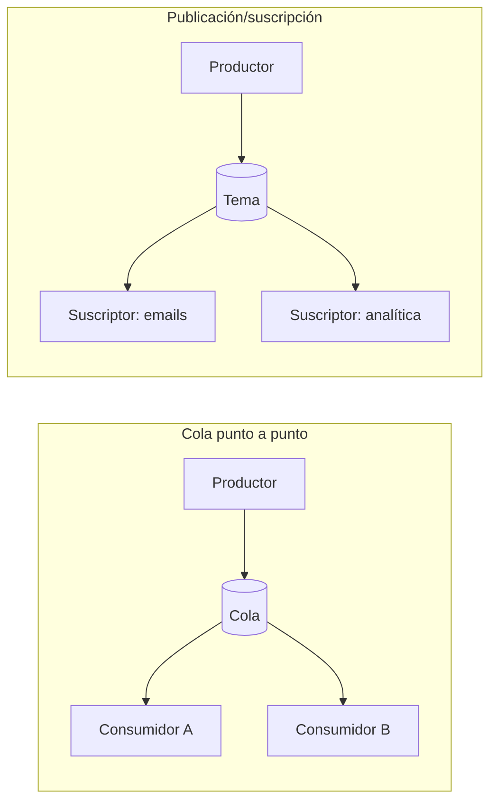

**Objetivo:** saber cuándo sacar trabajo del camino de la petición, cómo funciona una cola y cómo evitar que se convierta en un problema.
**Tiempo:** 3 h
**Lecturas:** Primer, *Asynchronism* (*Message queues*, *Task queues*, *Back pressure*) · Amazon Builders' Library, *Avoiding insurmountable queue backlogs*.

## Antes de leer: predice

1. Al comprar una entrada se envía un email de confirmación. Si el proveedor de email tarda 3 s, ¿cuánto tarda la compra? ¿Tiene que ser así?
2. Un consumidor de una cola procesa un mensaje, envía el email y, justo antes de confirmar a la cola que ha terminado, se cae. ¿Qué pasa con ese mensaje?
3. Una cola crece más rápido de lo que se vacía durante una hora. ¿Qué tiempo de espera verá un mensaje que entra ahora?

```respuesta id="f2-05-predice" titulo="Mis predicciones"
Antes de leer: responde con lo que sepas o intuyas. No importa acertar.
```

## Síncrono frente a asíncrono

- **Síncrono:** el llamante espera la respuesta. Simple, con resultado inmediato, pero **acopla en el tiempo**: si el llamado es lento o está caído, el llamante también.
- **Asíncrono:** el llamante deja un mensaje y sigue. El trabajo ocurre después. **Desacopla en el tiempo**, pero el resultado no es inmediato y aparecen nuevos problemas (duplicados, orden, fallos silenciosos).

Respuesta a la primera predicción: si el email se envía dentro de la petición, la compra tarda **al menos 3 s**, y si el proveedor cae, la compra falla. El email no necesita enviarse en ese instante: es un candidato ideal para una cola.

**Regla práctica:** en el camino síncrono solo lo que el usuario **necesita** para su respuesta. Todo lo demás (emails, thumbnails, analítica, notificaciones a otros sistemas), a una cola.

## Colas, tareas y pub/sub



- **Cola de mensajes (punto a punto):** cada mensaje lo procesa **un** consumidor. Varios consumidores reparten el trabajo (escalado horizontal del procesamiento). RabbitMQ, SQS.
- **Cola de tareas:** una cola de mensajes que representan trabajo a ejecutar (Celery, Sidekiq, tablas-cola en PostgreSQL con `SELECT … FOR UPDATE SKIP LOCKED`).
- **Pub/sub:** cada mensaje llega a **todos** los suscriptores. El productor no sabe quién escucha: desacoplamiento máximo. SNS, temas de Kafka con varios grupos de consumidores (Fase 6).

## Cómo se garantiza la entrega

Un broker típico funciona así:

1. El consumidor **recibe** un mensaje; el broker lo oculta a los demás durante un tiempo (*visibility timeout*).
2. El consumidor lo procesa.
3. El consumidor **confirma** (*ack*); el broker lo borra.
4. Si no llega el ack a tiempo (el consumidor murió o tardó demasiado), el mensaje **vuelve a estar disponible** y otro lo procesará.

Respuesta a la segunda predicción: el mensaje se reentrega y el email se envía **dos veces**. Esta es la semántica **al menos una vez** (*at-least-once*), la habitual. Consecuencia ineludible:

:::note[Regla de oro de las colas]
**Los consumidores deben ser idempotentes.** Procesar el mismo mensaje dos veces debe dar el mismo resultado que procesarlo una. Por ejemplo, guardando el ID de cada mensaje procesado y descartando los repetidos. Lo verás a fondo en la Fase 4.
:::

La alternativa, **como mucho una vez** (confirmar antes de procesar), pierde mensajes si el consumidor cae. "Exactamente una vez" no existe como garantía del transporte; se **construye** con al menos una vez + idempotencia.

**Colas de mensajes muertos (DLQ):** un mensaje que falla siempre (datos corruptos, bug) se reintentaría eternamente, bloqueando recursos. Tras N intentos se mueve a una DLQ para revisarlo a mano. Monitoriza la DLQ: un mensaje ahí es un fallo real.

**Orden:** muchas colas no garantizan orden estricto (o solo "aproximado"). Si necesitas orden, suele ser **por clave** (todos los mensajes de un pedido, en orden), no global. Kafka lo garantiza por partición (Fase 6).

## Back pressure y colas que no se vacían

Una cola **absorbe picos**: si llegan 1.000 mensajes/s durante un minuto y los consumidores procesan 200/s, la cola crece y luego se vacía. Es el **nivelado de carga** (*load leveling*).

Pero si la tasa de llegada supera **de forma sostenida** la de procesamiento, la cola crece sin límite. La **ley de Little** relaciona las tres magnitudes de cualquier sistema de colas estable:

> **L = λ × W**
> elementos en el sistema = tasa de llegada × tiempo medio en el sistema

Respuesta a la tercera predicción: si hay 720.000 mensajes en cola y los consumidores sacan 200/s, un mensaje nuevo espera **una hora**. Para un email de "tu entrada está lista", inaceptable. Y si los mensajes tienen fecha de caducidad (una reserva de 10 minutos), procesarlos tarde es trabajo **inútil**.

Mitigaciones:

- **Back pressure:** limitar la cola y **rechazar** (o frenar al productor) cuando está llena, en lugar de aceptar trabajo que no se podrá hacer a tiempo. Un channel con buffer en Go es exactamente esto.
- **Autoescalar consumidores** según la profundidad de la cola.
- **Descartar trabajo caducado** al sacarlo de la cola.
- Procesar **primero lo más reciente** (LIFO) cuando lo viejo pierde valor. El artículo de Amazon lo trata a fondo.
- **Monitorizar la edad del mensaje más antiguo**, no solo la longitud de la cola.

## Ejercicios

### Ejercicio 1 · Cola acotada con back pressure (Go)

Añade a tu KV store un endpoint `POST /trabajos` que encola un trabajo (simulado: `time.Sleep` de 200 ms) en un **channel con buffer de 100**, procesado por un pool de 4 workers.

1. En el editor: `nuevoServidorTrabajos(capacidad, workers, trabajo)` devuelve un handler con `POST /trabajos` que encola y responde **`202`**, o, si la cola está llena, **`503`** con `Retry-After: 1` **inmediatamente, sin bloquear**.
2. Después, en tu repositorio: móntalo con capacidad 100, 4 workers y un trabajo de 200 ms, lanza 2.000 peticiones en ráfaga (con `hey`, `oha` o un script en Go) y mide cuántas se aceptan y cuántas se rechazan.
3. Explica el resultado con la ley de Little.

```go practica id="f2-cola" titulo="Cola acotada con back pressure"
package practica

import "net/http"

// nuevoServidorTrabajos acepta trabajos en una cola de tamaño capacidad, procesada por
// workers goroutines que ejecutan trabajo(). Con la cola llena: 503 y Retry-After, sin esperar.
func nuevoServidorTrabajos(capacidad, workers int, trabajo func()) http.Handler {
	mux := http.NewServeMux()
	mux.HandleFunc("POST /trabajos", func(w http.ResponseWriter, r *http.Request) {
		http.Error(w, "TODO", http.StatusNotImplemented)
	})
	return mux
}
```

```go tests id="f2-cola"
package practica

import (
	"net/http"
	"net/http/httptest"
	"testing"
	"time"
)

func TestColaLlenaRechazaSinBloquear(t *testing.T) {
	liberar := make(chan struct{})
	defer close(liberar)
	const capacidad, workers = 5, 2
	srv := httptest.NewServer(nuevoServidorTrabajos(capacidad, workers, func() { <-liberar }))
	defer srv.Close()

	aceptadas, rechazadas := 0, 0
	for range capacidad + workers + 10 {
		inicio := time.Now()
		res, err := http.Post(srv.URL+"/trabajos", "text/plain", nil)
		if err != nil {
			t.Fatal(err)
		}
		res.Body.Close()
		switch res.StatusCode {
		case http.StatusAccepted:
			aceptadas++
		case http.StatusServiceUnavailable:
			rechazadas++
			if res.Header.Get("Retry-After") == "" {
				t.Error("un 503 por cola llena debe llevar Retry-After")
			}
			if d := time.Since(inicio); d > 200*time.Millisecond {
				t.Errorf("el 503 tardó %v: debe responder sin esperar a que haya hueco", d)
			}
		default:
			t.Fatalf("código inesperado %d", res.StatusCode)
		}
	}
	if aceptadas < capacidad || aceptadas > capacidad+workers {
		t.Errorf("aceptadas = %d; con cola %d y %d workers ocupados, quiero entre %d y %d", aceptadas, capacidad, workers, capacidad, capacidad+workers)
	}
	if rechazadas == 0 {
		t.Error("con la cola llena debería haber rechazos")
	}
}
```

```go tests-extra id="f2-cola"
package practica

import (
	"net/http"
	"net/http/httptest"
	"sync/atomic"
	"testing"
	"time"
)

func TestSeVaciaYVuelveAAceptar(t *testing.T) {
	var hechos atomic.Int32
	srv := httptest.NewServer(nuevoServidorTrabajos(3, 2, func() { time.Sleep(20 * time.Millisecond); hechos.Add(1) }))
	defer srv.Close()
	aceptadas := 0
	for range 20 {
		res, _ := http.Post(srv.URL+"/trabajos", "text/plain", nil)
		res.Body.Close()
		if res.StatusCode == http.StatusAccepted {
			aceptadas++
		}
	}
	time.Sleep(300 * time.Millisecond) // los workers vacían la cola
	if int(hechos.Load()) != aceptadas {
		t.Errorf("se aceptaron %d trabajos pero se ejecutaron %d", aceptadas, hechos.Load())
	}
	res, _ := http.Post(srv.URL+"/trabajos", "text/plain", nil)
	res.Body.Close()
	if res.StatusCode != http.StatusAccepted {
		t.Errorf("con la cola vacía → %d, quiero 202", res.StatusCode)
	}
}
```

<details>
<summary>Pista</summary>

Un envío **no bloqueante** a un channel se hace con `select` y `default`:

```go
select {
case cola <- t:
	w.WriteHeader(http.StatusAccepted)
default:
	w.Header().Set("Retry-After", "1")
	http.Error(w, "cola llena", http.StatusServiceUnavailable)
}
```

</details>

<details>
<summary>Solución</summary>

```go solucion id="f2-cola"
package practica

import "net/http"

func nuevoServidorTrabajos(capacidad, workers int, trabajo func()) http.Handler {
	cola := make(chan struct{}, capacidad) // la cola acotada: un channel con buffer
	for range workers {
		go func() {
			for range cola {
				trabajo()
			}
		}()
	}

	mux := http.NewServeMux()
	mux.HandleFunc("POST /trabajos", func(w http.ResponseWriter, r *http.Request) {
		select {
		case cola <- struct{}{}: // hay hueco
			w.WriteHeader(http.StatusAccepted)
		default: // cola llena: rechazar ya, sin bloquear (back pressure)
			w.Header().Set("Retry-After", "1")
			http.Error(w, "cola llena", http.StatusServiceUnavailable)
		}
	})
	return mux
}
```

</details>

<details>
<summary>Qué deberías observar</summary>

4 workers × 5 trabajos/s = **20 trabajos/s** de capacidad. La ráfaga llena la cola (100) casi al instante y el resto se rechaza. Con L = 100 y λ de salida = 20/s, un trabajo que entra con la cola llena espera W = 100 / 20 = **5 s**. Si ese tiempo es inaceptable, la cola es demasiado larga: una cola larga no aumenta la capacidad, solo **esconde la sobrecarga como latencia**.

</details>

### Ejercicio 2 · ¿Síncrono o cola?

Para cada acción de Taquilla, ¿síncrona o asíncrona? Justifica.

1. Reservar asientos.
2. Enviar el email con las entradas.
3. Generar el PDF de la entrada.
4. Actualizar el panel de ventas del organizador.
5. Notificar al PSP del pago (lo inicia el cliente).
6. Recibir el webhook del PSP que confirma el pago.

```respuesta id="f2-05-ej2" titulo="¿Síncrono o cola?"
Escribe aquí tu razonamiento antes de abrir las pistas.
```

<details>
<summary>Solución</summary>

1. **Síncrona:** el usuario necesita saber ya si tiene los asientos. (En una salida a la venta masiva, puede haber una cola *antes*, la cola virtual de la Fase 7, pero la reserva en sí se resuelve con respuesta.)
2. **Asíncrona:** cola + consumidor idempotente.
3. **Asíncrona** (o bajo demanda al descargar). No bloquea la compra.
4. **Asíncrona:** el panel tolera segundos de retraso (eventos, Fase 6).
5. **Síncrona desde el punto de vista del usuario** (redirección al PSP), pero el **resultado** llega por webhook.
6. Recepción **síncrona y rápida**: responder `200` en cuanto se ha guardado el evento de forma duradera, y **procesar asíncronamente**. Los PSP reintentan los webhooks: el procesamiento debe ser idempotente.

</details>

## Taquilla

Añade al C4 de Contenedores la **cola** y los **workers** de notificaciones. Escribe el ADR "Envío asíncrono de notificaciones" (puedes partir del [ejemplo de ADR de la Fase 1](/fase-1/05-adr-y-proceso/#ejercicio-1--mejora-este-adr)), incluyendo idempotencia del consumidor, DLQ y qué pasa si la cola se atasca durante una salida a la venta.

## Autorrevisión

- [ ] Sé qué sacar del camino síncrono y por qué.
- [ ] Distingo cola punto a punto de pub/sub.
- [ ] Explico por qué "al menos una vez" exige consumidores idempotentes.
- [ ] Aplico la ley de Little para razonar sobre colas y back pressure.

## Para la sesión de tutor

Explícame con la ley de Little por qué "poner una cola más grande" no arregla un sistema que no da abasto.
