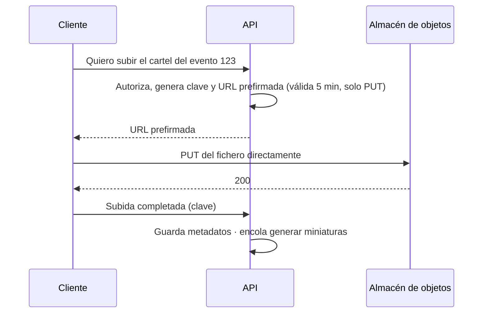

**Objetivo:** saber dónde guardar ficheros grandes y cómo generar identificadores únicos sin un punto central de coordinación, eligiendo el tipo de ID según su uso.
**Tiempo:** 3 h
**Lecturas:** Alex Xu vol. 1, *Design a unique ID generator in distributed systems* · Documentación de Amazon S3, *Uploading objects using presigned URLs* · RFC 9562 (UUID, incluye UUIDv7), secciones introductorias.

## Antes de leer: predice

1. ¿Por qué no guardar las imágenes de los carteles como columnas `BYTEA` en PostgreSQL?
2. Los IDs de pedido son autoincrementales: el pedido 10.000 y, al día siguiente, el 10.450. ¿Qué información le das a un competidor que compre dos entradas?
3. El código QR de una entrada contiene su ID. ¿Qué propiedad **imprescindible** debe tener ese ID que no necesita un ID de pedido?

```respuesta id="f2-07-predice" titulo="Mis predicciones"
Antes de leer: responde con lo que sepas o intuyas. No importa acertar.
```

## Almacenamiento de objetos

Un almacén de objetos (Amazon S3, Google Cloud Storage, Azure Blob, MinIO) guarda **objetos**: bytes + metadatos, identificados por una **clave** dentro de un **bucket**.

- **Espacio de nombres plano:** `carteles/2026/evt-123.webp` es una clave, no una ruta de carpetas (aunque se muestre así).
- **Objetos inmutables:** se sustituyen enteros, no se editan por partes.
- **Durabilidad altísima** (S3 anuncia 11 nueves), replicación entre zonas, capacidad prácticamente ilimitada y coste por GB bajo.
- **Latencia** de decenas de milisegundos por petición: no es un disco local ni una base de datos.
- **Políticas de ciclo de vida:** mover objetos viejos a almacenamiento más barato (acceso infrecuente, archivo) o borrarlos.

Respuesta a la primera predicción: se puede, pero es mala idea a escala. Engorda la base de datos (copias de seguridad, réplicas y memoria compartidas con datos transaccionales), gasta conexiones de la BD en transferir bytes, y no se integra con la CDN. **Patrón estándar:** el binario en el almacén de objetos, y en la BD los **metadatos y la clave** del objeto.

### URLs prefirmadas

Para subir o descargar ficheros sin que los bytes pasen por tus servidores de aplicación:



La API solo firma permisos temporales; el tráfico pesado va directo al almacén. Para ficheros grandes, **subida multiparte** (trozos en paralelo, reanudable).

## Identificadores únicos

En un solo servidor, un contador basta. En un sistema distribuido, muchas instancias generan IDs a la vez. Opciones:

| Tipo | Cómo | Ventajas | Inconvenientes |
|---|---|---|---|
| **Autoincremento de la BD** | `BIGSERIAL` | Simple, compacto, ordenado | Depende de una BD central; con sharding se complica; **predecible** |
| **Servidores de tickets** | Una o dos BD que solo reparten rangos de IDs (Flickr) | Compacto, ordenado | Otro componente crítico que operar |
| **UUIDv4** | 122 bits aleatorios | Sin coordinación, impredecible | 128 bits; **aleatorio = índices B-tree fragmentados** (cada inserción en un sitio distinto del árbol) |
| **UUIDv7** (RFC 9562, 2024) | Marca de tiempo en ms + bits aleatorios | Sin coordinación, **ordenado en el tiempo** (buen comportamiento en índices) | 128 bits; revela la hora de creación |
| **Snowflake** (Twitter) | 64 bits: tiempo + máquina + secuencia | Compacto (cabe en un `BIGINT`), ordenado, sin coordinación en caliente | Hay que asignar IDs de máquina únicos; **sensible a que el reloj retroceda** |
| **ULID** | Similar a UUIDv7, codificado en 26 caracteres | Ordenado, legible | No estándar RFC |

### Snowflake por dentro

```text
 1 bit    41 bits                     10 bits       12 bits
┌───┬──────────────────────────────┬────────────┬─────────────┐
│ 0 │ ms desde una época propia    │ ID máquina │ secuencia   │
└───┴──────────────────────────────┴────────────┴─────────────┘
       ~69 años                       1.024        4.096 por ms y máquina
```

Hasta 4.096 IDs por milisegundo por máquina (~4 millones por segundo), ordenados por tiempo, sin hablar con nadie.

Respuesta a la segunda predicción: con IDs secuenciales, la diferencia entre dos pedidos revela **cuántos pedidos hacéis al día**. También permiten **enumerar** recursos (`/pedidos/10001`, `/pedidos/10002`…): si falla la autorización, un atacante los recorre todos. Un ID expuesto al exterior no debería ser un contador.

### IDs frente a secretos

Respuesta a la tercera predicción: un QR que da **acceso** a un recinto es un **secreto**, no un identificador. Debe ser **imposible de adivinar**: generado con un generador criptográficamente seguro (`crypto/rand`) con al menos 128 bits de entropía, o firmado (un HMAC del ID de la entrada con una clave del servidor). Un Snowflake o un UUIDv7 **no sirven**: son parcialmente predecibles (tiempo, máquina, secuencia).

| Uso | Tipo de ID |
|---|---|
| Clave primaria interna | `BIGSERIAL`, Snowflake o UUIDv7 |
| ID visible en URLs y APIs | UUIDv7 / ULID, o Snowflake si no importa revelar el volumen |
| Token de acceso, QR, enlace de restablecimiento de contraseña | **Aleatorio criptográfico** (≥128 bits) o firmado |
| Código corto legible por humanos | Base62 o similar, con comprobación de colisiones |

## Ejercicios

### Ejercicio 1 · Generador Snowflake (Go)

Implementa `Generador` con `Siguiente() (int64, error)`:

1. 41 bits de tiempo en ms desde el 1 de enero de 2025, 10 bits de máquina y 12 de secuencia.
2. Seguro para uso concurrente.
3. Si se agotan las 4.096 secuencias de un milisegundo, espera al siguiente.
4. Si el reloj **retrocede**, devuelve un error.
5. `New` rechaza IDs de máquina fuera de rango. Los tests lanzan 8 goroutines que generan 20.000 IDs cada una: ninguno puede repetirse.

```go practica id="f2-snowflake" titulo="Generador Snowflake"
package practica

import (
	"errors"
	"sync"
	"time"
)

const (
	epoch         int64 = 1735689600000 // 2025-01-01T00:00:00Z en ms
	bitsMaquina         = 10
	bitsSecuencia       = 12
	maxMaquina          = 1<<bitsMaquina - 1
	maxSecuencia        = 1<<bitsSecuencia - 1
)

type Generador struct {
	mu      sync.Mutex
	maquina int64
	ahora   func() int64 // ms desde Unix; los tests la sustituyen
	// TODO: lo que necesites recordar entre llamadas
}

func New(maquina int64) (*Generador, error) {
	return &Generador{maquina: maquina, ahora: func() int64 { return time.Now().UnixMilli() }}, nil // TODO: validar
}

// Siguiente devuelve un ID único: tiempo<<22 | maquina<<12 | secuencia.
func (g *Generador) Siguiente() (int64, error) {
	return 0, errors.New("TODO")
}
```

```go tests id="f2-snowflake"
package practica

import (
	"sync"
	"testing"
)

func TestUnicosConcurrentes(t *testing.T) {
	g, err := New(7)
	if err != nil {
		t.Fatal(err)
	}
	var mu sync.Mutex
	vistos := make(map[int64]bool, 160_000)
	var wg sync.WaitGroup
	for range 8 {
		wg.Go(func() {
			ids := make([]int64, 0, 20_000)
			for range 20_000 {
				id, err := g.Siguiente()
				if err != nil {
					t.Error(err)
					return
				}
				ids = append(ids, id)
			}
			mu.Lock()
			defer mu.Unlock()
			for _, id := range ids {
				if vistos[id] {
					t.Errorf("ID duplicado: %d", id)
					return
				}
				vistos[id] = true
			}
		})
	}
	wg.Wait()
}

func TestComposicion(t *testing.T) {
	g, _ := New(5)
	g.ahora = func() int64 { return epoch + 1000 }
	id, err := g.Siguiente()
	if err != nil {
		t.Fatal(err)
	}
	if tiempo := id >> (bitsMaquina + bitsSecuencia); tiempo != 1000 {
		t.Errorf("bits de tiempo = %d, quiero 1000", tiempo)
	}
	if maq := (id >> bitsSecuencia) & maxMaquina; maq != 5 {
		t.Errorf("bits de máquina = %d, quiero 5", maq)
	}
	id2, _ := g.Siguiente()
	if id2 <= id {
		t.Errorf("los IDs deben crecer: %d después de %d", id2, id)
	}
}
```

```go tests-extra id="f2-snowflake"
package practica

import "testing"

func TestRelojQueRetrocede(t *testing.T) {
	g, _ := New(1)
	ms := epoch + 5000
	g.ahora = func() int64 { return ms }
	g.Siguiente()
	ms -= 10
	if _, err := g.Siguiente(); err == nil {
		t.Fatal("si el reloj retrocede, Siguiente debe devolver error")
	}
}

func TestMaquinaFueraDeRango(t *testing.T) {
	for _, m := range []int64{-1, maxMaquina + 1} {
		if _, err := New(m); err == nil {
			t.Errorf("New(%d) debería fallar", m)
		}
	}
}

func TestSecuenciaAgotada(t *testing.T) {
	g, _ := New(1)
	llamadas := int64(0)
	// El reloj avanza 1 ms cada 5.000 lecturas: agotará las 4.096 secuencias de un ms.
	g.ahora = func() int64 { llamadas++; return epoch + llamadas/5000 }
	var anterior int64
	for i := range 10_000 {
		id, err := g.Siguiente()
		if err != nil {
			t.Fatal(err)
		}
		if id <= anterior {
			t.Fatalf("id %d (%d) no es mayor que el anterior: ¿se ha repetido una secuencia?", i, id)
		}
		anterior = id
	}
}
```

<details>
<summary>Pista</summary>

Guarda el último milisegundo usado y la secuencia. Si el milisegundo actual es el mismo, incrementa la secuencia (con máscara `& 0xFFF`); si ha dado la vuelta a 0, espera activamente al siguiente milisegundo. El ID se compone con desplazamientos: `tiempo<<22 | maquina<<12 | secuencia`.

</details>

<details>
<summary>Solución</summary>

```go solucion id="f2-snowflake"
package practica

import (
	"fmt"
	"sync"
	"time"
)

const (
	epoch         int64 = 1735689600000 // 2025-01-01T00:00:00Z en ms
	bitsMaquina         = 10
	bitsSecuencia       = 12
	maxMaquina          = 1<<bitsMaquina - 1
	maxSecuencia        = 1<<bitsSecuencia - 1
)

type Generador struct {
	mu        sync.Mutex
	maquina   int64
	ultimoMs  int64
	secuencia int64
	ahora     func() int64 // ms desde Unix; inyectable para tests
}

func New(maquina int64) (*Generador, error) {
	if maquina < 0 || maquina > maxMaquina {
		return nil, fmt.Errorf("maquina fuera de rango [0, %d]", maxMaquina)
	}
	return &Generador{maquina: maquina, ahora: func() int64 { return time.Now().UnixMilli() }}, nil
}

func (g *Generador) Siguiente() (int64, error) {
	g.mu.Lock()
	defer g.mu.Unlock()

	ms := g.ahora()
	if ms < g.ultimoMs {
		return 0, fmt.Errorf("el reloj ha retrocedido %d ms", g.ultimoMs-ms)
	}
	if ms == g.ultimoMs {
		g.secuencia = (g.secuencia + 1) & maxSecuencia
		if g.secuencia == 0 { // agotados los 4096 IDs de este milisegundo
			for ms <= g.ultimoMs {
				ms = g.ahora()
			}
		}
	} else {
		g.secuencia = 0
	}
	g.ultimoMs = ms
	return (ms-epoch)<<(bitsMaquina+bitsSecuencia) | g.maquina<<bitsSecuencia | g.secuencia, nil
}
```

Preguntas para pensar: ¿cómo asignarías IDs de máquina únicos a instancias que aparecen y desaparecen con el autoescalado? ¿Por qué el reloj puede retroceder (pista: NTP, Fase 4)? ¿Es mejor devolver error o esperar?

</details>

### Ejercicio 2 · Elige el ID

Para cada caso de Taquilla, elige tipo de identificador y justifica:

1. Clave primaria de la tabla de asientos.
2. ID de pedido que aparece en la URL `/pedidos/{id}` y en los emails.
3. Código QR de la entrada.
4. Referencia corta que el cliente dicta por teléfono al servicio de atención ("mi pedido es el …").
5. Clave de idempotencia de una reserva.

```respuesta id="f2-07-ej2" titulo="Elige el ID"
Escribe aquí tu razonamiento antes de abrir las pistas.
```

<details>
<summary>Solución</summary>

1. `BIGSERIAL` o Snowflake: interno, compacto, nunca se expone.
2. UUIDv7 o ULID: no enumerable, no revela el volumen de ventas (UUIDv7 revela la fecha, lo que aquí es aceptable).
3. **Token aleatorio criptográfico** de 128+ bits (o firmado con HMAC). Es un secreto.
4. Código corto base32 sin caracteres ambiguos (sin `0/O`, `1/I/L`), de 8 caracteres (~10¹² combinaciones), generado aleatoriamente con comprobación de unicidad. No es un secreto: se usa junto con el email del cliente.
5. **La genera el cliente** (UUIDv4 o v7) y la envía en la cabecera. El servidor solo la almacena y compara.

</details>

## Taquilla

1. Añade el **almacén de objetos** al C4 (carteles, PDFs de entradas) y el flujo de subida con URL prefirmada.
2. Escribe el ADR "Estrategia de identificadores", con la tabla del ejercicio 2 (tu versión).

## Autorrevisión

- [ ] Sé por qué los ficheros van al almacén de objetos y los metadatos a la BD.
- [ ] Sé usar URLs prefirmadas para no pasar bytes por la API.
- [ ] Comparo autoincremento, UUIDv4, UUIDv7 y Snowflake.
- [ ] Distingo un identificador de un secreto.

## Para la sesión de tutor

Explícame qué pasa con tu generador Snowflake si NTP corrige el reloj de una máquina 50 ms hacia atrás durante una salida a la venta, y qué harías.
