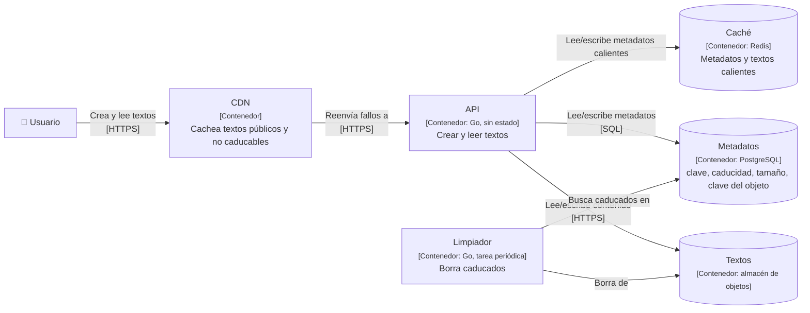

## Kata · Pastebin

**Tiempo:** 60 minutos. Aplica los 4 pasos del [proceso de diseño](/fase-1/05-adr-y-proceso/#el-proceso-de-diseño-en-4-pasos).

**Enunciado:** un servicio donde los usuarios pegan un texto (código, logs) y obtienen un enlace corto para compartirlo.

- Pegar un texto de hasta 1 MB → devuelve una URL corta (`pb.io/aB3xK9q`).
- Ver un texto por su URL.
- Caducidad opcional (10 minutos, 1 día, 1 mes, nunca).
- Textos privados: solo accesibles por quien tenga el enlace, que no debe ser adivinable.
- Sin cuentas de usuario (en esta versión).

Carga: 1 millón de textos nuevos al día; 10 lecturas por texto de media; tamaño medio 10 KB. Algunos textos se hacen virales (enlazados desde Reddit o Hacker News).

**Entrega:** estimación, C4 de Contenedores, API, modelo de datos, flujos de escritura y lectura, y 3 ADRs (almacenamiento del texto, generación de la URL corta, estrategia de caché y CDN).

### Guía de tiempos

| Minutos | Qué |
|---|---|
| 0–8 | Preguntas, requisitos, estimación |
| 8–25 | C4, API y modelo de datos |
| 25–45 | Profundizar: almacenamiento, IDs, lecturas virales |
| 45–60 | Caducidad, fallos, ADRs |

```respuesta id="f2-cierre-kata" titulo="Pastebin"
Tu diseño: requisitos, estimación, API, datos, C4, profundizar, fallos. Puedes seguir la plantilla de kata de los anexos.
```

<details>
<summary>Pista 1 · Estimación</summary>

10⁶ escrituras/día ≈ 12/s. Lecturas: ×10 ≈ 120/s de media, pero un texto viral puede recibir miles por segundo **él solo**. Almacenamiento: 10⁶ × 10 KB = 10 GB/día. ¿Dónde guardas 3,6 TB al año de texto?

</details>

<details>
<summary>Pista 2 · URL corta</summary>

Si es de un texto privado, la URL **es** el secreto. ¿Cuántos caracteres aleatorios base62 necesitas para que no sea adivinable? (62⁷ ≈ 3,5 × 10¹²; 62¹⁰ ≈ 8 × 10¹⁷.)

</details>

<details>
<summary>Solución de referencia</summary>

**Estimación**

| Magnitud | Cálculo | Conclusión |
|---|---|---|
| Escrituras | 10⁶/día ≈ 12/s (pico ~50/s) | Trivial para cualquier BD |
| Lecturas | ~120/s de media; miles/s en un viral | El reto son las **claves calientes** |
| Almacenamiento | 10 GB/día → 3,6 TB/año | Contenido al **almacén de objetos**; metadatos en BD |
| Metadatos | 10⁶ × ~200 B = 200 MB/día | Una BD relacional basta durante años |

**Contenedores**



**API**

- `POST /textos` (cuerpo: texto, caducidad, visibilidad) → `201 {"url": "..."}`. Con `Idempotency-Key` opcional.
- `GET /{clave}` → `200` con el texto; `404` si no existe o caducó.

**Modelo de datos:** `textos(clave PK, objeto_key, tamaño, visibilidad, creado_en, expira_en)`, con índice en `expira_en` para el limpiador.

**ADR 1 · Almacenamiento:** contenido en almacén de objetos (barato, duradero, ilimitado); metadatos en PostgreSQL. Alternativa descartada: el texto en la BD (engorda copias y réplicas; 3,6 TB/año). Consecuencia: dos escrituras por texto; si falla la segunda, queda un objeto huérfano, que un proceso de limpieza elimina.

**ADR 2 · URL corta:** **aleatoria** de 10 caracteres base62 generada con `crypto/rand` (≈ 8 × 10¹⁷ combinaciones), con `INSERT` que falla ante colisión (clave primaria) y reintento. Alternativas descartadas: un contador codificado en base62 (enumerable: expondría los textos privados) y un hash del contenido (textos iguales comparten URL y la caducidad se complica).

**ADR 3 · Caché:** textos públicos sin caducidad → CDN con TTL largo (son inmutables: nunca se editan). Con caducidad → TTL en la CDN acotado por `expira_en`. Privados → `Cache-Control: private` (no en la CDN compartida) y caché de aplicación. Los virales los absorbe la CDN. Protección contra estampida en la caché de aplicación con coalescencia de peticiones. Caché negativa de corta duración para claves inexistentes (bots que prueban URLs).

**Fallos y cierre**

- Si cae Redis: la BD aguanta ~120 lecturas/s sin problema; los virales los absorbe la CDN.
- Si cae el almacén de objetos: las lecturas fallan salvo lo cacheado; las escrituras devuelven `503`.
- Caducidad: la lectura comprueba `expira_en` (nunca se sirve un caducado aunque el limpiador vaya retrasado), y el limpiador borra en segundo plano.
- Abuso: límite de tamaño (1 MB), rate limiting por IP (Fase 7), detección de contenido malicioso.

</details>

### Autoevaluación

Con el [panel de revisión](/guia/panel-de-revision/), evalúa: **Requisitos, Estimación, Arquitectura, Datos, Escalabilidad, Fiabilidad, Trade-offs y Comunicación**. Guárdala en `docs/katas/fase-2-pastebin.md`.

## Revisión de Taquilla v1

- [ ] C4 de Contenedores con: CDN, balanceador, aplicación sin estado, BD, caché, cola con workers y almacén de objetos. Cada elemento con tecnología y responsabilidad.
- [ ] ADR de estado: dónde viven la sesión, el carrito y la **reserva temporal**.
- [ ] ADR de caché en el borde con la decisión sobre el mapa de asientos.
- [ ] ADR de caché del catálogo con la protección frente a estampidas y claves calientes.
- [ ] ADR del almacén principal justificado por patrones de acceso.
- [ ] ADR de notificaciones asíncronas con consumidor idempotente y DLQ.
- [ ] `api.md` con la API de reservas e idempotencia.
- [ ] ADR de identificadores (con el QR como secreto).
- [ ] Diagrama dinámico "ver la página de un evento": qué sale de la CDN, qué de la caché y qué de la BD.

## Preguntas de repaso

1. Tu balanceador saca de la rotación una instancia que está lenta, pero no caída. ¿Con qué tipo de health check lo consiguió?
2. ¿Por qué una caché con un 99 % de aciertos puede ser más peligrosa para la disponibilidad que una con un 50 %?
3. ¿Qué tienen en común la coalescencia de peticiones y el group commit de la [Fase 0](/fase-0/03-so-concurrencia-y-disco/)?
4. Un consumidor de la cola de emails se cae después de enviar el email y antes del ack. ¿Qué garantiza que el cliente no reciba dos emails?
5. ¿Por qué la paginación por offset y un índice B-tree no se llevan bien con `OFFSET 1000000`?
6. (De la Fase 1) Tu API tiene un p50 de 20 ms y un p99 de 900 ms. ¿Qué lección de esta fase te daría más pistas sobre la causa?

```respuesta id="f2-cierre-repaso" titulo="Preguntas de repaso"
Responde sin mirar las lecciones.
```

<details>
<summary>Respuestas</summary>

1. Un health check **pasivo** (detección de anomalías sobre el tráfico real con umbral de latencia) o timeouts. El activo contra `/health` suele seguir respondiendo bien.
2. Porque la BD se dimensiona para el 1 % de fallos. Si la caché se vacía, recibe **100 veces** su carga. Con un 50 %, solo el doble.
3. Ambas **agrupan** trabajo idéntico o compatible para hacerlo una vez: muchas lecturas de la misma clave → una consulta; muchas transacciones → un `fsync`.
4. Nada, salvo que el consumidor sea **idempotente**: por ejemplo, guardar el ID del mensaje procesado (o el ID de notificación) antes o de forma atómica con el envío, y descartar el mensaje si ya se procesó. Aun así, con un proveedor externo siempre queda una ventana; por eso muchos proveedores de email aceptan también una clave de idempotencia.
5. Porque el B-tree permite llegar rápido a una **clave**, pero no a una **posición**: para saltar un millón de filas hay que recorrerlas. El cursor convierte la posición en una clave (`WHERE (fecha, id) > …`).
6. Caché (fallos de caché, estampidas, claves calientes) y colas (esperas); también balanceo (una instancia lenta) y amplificación de cola por fan-out. El p99 alto con p50 bajo suele indicar un subconjunto de peticiones que sigue un camino distinto: fallo de caché, cola, reintento o instancia degradada.

</details>

## Criterios de dominio

- [ ] Para cada bloque sé decir qué problema resuelve y qué problema nuevo introduce.
- [ ] Elijo estrategia de caché y de invalidación según el patrón de lectura y escritura.
- [ ] Justifico SQL frente a NoSQL para un caso concreto sin caer en "NoSQL escala mejor".
- [ ] Diseño consumidores de colas idempotentes y sé razonar con la ley de Little.
- [ ] Diseño una API REST con paginación por cursor e idempotencia.
- [ ] Distingo identificadores de secretos.
- [ ] La kata puntúa al menos 3 en Arquitectura, Datos y Escalabilidad.

## Siguiente

[Fase 3 · Datos a escala](/fase-3/): el corazón de DDIA. Cómo se guardan, replican, reparten y protegen los datos.
