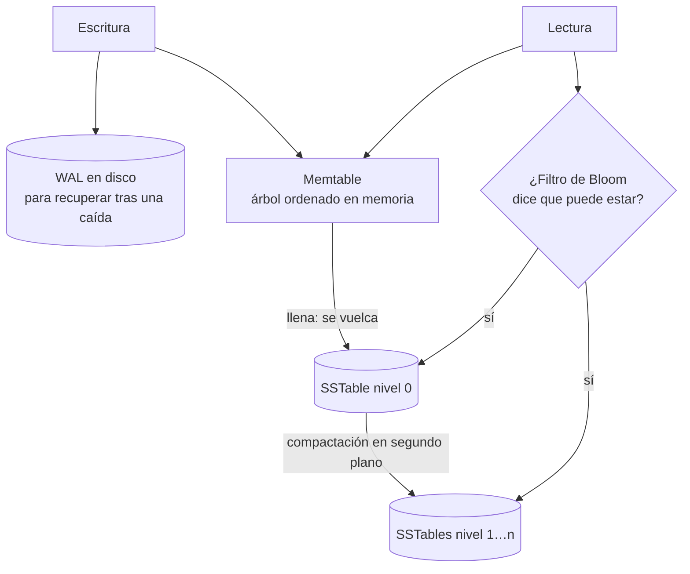

**Objetivo:** entender cómo guarda los datos una base de datos por dentro, para elegir motor y predecir su comportamiento bajo tu carga.
**Tiempo:** 1 semana
**Lecturas:** DDIA, capítulo de almacenamiento y recuperación · Opcional: *Database Internals*, capítulos de B-trees y de almacenamiento estructurado en log.

## Antes de leer: predice

1. La base de datos más simple del mundo: `echo "$clave,$valor" >> datos.log` para escribir, y `grep "^$clave," datos.log | tail -1` para leer. ¿Qué operación es rapidísima y cuál es terrible? ¿Cómo arreglarías la terrible?
2. Si nunca sobrescribes ni borras (solo añades al final), ¿qué pasa con el disco con el tiempo?

```respuesta id="f3-02-predice" titulo="Mis predicciones"
Antes de leer: responde con lo que sepas o intuyas. No importa acertar.
```

## De un log a un motor de verdad

Respuesta a la primera predicción: **escribir** es rapidísimo (añadir al final: escritura secuencial, [Fase 0](/fase-0/03-so-concurrencia-y-disco/#memoria-disco-y-durabilidad)). **Leer** es O(n): recorre el fichero entero. La solución es un **índice**: una estructura adicional que dice dónde está cada clave. Todo índice acelera las lecturas y ralentiza las escrituras.

### Log + índice hash (estilo Bitcask)

- Un map en memoria `clave → offset en el fichero`.
- Escribir: añadir al final y actualizar el map. Leer: un acceso a disco.
- Borrar: añadir una **lápida** (*tombstone*).
- Respuesta a la segunda predicción: el log crece sin fin. Se trocea en **segmentos** y se **compacta**: se reescriben solo los valores vivos más recientes.
- Al arrancar, se reconstruye el índice leyendo el log (o desde un snapshot del índice).
- Limitaciones: **todas las claves deben caber en memoria**, y las consultas por rango son imposibles (el hash no ordena).

### SSTables y LSM-trees

¿Y si mantenemos los segmentos **ordenados por clave**? Una *Sorted String Table* (SSTable) permite:

- Fusionar segmentos como en *merge sort*, de forma eficiente.
- Un índice **disperso** en memoria (una clave cada pocos KB): lo demás se encuentra buscando cerca.
- Consultas por **rango**.

¿Cómo se escriben ordenados si las escrituras llegan desordenadas? Así funciona un **LSM-tree** (*Log-Structured Merge-tree*):



- Las lecturas buscan en la memtable, luego en los segmentos del más nuevo al más viejo. Un **filtro de Bloom** por segmento evita buscar donde la clave seguro que no está.
- Ejemplos: LevelDB, RocksDB, Cassandra, ScyllaDB, HBase.

### B-trees

El índice más extendido (PostgreSQL, MySQL/InnoDB, SQL Server, SQLite):

- Divide los datos en **páginas** de tamaño fijo (4–16 KB), organizadas en un árbol ordenado con un factor de ramificación de cientos. Un B-tree de 4 niveles con páginas de 4 KB y 500 hijos por página direcciona ~256 TB.
- Las escrituras **sobrescriben la página en su sitio**. Para sobrevivir a una caída a mitad de escritura (una división de página toca varias páginas), primero se escribe en el **WAL**.
- Una clave está en **un solo lugar**: lectura predecible.

### LSM frente a B-tree

| | LSM-tree | B-tree |
|---|---|---|
| Escrituras | Más rápidas (secuenciales, en lote) | Más lentas (escrituras aleatorias de páginas + WAL) |
| Lecturas | Pueden consultar varios segmentos | Predecibles: un camino en el árbol |
| Amplificación de escritura | Por compactación (reescribe datos varias veces) | Por páginas completas y WAL |
| Espacio | Compacta y comprime mejor | Fragmentación de páginas |
| Riesgo | La compactación compite con las escrituras; si no da abasto, las lecturas se degradan | Maduro y predecible |

**Amplificación de escritura:** una escritura lógica provoca varias físicas. En SSD, además, desgasta el dispositivo. Regla general, **a verificar con tu carga**: LSM para cargas con muchas escrituras; B-tree para lecturas predecibles y transacciones. Mide.

## Índices secundarios y dónde vive la fila

- **Índice secundario:** por una columna que no es la clave primaria. Puede tener duplicados.
- **Heap + índices:** los índices apuntan a la fila en un *heap* (PostgreSQL). Todos los índices apuntan al mismo sitio.
- **Índice agrupado** (*clustered*): la fila vive **dentro** del índice primario (InnoDB). Los secundarios apuntan a la clave primaria.
- **Índice de cobertura:** incluye columnas extra para responder la consulta sin ir a la fila (`Index Only Scan` en PostgreSQL, [Fase 0](/fase-0/04-bases-de-datos/#leer-un-plan-de-ejecución)).

## OLTP frente a OLAP

| | OLTP (transaccional) | OLAP (analítico) |
|---|---|---|
| Patrón de acceso | Pocas filas por clave, lectura y escritura | Agregaciones sobre millones de filas, pocas columnas |
| Usuarios | La aplicación, usuarios finales | Analistas, informes |
| Volumen | GB–TB | TB–PB |
| Ejemplo | "Reserva el asiento A5" | "Ventas por ciudad y mes del último año" |

Por eso se separan: un **almacén de datos** (*data warehouse*) recibe copias de las bases OLTP (ETL, Fase 6) y se organiza para analítica.

### Almacenamiento por columnas

Una consulta analítica lee 3 columnas de una tabla de 100. Si los datos se guardan **por filas**, se leen las 100. **Por columnas**, cada columna va en su propio fichero: solo se leen 3. Y como una columna tiene valores parecidos, **comprime muchísimo** (codificación por diccionario, *run-length*). Ejemplos: ClickHouse, BigQuery, Snowflake, Parquet como formato de fichero.

## Ejercicios

### Ejercicio 1 · Tu propio motor (Go)

Convierte el almacén de tu KV store HTTP en un motor persistente estilo Bitcask:

1. **Formato de registro:** `[crc32][long. clave][long. valor][clave][valor]`, con un valor de longitud especial como lápida.
2. `Put`, `Get` y `Delete` sobre un único fichero de log, con índice hash en memoria. `fsync` en cada escritura.
3. **Recuperación:** al abrir, reconstruir el índice recorriendo el log. Si el **último registro está incompleto** (caída a mitad de escritura), descartarlo.
4. **Compactación:** reescribir solo las claves vivas en un fichero nuevo y sustituir el viejo **de forma atómica**.
5. Los tests reabren el fichero, simulan un registro final truncado y compactan comprobando que el fichero encoge y los datos siguen. Trabajan en un directorio temporal (`t.TempDir()`).

```go practica id="f3-bitcask" titulo="Motor estilo Bitcask"
package practica

import (
	"errors"
	"os"
)

var ErrNoEncontrado = errors.New("no encontrado")

// Formato de registro: [crc32 4B][long. clave 4B][long. valor 4B][clave][valor]
// Una longitud de valor 0xFFFFFFFF marca un borrado (lápida).

type Store struct {
	ruta string
	f    *os.File
	// TODO: índice en memoria, siguiente offset, mutex…
}

// Open abre (o crea) el log y reconstruye el índice. Descarta un registro final incompleto.
func Open(ruta string) (*Store, error) {
	return nil, errors.New("TODO")
}

func (s *Store) Put(clave string, valor []byte) error { return errors.New("TODO") }

// Get devuelve ErrNoEncontrado si la clave no existe o se borró.
func (s *Store) Get(clave string) ([]byte, error) { return nil, errors.New("TODO") }

func (s *Store) Delete(clave string) error { return errors.New("TODO") }

// Compactar reescribe solo los valores vivos y sustituye el log de forma atómica.
func (s *Store) Compactar() error { return errors.New("TODO") }

func (s *Store) Close() error { return nil }
```

```go tests id="f3-bitcask"
package practica

import (
	"errors"
	"path/filepath"
	"testing"
)

func TestPutGetDelete(t *testing.T) {
	s, err := Open(filepath.Join(t.TempDir(), "datos.log"))
	if err != nil {
		t.Fatal(err)
	}
	defer s.Close()
	if err := s.Put("a", []byte("uno")); err != nil {
		t.Fatal(err)
	}
	s.Put("a", []byte("dos"))
	if v, err := s.Get("a"); err != nil || string(v) != "dos" {
		t.Fatalf("Get(a) = %q, %v; quiero \"dos\"", v, err)
	}
	s.Delete("a")
	if _, err := s.Get("a"); !errors.Is(err, ErrNoEncontrado) {
		t.Fatalf("tras borrar, err = %v; quiero ErrNoEncontrado", err)
	}
}

func TestSobreviveAlReinicio(t *testing.T) {
	ruta := filepath.Join(t.TempDir(), "datos.log")
	s, _ := Open(ruta)
	for i := range 100 {
		s.Put("contador", []byte{byte(i)})
	}
	s.Put("b", []byte("hola"))
	s.Put("c", []byte("x"))
	s.Delete("c")
	s.Close()

	s, err := Open(ruta)
	if err != nil {
		t.Fatal(err)
	}
	defer s.Close()
	if v, _ := s.Get("contador"); len(v) != 1 || v[0] != 99 {
		t.Errorf("contador = %v; quiero el último valor, 99", v)
	}
	if v, _ := s.Get("b"); string(v) != "hola" {
		t.Errorf("b = %q", v)
	}
	if _, err := s.Get("c"); !errors.Is(err, ErrNoEncontrado) {
		t.Error("c estaba borrada antes de reiniciar")
	}
}
```

```go tests-extra id="f3-bitcask"
package practica

import (
	"errors"
	"os"
	"path/filepath"
	"testing"
)

func TestRegistroFinalTruncado(t *testing.T) {
	ruta := filepath.Join(t.TempDir(), "datos.log")
	s, _ := Open(ruta)
	s.Put("a", []byte("intacto"))
	s.Close()

	f, _ := os.OpenFile(ruta, os.O_WRONLY|os.O_APPEND, 0)
	f.Write([]byte{1, 2, 3, 4, 5}) // un registro a medio escribir: la luz se fue aquí
	f.Close()

	s, err := Open(ruta)
	if err != nil {
		t.Fatalf("Open con un registro final incompleto: %v", err)
	}
	defer s.Close()
	if v, _ := s.Get("a"); string(v) != "intacto" {
		t.Errorf("a = %q", v)
	}
	if err := s.Put("b", []byte("después")); err != nil {
		t.Fatal(err)
	}
	s.Close()
	s, _ = Open(ruta) // lo escrito tras la basura debe poder leerse al reabrir
	if v, _ := s.Get("b"); string(v) != "después" {
		t.Errorf("b = %q: ¿escribiste detrás de los bytes corruptos sin descartarlos?", v)
	}
}

func TestCompactar(t *testing.T) {
	ruta := filepath.Join(t.TempDir(), "datos.log")
	s, _ := Open(ruta)
	defer s.Close()
	for i := range 200 {
		s.Put("a", []byte{byte(i)})
	}
	s.Put("borrada", []byte("x"))
	s.Delete("borrada")
	antes, _ := os.Stat(ruta)
	if err := s.Compactar(); err != nil {
		t.Fatal(err)
	}
	despues, _ := os.Stat(ruta)
	if despues.Size() >= antes.Size() {
		t.Errorf("el fichero no encoge: %d → %d bytes", antes.Size(), despues.Size())
	}
	if v, _ := s.Get("a"); len(v) != 1 || v[0] != 199 {
		t.Errorf("a = %v tras compactar", v)
	}
	if _, err := s.Get("borrada"); !errors.Is(err, ErrNoEncontrado) {
		t.Error("la clave borrada reaparece tras compactar")
	}
	s.Put("nueva", []byte("ok"))
	if v, _ := s.Get("nueva"); string(v) != "ok" {
		t.Error("no se puede escribir después de compactar")
	}
}
```

<details>
<summary>Pista 1 · Formato</summary>

`encoding/binary.BigEndian.PutUint32` para las cabeceras y `hash/crc32.ChecksumIEEE` para detectar corrupción. Para lápida, usa `0xFFFFFFFF` como longitud de valor.

</details>

<details>
<summary>Pista 2 · Recuperación y atomicidad</summary>

Al recorrer el log, un `io.ErrUnexpectedEOF` o un CRC incorrecto en el último registro significa que la escritura se cortó: trunca el fichero hasta el último registro bueno. Para la compactación atómica: escribe en `datos.log.compact`, haz `fsync` y luego `os.Rename` sobre el original (en POSIX, `rename` es atómico).

</details>

<details>
<summary>Solución</summary>

```go solucion id="f3-bitcask"
package practica

import (
	"bufio"
	"encoding/binary"
	"errors"
	"fmt"
	"hash/crc32"
	"io"
	"os"
	"sync"
)

// Formato de registro:
// [crc32 4B][len clave 4B][len valor 4B][clave][valor]
// Un len de valor igual a lapida marca un borrado.
const (
	cabecera = 12
	lapida   = ^uint32(0)
)

var ErrNoEncontrado = errors.New("no encontrado")

type Store struct {
	mu     sync.RWMutex
	ruta   string
	f      *os.File
	indice map[string]int64 // clave -> offset del registro más reciente
	fin    int64            // offset donde se escribirá el próximo registro
}

func Open(ruta string) (*Store, error) {
	f, err := os.OpenFile(ruta, os.O_CREATE|os.O_RDWR, 0o644)
	if err != nil {
		return nil, err
	}
	s := &Store{ruta: ruta, f: f, indice: map[string]int64{}}
	if err := s.reconstruir(); err != nil {
		f.Close()
		return nil, err
	}
	return s, nil
}

// reconstruir recorre el log entero para rehacer el índice en memoria.
func (s *Store) reconstruir() error {
	r := bufio.NewReader(io.NewSectionReader(s.f, 0, 1<<62))
	var off int64
	for {
		clave, _, borrado, n, err := leerRegistro(r)
		if errors.Is(err, io.EOF) {
			break
		}
		if err != nil {
			// Registro final incompleto o corrupto (caída a mitad de escritura):
			// se descarta la cola del fichero.
			if err := s.f.Truncate(off); err != nil {
				return err
			}
			break
		}
		if borrado {
			delete(s.indice, clave)
		} else {
			s.indice[clave] = off
		}
		off += n
	}
	s.fin = off
	return nil
}

func leerRegistro(r io.Reader) (clave string, valor []byte, borrado bool, n int64, err error) {
	var cab [cabecera]byte
	if _, err = io.ReadFull(r, cab[:]); err != nil {
		if errors.Is(err, io.ErrUnexpectedEOF) {
			err = fmt.Errorf("cabecera incompleta: %w", err)
		}
		return
	}
	crc := binary.BigEndian.Uint32(cab[0:4])
	lk := binary.BigEndian.Uint32(cab[4:8])
	lv := binary.BigEndian.Uint32(cab[8:12])
	borrado = lv == lapida
	if borrado {
		lv = 0
	}
	cuerpo := make([]byte, lk+lv)
	if _, err = io.ReadFull(r, cuerpo); err != nil {
		err = fmt.Errorf("cuerpo incompleto: %w", err)
		return
	}
	if crc32.ChecksumIEEE(append(cab[4:12:12], cuerpo...)) != crc {
		err = errors.New("crc incorrecto")
		return
	}
	return string(cuerpo[:lk]), cuerpo[lk:], borrado, int64(cabecera) + int64(lk) + int64(lv), nil
}

func codificar(clave string, valor []byte, borrado bool) []byte {
	lv := uint32(len(valor))
	if borrado {
		lv, valor = lapida, nil
	}
	buf := make([]byte, cabecera+len(clave)+len(valor))
	binary.BigEndian.PutUint32(buf[4:8], uint32(len(clave)))
	binary.BigEndian.PutUint32(buf[8:12], lv)
	copy(buf[cabecera:], clave)
	copy(buf[cabecera+len(clave):], valor)
	binary.BigEndian.PutUint32(buf[0:4], crc32.ChecksumIEEE(buf[4:]))
	return buf
}

func (s *Store) anadir(clave string, valor []byte, borrado bool) (int64, error) {
	reg := codificar(clave, valor, borrado)
	off := s.fin
	if _, err := s.f.WriteAt(reg, off); err != nil {
		return 0, err
	}
	if err := s.f.Sync(); err != nil { // durabilidad: ver Fase 0, lección 3
		return 0, err
	}
	s.fin += int64(len(reg))
	return off, nil
}

func (s *Store) Put(clave string, valor []byte) error {
	s.mu.Lock()
	defer s.mu.Unlock()
	off, err := s.anadir(clave, valor, false)
	if err != nil {
		return err
	}
	s.indice[clave] = off
	return nil
}

func (s *Store) Delete(clave string) error {
	s.mu.Lock()
	defer s.mu.Unlock()
	if _, ok := s.indice[clave]; !ok {
		return nil
	}
	if _, err := s.anadir(clave, nil, true); err != nil {
		return err
	}
	delete(s.indice, clave)
	return nil
}

func (s *Store) Get(clave string) ([]byte, error) {
	s.mu.RLock()
	defer s.mu.RUnlock()
	off, ok := s.indice[clave]
	if !ok {
		return nil, ErrNoEncontrado
	}
	_, valor, _, _, err := leerRegistro(io.NewSectionReader(s.f, off, s.fin-off))
	return valor, err
}

// Compactar reescribe solo los valores vivos en un fichero nuevo y lo
// sustituye de forma atómica con un rename.
func (s *Store) Compactar() error {
	s.mu.Lock()
	defer s.mu.Unlock()
	tmp := s.ruta + ".compact"
	nf, err := os.OpenFile(tmp, os.O_CREATE|os.O_TRUNC|os.O_RDWR, 0o644)
	if err != nil {
		return err
	}
	nuevo := make(map[string]int64, len(s.indice))
	var off int64
	for clave, viejo := range s.indice {
		_, valor, _, _, err := leerRegistro(io.NewSectionReader(s.f, viejo, s.fin-viejo))
		if err != nil {
			nf.Close()
			return err
		}
		reg := codificar(clave, valor, false)
		if _, err := nf.WriteAt(reg, off); err != nil {
			nf.Close()
			return err
		}
		nuevo[clave] = off
		off += int64(len(reg))
	}
	if err := nf.Sync(); err != nil {
		nf.Close()
		return err
	}
	if err := os.Rename(tmp, s.ruta); err != nil {
		nf.Close()
		return err
	}
	s.f.Close()
	s.f, s.indice, s.fin = nf, nuevo, off
	return nil
}

func (s *Store) Close() error { return s.f.Close() }
```

Limitaciones que conviene que puedas explicar: la compactación bloquea todas las escrituras (Bitcask real compacta segmentos cerrados mientras se escribe en el activo); el `fsync` por escritura limita el throughput (¿group commit?); para ser 100 % correcto, tras el `rename` habría que hacer `fsync` también del **directorio**; y todas las claves deben caber en memoria.

</details>

### Ejercicio 2 · ¿Qué motor?

1. Ingesta de 500.000 eventos de telemetría por segundo, consultados por dispositivo y rango de tiempo.
2. El inventario de asientos de Taquilla: lecturas y actualizaciones por clave, con transacciones.
3. "Ingresos por ciudad y mes de los últimos 3 años", sobre 2.000 millones de entradas vendidas.

```respuesta id="f3-02-ej2" titulo="¿Qué motor?"
Escribe aquí tu razonamiento antes de abrir las pistas.
```

<details>
<summary>Solución</summary>

1. **LSM-tree** (Cassandra, ScyllaDB o un motor de series temporales): escrituras masivas y secuenciales; rangos por clave ordenada.
2. **B-tree** (PostgreSQL): lecturas predecibles, actualizaciones en su sitio, transacciones maduras.
3. **Almacén columnar** (ClickHouse, BigQuery): lee solo 3 columnas comprimidas de miles de millones de filas.

</details>

## Taquilla

Añade al modelo de datos los **índices** de cada tabla central, justificando cada uno con una consulta concreta. Identifica la consulta analítica que **no** debería ejecutarse contra la base de datos transaccional y anota dónde iría (se resuelve en la Fase 6).

## Autorrevisión

- [ ] Explico cómo funciona un LSM-tree (memtable, WAL, SSTables, compactación, filtros de Bloom).
- [ ] Explico cómo funciona un B-tree y por qué necesita WAL.
- [ ] Sé cuándo un LSM-tree gana a un B-tree y al revés.
- [ ] Sé por qué la analítica usa almacenamiento por columnas.
- [ ] Mi motor Bitcask sobrevive a una caída a mitad de escritura.

## Para la sesión de tutor

Trae tu motor. Te preguntaré qué pasa si el proceso muere **durante** la compactación, en cada línea del código.
