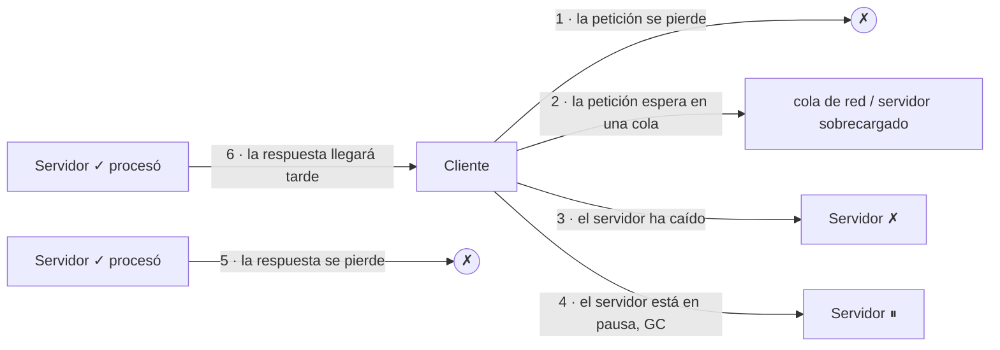

**Objetivo:** razonar sobre un sistema en el que cualquier mensaje puede perderse o retrasarse, cualquier reloj puede mentir y cualquier proceso puede congelarse, y aun así saber qué se puede garantizar.
**Tiempo:** 1 semana
**Lecturas:** *Understanding Distributed Systems*, parte de comunicación · DDIA, capítulo sobre los problemas de los sistemas distribuidos (redes no fiables, relojes no fiables, "conocimiento, verdad y mentiras").

## Antes de leer: predice

1. Envías una petición a otro servicio y no recibes respuesta en 5 segundos. Enumera **todo** lo que puede haber pasado.
2. Dos servidores registran un evento cada uno, con `time.Now()`. El del servidor A tiene una marca anterior a la del B. ¿Ocurrió antes el de A?
3. Un proceso tiene un "lock" con caducidad de 10 s. Comprueba que le quedan 8 s y empieza a escribir. ¿Puede estar escribiendo sin tener el lock?

```respuesta id="f4-01-predice" titulo="Mis predicciones"
Antes de leer: responde con lo que sepas o intuyas. No importa acertar.
```

## Fallos parciales

En un solo ordenador, las cosas funcionan o no: un bug de memoria suele tumbar el proceso entero. En un sistema distribuido, **una parte puede fallar mientras el resto sigue**, y a menudo **no sabes qué parte ni si ha fallado**. Esto es lo que hace difícil el tema: no el fallo, sino la **incertidumbre**.

## Redes no fiables

La mayoría de sistemas se comunican por redes asíncronas por paquetes: no hay garantía de cuándo llegará un mensaje, ni de que llegue. Respuesta a la primera predicción, desde el cliente **no se distingue** entre:



Lo único que ves en los seis casos es **silencio**. En el 5 y el 6 el servidor **sí hizo el trabajo**. Por eso reintentar a ciegas es peligroso (lección 5) y por eso "caído" y "lento" son indistinguibles.

### Timeouts

El timeout es la **única** herramienta para detectar fallos, y no hay un valor correcto:

- **Corto:** detectas antes, pero declaras muerto a un nodo que solo iba lento. Si ese nodo tenía trabajo, se reasigna a otros, que ya estaban cargados: puedes provocar un **fallo en cascada**.
- **Largo:** tardas en detectar y los usuarios esperan.

Los retrasos varían sobre todo por **colas**: en los switches, en el sistema operativo, en la aplicación (un servidor saturado), en el hipervisor. Por eso las redes compartidas tienen colas de latencia muy largas. Alternativas a un valor fijo: medir la distribución de tiempos de respuesta y ajustar el timeout a ella (**timeouts adaptativos**, como el *Phi Accrual failure detector* de Cassandra o el RTO de TCP).

### Particiones de red

Una **partición** separa la red en grupos que no se ven entre sí, aunque cada grupo funcione. Ocurren más de lo que parece: fallos de switches, configuraciones erróneas, incluso tiburones mordiendo cables submarinos. Diseña asumiendo que **pasarán**, y decide qué hace el sistema cuando pasan (lección 3).

## Relojes no fiables

Cada máquina tiene su propio reloj de cuarzo, que **deriva** (Google asume hasta 200 partes por millón, unos 17 segundos al día sin corregir). Se corrigen con NTP, que como mucho consigue precisiones de milisegundos en buenas condiciones, y a veces mucho peores.

Hay **dos relojes** distintos:

| | Reloj de pared (*time-of-day*) | Reloj monotónico |
|---|---|---|
| Qué mide | La fecha y hora "reales" | Tiempo transcurrido desde un punto arbitrario |
| ¿Puede saltar hacia atrás? | **Sí** (NTP lo corrige, segundos intercalares) | No |
| Úsalo para | Mostrar fechas | **Medir duraciones y timeouts** |

En Go, `time.Now()` lleva ambas lecturas, y `time.Since(t)` usa la monotónica. En otros lenguajes, cuidado: restar dos marcas de reloj de pared para medir una duración puede dar un número **negativo**.

Respuesta a la segunda predicción: **no puedes saberlo.** Si la diferencia es menor que el error de sincronización de los relojes, el orden de las marcas no dice nada. Esto rompe estrategias que parecen razonables, como **"la última escritura gana"** (LWW) por marca de tiempo: una escritura de un nodo con el reloj adelantado puede **ganar siempre** y descartar en silencio escrituras posteriores.

Un reloj debería verse como un **intervalo de confianza**, no como un punto. Google Spanner lo hace explícito con **TrueTime**, que devuelve `[más temprano, más tarde]` y **espera** la incertidumbre antes de confirmar, usando GPS y relojes atómicos para que sea pequeña.

## Pausas de proceso

Un proceso puede **congelarse** en cualquier línea durante un tiempo arbitrario, sin enterarse:

- Pausas de recolección de basura ("stop the world").
- La máquina virtual se suspende o migra en caliente.
- El sistema operativo quita la CPU al hilo, o hace swapping.
- Alguien envía `SIGSTOP`.

Respuesta a la tercera predicción: **sí.**

```text
while true:
    if lease.caduca_en - ahora() > 2s:   # quedan 8 s: todo bien
        # ← aquí el proceso se congela 15 s por una pausa de GC
        procesar_peticion()               # el lease caducó hace 7 s y otro nodo ya lo tiene
```

El proceso comprueba el lease, se congela, y al despertar **cree** que sigue teniéndolo. Otro nodo lo ha obtenido entretanto y ahora **dos escriben a la vez**. No se arregla comprobando "más cerca" de la escritura: la pausa puede ocurrir en cualquier línea. Se arregla haciendo que **el recurso** rechace al que ya no es dueño: **tokens de fencing** (lección 4).

## La verdad la decide la mayoría

Un nodo no puede fiarse de su propia visión. Un nodo que sale de una pausa larga, o que está aislado por una partición, puede creerse líder cuando los demás ya lo han sustituido. Por eso los sistemas distribuidos toman decisiones por **quórum**: una **mayoría** de nodos. Dos mayorías siempre se solapan, así que no puede haber dos decisiones contradictorias.

## Modelos de sistema

Para razonar sobre algoritmos se fijan supuestos:

- **Tiempo:** síncrono (retrasos acotados: irreal), **parcialmente síncrono** (casi siempre acotados, a veces no: el realista) o asíncrono (sin ningún supuesto de tiempo).
- **Fallos de nodo:** parada (*crash-stop*), **parada y recuperación** (*crash-recovery*: vuelve con lo que tenía en disco; el realista) o **bizantinos** (nodos que mienten: relevante en blockchains o aviónica, no en un centro de datos propio).

Y dos tipos de propiedades:

- **Seguridad** (*safety*): "nunca pasa nada malo" (nunca dos líderes, nunca dos ventas de un asiento). Si se viola, se viola en un instante concreto y no tiene arreglo.
- **Vitalidad** (*liveness*): "al final pasa algo bueno" (al final se elige líder, al final se responde). Puede cumplirse más tarde.

Los buenos algoritmos garantizan la **seguridad siempre** y la vitalidad **cuando las condiciones lo permiten**.

## Ejercicios

### Ejercicio 1 · Gossip Glomers: Echo y Unique IDs

Instala Maelstrom y resuelve los retos 1 (Echo) y 2 (Unique ID Generation) de fly.io/dist-sys.

En el 2, Maelstrom comprueba unicidad **con particiones de red**: los nodos no pueden coordinarse. Compara tu solución con el [generador Snowflake de la Fase 2](/fase-2/07-objetos-e-ids/#ejercicio-1--generador-snowflake-go): ¿qué información de la que usa Snowflake te da Maelstrom gratis?

```respuesta id="f4-01-ej1" titulo="Gossip Glomers: Echo y Unique IDs"
Escribe aquí tu razonamiento antes de abrir las pistas.
```

<details>
<summary>Pista</summary>

Cada nodo tiene un ID único (`n0`, `n1`…), y cada nodo puede llevar un contador local. ¿Hace falta un reloj?

</details>

### Ejercicio 2 · ¿Qué ha pasado?

Para cada situación, di qué puede haber ocurrido y qué haría un diseño robusto:

1. El servicio de pagos no responde en 3 s a un "cobrar 45 €".
2. Un nodo de la base de datos deja de enviar heartbeats al resto durante 12 s y luego vuelve como si nada.
3. Dos réplicas con "la última escritura gana" tienen el reloj desfasado 800 ms. Un usuario cambia su dirección dos veces en 500 ms.
4. Tu servicio mide la duración de las peticiones con la diferencia de dos `System.currentTimeMillis()` (reloj de pared) y a veces registra duraciones negativas.

```respuesta id="f4-01-ej2" titulo="¿Qué ha pasado?"
Escribe aquí tu razonamiento antes de abrir las pistas.
```

<details>
<summary>Solución</summary>

1. Cualquiera de los seis casos: incluido que **ya se haya cobrado**. No reintentar a ciegas: reintentar **con la misma clave de idempotencia** (lección 5) o consultar el estado del cobro.
2. Una pausa larga (GC, VM) o una partición. Mientras tanto, el resto puede haberlo declarado muerto y promovido otro líder. Al volver no debe asumir que sigue siendo líder: debe comprobar el **término** actual (Raft) y los recursos deben rechazar sus escrituras con **fencing**.
3. Si el segundo cambio lo procesó la réplica con el reloj **atrasado**, puede tener una marca **anterior** al primero: gana el **viejo**, y el nuevo se descarta sin error. Soluciones: no usar LWW para datos que importan, usar versiones lógicas (lección 2) o enrutar las escrituras de un usuario al mismo líder.
4. Correcciones de NTP que mueven el reloj de pared hacia atrás. Usar un reloj **monotónico** para duraciones.

</details>

### Ejercicio 3 · Timeouts con números

Un servicio tiene una latencia p50 = 20 ms, p99 = 200 ms y p999 = 2 s. Le pones un timeout de 250 ms y reintentas una vez al vencer.

1. ¿Qué proporción de peticiones hace timeout en el primer intento?
2. Si el servicio empieza a degradarse y su p50 sube a 300 ms, ¿qué pasa con la carga que recibe?

```respuesta id="f4-01-ej3" titulo="Timeouts con números"
Escribe aquí tu razonamiento antes de abrir las pistas.
```

<details>
<summary>Solución</summary>

1. Algo menos del 1 % (entre el p99 y el p999).
2. Casi **todas** las peticiones hacen timeout y se reintentan: el servicio recibe **el doble** de carga justo cuando está degradado. Además, el trabajo de los primeros intentos se sigue haciendo aunque nadie espere el resultado. Es una receta para el colapso. Remedios (Fase 7): reintentos con **backoff exponencial y jitter**, **presupuestos de reintento** (por ejemplo, reintentos como máximo el 10 % de las peticiones), **circuit breakers** y propagar el plazo (`context`) para que el servidor abandone trabajo que ya nadie espera.

</details>

## Taquilla

Empieza `docs/fallos.md`. Para cada llamada entre componentes del C4 de Contenedores (app → BD, app → caché, app → PSP, PSP → webhook, worker → email…), anota:

1. Qué timeout pondrías y por qué.
2. Qué haces si vence: ¿reintentas? ¿Es seguro reintentar?
3. Qué pasa si la respuesta se pierde **después** de que el otro lado hizo el trabajo.

## Autorrevisión

- [ ] Enumero los seis escenarios indistinguibles de un "no hay respuesta".
- [ ] Sé por qué no hay un timeout correcto y qué es un timeout adaptativo.
- [ ] Distingo reloj de pared y monotónico, y sé por qué LWW pierde datos.
- [ ] Explico cómo una pausa de proceso rompe un lease.
- [ ] Distingo propiedades de seguridad y de vitalidad.

## Para la sesión de tutor

Trae tu `fallos.md`. Elegiré una llamada y te preguntaré qué pasa en cada uno de los seis escenarios.
