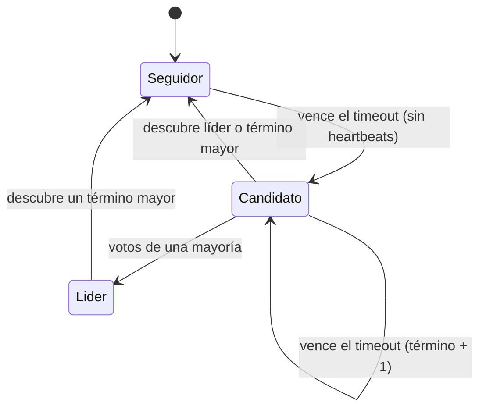
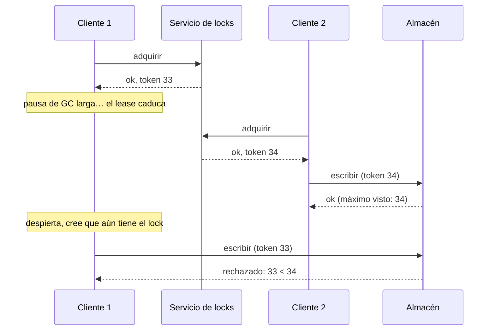

**Objetivo:** entender cómo un grupo de nodos se pone de acuerdo a pesar de fallos, cuándo necesitas consenso y cómo usarlo (casi nunca implementándolo tú).
**Tiempo:** 1 semana
**Lecturas:** Paper de **Raft** (secciones 5.1–5.4 imprescindibles) · Visualización en raft.github.io y *The Secret Lives of Data* (thesecretlivesofdata.com/raft) · DDIA, capítulo de consistencia y consenso (consenso, servicios de coordinación) · *Patterns of Distributed Systems*: *Leader and Followers*, *Generation Clock*, *Lease*.

## Antes de leer: predice

1. Cinco nodos. Una partición los separa en un grupo de 2 (que incluye al líder actual) y otro de 3. ¿Qué grupo debería poder seguir aceptando escrituras? ¿Qué pasa con el líder?
2. ¿Por qué los clústeres de consenso tienen casi siempre 3 o 5 nodos, y no 4 o 6?

```respuesta id="f4-04-predice" titulo="Mis predicciones"
Antes de leer: responde con lo que sepas o intuyas. No importa acertar.
```

## Para qué sirve el consenso

Consenso es conseguir que varios nodos **acuerden un valor** y no cambien de opinión, aunque algunos fallen. Parece abstracto, pero muchos problemas son consenso disfrazado:

- **Elegir un líder** (y que no haya dos).
- **Locks y leases** distribuidos.
- **Unicidad:** que dos nodos no asignen el mismo nombre o el mismo asiento.
- **Commit atómico** en varios nodos.
- **Log replicado:** acordar el orden de todas las operaciones. Si todos los nodos aplican el mismo log en el mismo orden, todos llegan al mismo estado (**máquina de estados replicada**). Es la forma general.

### El resultado FLP

Fischer, Lynch y Paterson (1985) demostraron que, en un modelo **completamente asíncrono** (sin ningún supuesto de tiempo), ningún algoritmo determinista garantiza llegar a consenso si un solo nodo puede fallar. En la práctica se esquiva usando **timeouts** (modelo parcialmente síncrono): los algoritmos reales **siempre son seguros** y **terminan cuando la red se porta razonablemente**.

## Raft

Raft se diseñó para ser **comprensible** (a diferencia de Paxos). Es el que usan etcd, Consul, CockroachDB, TiKV y muchos más.

### Roles y términos

Cada nodo es **seguidor**, **candidato** o **líder**. El tiempo se divide en **términos** numerados; cada término tiene como mucho un líder. El número de término funciona como un **reloj lógico**: un nodo que ve un término mayor que el suyo sabe que va atrasado y se convierte en seguidor.

### Elección



1. El líder envía **heartbeats** periódicos. Si un seguidor no recibe nada durante su **timeout de elección** (aleatorio, por ejemplo entre 150 y 300 ms), se convierte en candidato.
2. El candidato **incrementa el término**, se vota a sí mismo y pide votos a los demás.
3. Cada nodo vota **como mucho una vez por término**, y solo a un candidato cuyo log esté **al menos tan actualizado** como el suyo (mayor término en la última entrada o, a igual término, log más largo).
4. Con los votos de una **mayoría**, es líder.

La aleatoriedad del timeout evita que todos se presenten a la vez y se repartan los votos eternamente.

### Replicación del log

1. El cliente envía la operación al líder, que la **añade a su log**.
2. El líder la envía a los seguidores (`AppendEntries`, que también sirve de heartbeat).
3. Cuando una **mayoría** la tiene, la entrada está **confirmada** (*committed*): el líder la aplica a su máquina de estados y responde al cliente. Los seguidores la aplican cuando se enteran.
4. Si el log de un seguidor difiere del del líder, el líder lo **corrige** (los seguidores descartan sus entradas en conflicto). El líder nunca sobrescribe ni borra entradas de su propio log.

### Por qué es seguro

- **Una mayoría en cada decisión:** dos mayorías siempre comparten al menos un nodo. Una entrada confirmada está en una mayoría, y cualquier candidato necesita votos de una mayoría, así que **al menos un votante tiene la entrada**.
- **Restricción de elección:** ese votante no vota a un candidato con el log menos actualizado. Resultado: **todo líder tiene todas las entradas confirmadas.**

Respuesta a la primera predicción: el grupo de **3** tiene mayoría: elige un nuevo líder (término mayor) y sigue. El viejo líder, en el grupo de 2, puede seguir **creyéndose** líder y aceptando peticiones, pero **no puede confirmar nada**: no llega a una mayoría. Cuando la partición se cura, ve el término mayor, se convierte en seguidor y sus entradas no confirmadas se descartan. Seguridad garantizada; el lado minoritario pierde disponibilidad (es un sistema **CP**).

Respuesta a la segunda predicción: con **2f + 1** nodos se toleran **f** fallos. 3 nodos toleran 1; 4 nodos… también solo 1 (la mayoría de 4 es 3). El cuarto nodo añade coste y latencia sin añadir tolerancia. 5 nodos toleran 2.

### El coste del consenso

- Cada escritura espera a una **mayoría**: al menos un viaje de ida y vuelta. Con nodos en varias regiones, decenas o cientos de ms.
- Todo pasa por el líder: el throughput de escritura está limitado.
- Timeouts mal ajustados en redes inestables provocan **elecciones continuas**, y sin líder no hay escrituras.

Por eso el consenso se usa para **lo que tiene que ser consistente y es pequeño** (metadatos, configuración, locks, quién es líder de qué partición), no para todos los datos.

## Servicios de coordinación

No implementes Raft en tu aplicación. Usa un **servicio de coordinación**: **etcd**, **ZooKeeper** o Consul. Ofrecen:

- Operaciones **linearizables** sobre un almacén clave-valor pequeño, con comparar y asignar.
- **Leases y nodos efímeros:** una clave que desaparece si su dueño deja de renovar la sesión. Sirve para detectar fallos y para elegir un líder.
- **Watches:** avisos cuando algo cambia.
- **Contadores monótonos** (la revisión en etcd, el `zxid` en ZooKeeper), útiles como tokens de fencing.

Kubernetes guarda todo su estado en etcd; Kafka usaba ZooKeeper y ahora usa su propio Raft (KRaft).

## Leases y tokens de fencing

Vuelve a la [pausa de proceso de la lección 1](/fase-4/01-fallos-parciales/#pausas-de-proceso): el cliente 1 cree tener el lease, pero caducó durante una pausa, y el cliente 2 ya lo tiene. La solución: cada vez que se concede el lease, el servicio de locks entrega un **token** que **siempre crece**. El recurso protegido (la base de datos, el almacén) **recuerda el mayor token visto y rechaza cualquier escritura con uno menor**.



La clave: **no confíes en que el cliente sepa si sigue teniendo el lock.** Haz que el recurso lo compruebe.

## Ejercicios

### Ejercicio 1 · Raft a mano

Usa la visualización de raft.github.io para responder, **prediciendo antes de probarlo**:

1. Para al líder. ¿Cuánto tarda en aparecer uno nuevo y de qué depende?
2. Con 5 nodos, para 2 seguidores y envía peticiones. ¿Se confirman?
3. Para 3 de 5. ¿Qué pasa con las peticiones? ¿Y cuando vuelven?
4. Aísla al líder (páralo solo a él un rato mientras llegan peticiones, luego reactívalo). ¿Qué pasa con las entradas que recibió estando aislado?

```respuesta id="f4-04-ej1" titulo="Raft a mano"
Escribe aquí tu razonamiento antes de abrir las pistas.
```

### Ejercicio 2 · Tokens de fencing (Go)

Implementa:

- `Cerrojo.Adquirir(cliente string, ttl time.Duration) (token uint64, ok bool)`: concede el lock si está libre o caducado, con un token que **siempre crece**.
- `Almacen.Escribir(token uint64, clave, valor string) error`: rechaza tokens menores que el mayor visto.

Los tests reproducen el diagrama: el cliente 1 obtiene el lock, "se pausa" (avanza un reloj simulado más allá del TTL), el cliente 2 obtiene el lock y escribe, y la escritura tardía del cliente 1 debe ser **rechazada**.

```go practica id="f4-fencing" titulo="Tokens de fencing"
package practica

import (
	"errors"
	"sync"
	"time"
)

var ErrTokenObsoleto = errors.New("token de fencing obsoleto")

// Cerrojo es un servicio de locks con arrendamiento (lease) que entrega tokens crecientes.
type Cerrojo struct {
	mu    sync.Mutex
	ahora func() time.Time // los tests la sustituyen por un reloj simulado
	// TODO
}

// Adquirir concede el lock si está libre, caducado o ya es de este cliente, con un token nuevo y mayor.
func (c *Cerrojo) Adquirir(cliente string, ttl time.Duration) (uint64, bool) {
	return 0, false
}

// Almacen rechaza escrituras con un token menor que el mayor visto.
type Almacen struct {
	mu sync.Mutex
	// TODO
}

func (a *Almacen) Escribir(token uint64, clave, valor string) error {
	return errors.New("TODO")
}
```

```go tests id="f4-fencing"
package practica

import (
	"errors"
	"testing"
	"time"
)

func TestZombiRechazado(t *testing.T) {
	ahora := time.Unix(0, 0)
	c := &Cerrojo{ahora: func() time.Time { return ahora }}
	t1, ok := c.Adquirir("cliente1", 10*time.Second)
	if !ok {
		t.Fatal("cliente1 debería obtener el lock libre")
	}
	if _, ok := c.Adquirir("cliente2", 10*time.Second); ok {
		t.Fatal("cliente2 no debe obtener un lock vigente de otro")
	}
	ahora = ahora.Add(15 * time.Second) // pausa de GC de cliente1: su lease caduca
	t2, ok := c.Adquirir("cliente2", 10*time.Second)
	if !ok || t2 <= t1 {
		t.Fatalf("cliente2: token %d, ok %v; quiero un token mayor que %d", t2, ok, t1)
	}
	var a Almacen
	if err := a.Escribir(t2, "asiento-7", "cliente2"); err != nil {
		t.Fatal(err)
	}
	if err := a.Escribir(t1, "asiento-7", "cliente1 (zombi)"); !errors.Is(err, ErrTokenObsoleto) {
		t.Fatalf("la escritura tardía de cliente1 → %v; quiero ErrTokenObsoleto", err)
	}
}
```

```go tests-extra id="f4-fencing"
package practica

import (
	"fmt"
	"sync"
	"testing"
	"time"
)

func TestTokensSiempreCrecen(t *testing.T) {
	ahora := time.Unix(0, 0)
	c := &Cerrojo{ahora: func() time.Time { return ahora }}
	var ultimo uint64
	for i := range 20 {
		ahora = ahora.Add(time.Minute)
		tk, ok := c.Adquirir("c", time.Second)
		if !ok || tk <= ultimo {
			t.Fatalf("vuelta %d: token %d tras %d", i, tk, ultimo)
		}
		ultimo = tk
	}
}

func TestMismoTokenPuedeEscribirVariasVeces(t *testing.T) {
	var a Almacen
	for range 3 {
		if err := a.Escribir(5, "k", "v"); err != nil {
			t.Fatalf("el dueño actual (token 5) debe poder seguir escribiendo: %v", err)
		}
	}
}

func TestCerrojoConcurrente(t *testing.T) {
	c := &Cerrojo{ahora: time.Now}
	var mu sync.Mutex
	duenos := 0
	var wg sync.WaitGroup
	for i := range 50 {
		wg.Go(func() {
			if _, ok := c.Adquirir(fmt.Sprintf("cliente-%d", i), time.Hour); ok {
				mu.Lock()
				duenos++
				mu.Unlock()
			}
		})
	}
	wg.Wait()
	if duenos != 1 {
		t.Errorf("%d clientes distintos obtuvieron un lock vigente a la vez; quiero 1", duenos)
	}
}
```

<details>
<summary>Solución</summary>

```go solucion id="f4-fencing"
package practica

import (
	"errors"
	"sync"
	"time"
)

var ErrTokenObsoleto = errors.New("token de fencing obsoleto")

// Cerrojo es un servicio de locks con arrendamiento (lease) que entrega tokens crecientes.
type Cerrojo struct {
	mu     sync.Mutex
	token  uint64
	dueno  string
	expira time.Time
	ahora  func() time.Time
}

func (c *Cerrojo) Adquirir(cliente string, ttl time.Duration) (uint64, bool) {
	c.mu.Lock()
	defer c.mu.Unlock()
	if c.dueno != "" && c.dueno != cliente && c.ahora().Before(c.expira) {
		return 0, false
	}
	c.token++
	c.dueno, c.expira = cliente, c.ahora().Add(ttl)
	return c.token, true
}

// Almacen rechaza escrituras con un token menor que el mayor visto.
type Almacen struct {
	mu          sync.Mutex
	ultimoToken uint64
	datos       map[string]string
}

func (a *Almacen) Escribir(token uint64, clave, valor string) error {
	a.mu.Lock()
	defer a.mu.Unlock()
	if token < a.ultimoToken {
		return ErrTokenObsoleto
	}
	a.ultimoToken = token
	if a.datos == nil {
		a.datos = map[string]string{}
	}
	a.datos[clave] = valor
	return nil
}
```

En un sistema real, el "almacén" es tu base de datos: una columna `token` en la fila protegida y un `UPDATE … WHERE token_actual <= $token`.

</details>

### Ejercicio 3 · Gossip Glomers: Kafka-Style Log

Resuelve el reto 5 (5a y 5b como mínimo). En 5b, varios nodos deben asignar **offsets únicos y crecientes** a los mensajes de cada log. Maelstrom te ofrece `lin-kv`, un almacén **linearizable** con comparar y asignar. ¿Por qué este reto necesita `lin-kv` y el contador del reto 4 se conformaba con `seq-kv`?

```respuesta id="f4-04-ej3" titulo="Gossip Glomers: Kafka-Style Log"
Escribe aquí tu razonamiento antes de abrir las pistas.
```

<details>
<summary>Pista</summary>

Dos nodos que asignan offsets a la vez: si ambos leen "el último offset es 41" y escriben 42, hay duplicado. ¿Qué operación de `lin-kv` lo impide?

</details>

### Ejercicio 4 (opcional, avanzado) · MIT 6.5840

Haz el lab de Raft (3A: elección; 3B: log). Cuenta con varias semanas. Es opcional, pero después de hacerlo no volverás a ver un sistema distribuido igual.

```respuesta id="f4-04-ej4" titulo="(opcional, avanzado) · MIT 6.5840"
Escribe aquí tu razonamiento antes de abrir las pistas.
```

## Taquilla

¿Dónde necesita Taquilla consenso o coordinación? Candidatos: el failover de la base de datos principal, un worker que solo debe ejecutarse en una instancia (el que libera reservas caducadas), la cola virtual. Para cada caso, decide si usarías el consenso **ya integrado** en un producto (PostgreSQL gestionado con failover, Patroni con etcd), un **servicio de coordinación**, o un lock en la propia base de datos (`pg_advisory_lock`), y si hace falta **fencing**.

## Autorrevisión

- [ ] Enumero problemas que son consenso disfrazado.
- [ ] Explico la elección de líder y la replicación del log de Raft.
- [ ] Explico por qué Raft no pierde entradas confirmadas.
- [ ] Sé por qué 2f + 1 nodos y por qué el consenso es caro.
- [ ] Sé qué es un token de fencing y por qué lo comprueba el recurso.

## Para la sesión de tutor

Explícame Raft en 5 minutos con un dibujo, como si yo no lo conociera. Te interrumpiré con "¿y si falla esto?".
