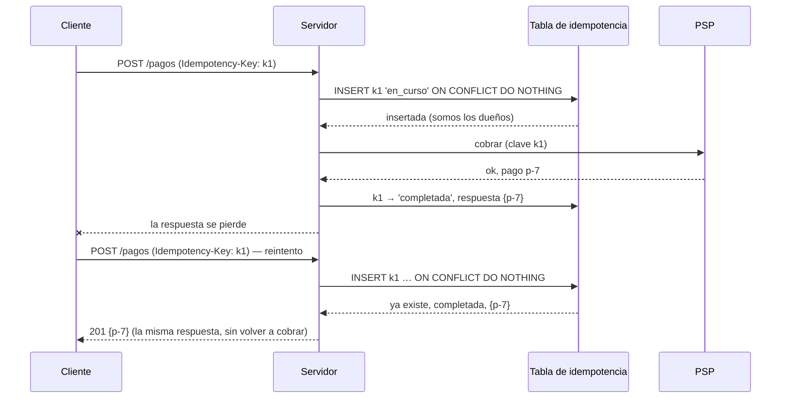

**Objetivo:** diseñar operaciones que se pueden reintentar sin miedo, de extremo a extremo.
**Tiempo:** 4–5 días
**Lecturas:** Stripe Engineering, *Designing robust and predictable APIs with idempotency* · microservices.io, *Idempotent Consumer* · DDIA, la sección sobre el argumento extremo a extremo (*end-to-end argument*) en el capítulo final.

## Antes de leer: predice

1. Un cliente paga, no recibe respuesta y reintenta. ¿Cómo puede el servidor saber que es **el mismo** pago y no un segundo?
2. Envías una petición de pago al PSP con timeout de 5 s y vence. Guardas "pago fallido" y el usuario reintenta. ¿Qué puede salir mal?

```respuesta id="f4-05-predice" titulo="Mis predicciones"
Antes de leer: responde con lo que sepas o intuyas. No importa acertar.
```

## Semánticas de entrega

| Semántica | Cómo | Riesgo |
|---|---|---|
| **Como mucho una vez** | Enviar sin reintentar (o confirmar antes de procesar) | Se pierden operaciones |
| **Al menos una vez** | Reintentar hasta tener confirmación | Se **duplican** operaciones |
| **Exactamente una vez** | No existe como propiedad del transporte | — |

Lo que sí existe es el **efecto exactamente una vez** (*effectively once*): **al menos una vez + idempotencia**. Se reintenta todo lo necesario, y el receptor garantiza que procesar lo mismo dos veces tiene el mismo efecto que procesarlo una.

## El argumento extremo a extremo

TCP deduplica paquetes, y el broker deduplica mensajes. Pero si el **usuario** pulsa "Pagar" dos veces, o la app reintenta tras un timeout, llegan **dos peticiones distintas** a nivel de TCP, a nivel de broker y a nivel de aplicación. Ninguna capa inferior puede saber que son la misma intención.

La idempotencia tiene que diseñarse **de extremo a extremo**: el identificador lo genera **el origen de la intención** (el cliente, al abrir el formulario de pago) y viaja hasta el último efecto (el cobro en el PSP). Esto responde a la primera predicción: el cliente envía una **clave de idempotencia** (`Idempotency-Key`), la misma en cada reintento.

## Diseño de una clave de idempotencia



Decisiones de diseño:

1. **Reclamar la clave de forma atómica** (`INSERT … ON CONFLICT DO NOTHING`): de varias peticiones concurrentes con la misma clave, solo una gana.
2. **Guardar la respuesta** y devolverla tal cual en los reintentos.
3. **Estado "en curso":** si llega un reintento mientras la primera se procesa, responder `409` ("reintenta más tarde"), no ejecutarla otra vez.
4. **Huella de la petición:** guardar un hash del cuerpo. La misma clave con otra petición es un error del cliente (`422`).
5. **Caducidad:** las claves se guardan un tiempo (Stripe, 24 h) y luego se borran.
6. **Propagar la clave hacia abajo:** si el efecto es externo (el PSP), enviarle una clave derivada. Si el servidor cae **después** de cobrar y **antes** de guardar "completada", el reintento vuelve a llamar al PSP, y el PSP deduplica.
7. **Recuperar claves huérfanas:** una clave en "en curso" durante demasiado tiempo indica un proceso que murió a mitad. Un proceso de reconciliación consulta al PSP qué pasó.

Respuesta a la segunda predicción: un timeout **no** es un fallo: es **no saber** ([lección 1](/fase-4/01-fallos-parciales/#redes-no-fiables)). Si guardas "fallido" y el PSP sí cobró, el usuario reintenta y **paga dos veces**. Lo correcto: estado "desconocido", reintentar con **la misma clave** o consultar al PSP.

## Consumidores idempotentes

Para mensajes de una cola (al menos una vez), el consumidor guarda los IDs procesados **en la misma transacción que el efecto**:

```sql
BEGIN;
INSERT INTO mensajes_procesados (mensaje_id) VALUES ($1);  -- falla por PK si ya se procesó
UPDATE entradas SET estado = 'emitida' WHERE pedido_id = $2;
COMMIT;
```

Si el `INSERT` choca con la clave primaria, el mensaje ya se procesó: se confirma a la cola sin hacer nada. Como ambas cosas van en la misma transacción, no hay ventana en la que el efecto exista sin el registro, ni al revés.

Otra forma es hacer el efecto **naturalmente idempotente**: `UPDATE … SET estado = 'emitida'` es idempotente por sí mismo; `UPDATE … SET contador = contador + 1` no.

## Ejercicios

### Ejercicio 1 · Pago idempotente (Go + PostgreSQL)

Implementa `ConIdempotencia(ctx, db, clave, huella string, fn func(ctx) (Respuesta, error)) (Respuesta, error)`:

- Ejecuta `fn` **como mucho una vez** por clave.
- Los reintentos con la misma clave y huella reciben la respuesta guardada.
- Si hay otra petición en curso con esa clave: `ErrEnCurso`.
- Misma clave con otra huella: `ErrClaveReutilizada`.
- Si `fn` falla, libera la clave para permitir reintentar.

```sql
CREATE TABLE idempotencia (
    clave      TEXT PRIMARY KEY,
    huella     TEXT NOT NULL,
    estado     TEXT NOT NULL CHECK (estado IN ('en_curso', 'completada')),
    respuesta  JSONB,
    creado_en  TIMESTAMPTZ NOT NULL DEFAULT now()
);
```

Test: 50 goroutines llaman a la vez con la misma clave; `fn` simula un cobro de 100 ms que incrementa un contador. Al final el contador debe valer **1**.

```respuesta id="f4-05-ej1" titulo="Pago idempotente (Go + PostgreSQL)"
Escribe aquí tu razonamiento antes de abrir las pistas.
```

<details>
<summary>Pista 1</summary>

Paso 1: `INSERT … ON CONFLICT (clave) DO NOTHING` y mira `RowsAffected()`. Si es 1, eres el dueño. Si es 0, lee la fila existente y decide según `huella` y `estado`.

</details>

<details>
<summary>Pista 2</summary>

Si `fn` falla y borras la fila, usa un contexto que no se cancele (`context.WithoutCancel(ctx)`): si el fallo fue precisamente que el contexto venció, el `DELETE` también fallaría.

</details>

<details>
<summary>Solución</summary>

```go
package pagos

import (
	"context"
	"encoding/json"
	"errors"

	"github.com/jackc/pgx/v5"
	"github.com/jackc/pgx/v5/pgxpool"
)

var (
	ErrEnCurso          = errors.New("ya hay una petición en curso con esta clave")
	ErrClaveReutilizada = errors.New("clave de idempotencia usada con otra petición")
)

type Respuesta struct {
	PagoID string `json:"pago_id"`
	Estado string `json:"estado"`
}

// ConIdempotencia ejecuta fn como mucho una vez por clave. Los reintentos con la
// misma clave y la misma huella reciben la respuesta guardada.
func ConIdempotencia(ctx context.Context, db *pgxpool.Pool, clave, huella string,
	fn func(ctx context.Context) (Respuesta, error)) (Respuesta, error) {

	// 1. Reclamar la clave. Solo una petición concurrente consigue insertar la fila.
	tag, err := db.Exec(ctx, `
		INSERT INTO idempotencia (clave, huella, estado) VALUES ($1, $2, 'en_curso')
		ON CONFLICT (clave) DO NOTHING`, clave, huella)
	if err != nil {
		return Respuesta{}, err
	}

	if tag.RowsAffected() == 0 {
		// 2. Otra petición ya la reclamó: devolver su resultado o avisar.
		var h, estado string
		var guardada []byte
		err := db.QueryRow(ctx, `SELECT huella, estado, respuesta FROM idempotencia WHERE clave = $1`,
			clave).Scan(&h, &estado, &guardada)
		if errors.Is(err, pgx.ErrNoRows) {
			return Respuesta{}, ErrEnCurso // se liberó justo ahora tras un fallo: que reintente
		}
		if err != nil {
			return Respuesta{}, err
		}
		if h != huella {
			return Respuesta{}, ErrClaveReutilizada
		}
		if estado == "en_curso" {
			return Respuesta{}, ErrEnCurso
		}
		var r Respuesta
		return r, json.Unmarshal(guardada, &r)
	}

	// 3. Somos los dueños de la clave: ejecutar la operación.
	r, err := fn(ctx)
	if err != nil {
		// Liberar la clave para permitir un reintento.
		db.Exec(context.WithoutCancel(ctx), `DELETE FROM idempotencia WHERE clave = $1`, clave)
		return Respuesta{}, err
	}
	js, _ := json.Marshal(r)
	_, err = db.Exec(ctx, `UPDATE idempotencia SET estado = 'completada', respuesta = $2 WHERE clave = $1`,
		clave, js)
	return r, err
}
```

Preguntas para pensar:

- Si el proceso **muere** entre `fn` y el `UPDATE`, la clave queda "en curso" para siempre y el cobro sí se hizo. ¿Qué proceso lo detecta y qué hace? (Pista: `creado_en` y la API de consulta del PSP.)
- Si `fn` devuelve un error por **timeout**, liberar la clave permite reintentar… ¿y si el PSP sí cobró? Por eso `fn` debe pasar la clave al PSP.
- ¿Cómo lo expondrías en HTTP? `ErrEnCurso` → `409`, `ErrClaveReutilizada` → `422`.

</details>

### Ejercicio 2 · ¿Es idempotente?

1. `UPDATE asientos SET estado = 'vendido' WHERE id = 5`
2. `INSERT INTO entradas (pedido_id, asiento_id) VALUES (9, 5)` con `UNIQUE (pedido_id, asiento_id)`
3. Enviar un email de confirmación.
4. `UPDATE cupos SET compradas = compradas + 2 WHERE …`
5. Publicar el evento `EntradaEmitida` en Kafka.

```respuesta id="f4-05-ej2" titulo="¿Es idempotente?"
Escribe aquí tu razonamiento antes de abrir las pistas.
```

<details>
<summary>Solución</summary>

1. **Sí.**
2. **Sí**, gracias a la restricción: el segundo `INSERT` falla (o con `ON CONFLICT DO NOTHING`, no hace nada).
3. **No.** Mitigación: registrar "email enviado para el pedido 9" antes o de forma atómica con el envío; usar la clave de idempotencia del proveedor de email si la tiene. Aun así hay una ventana: por eso se acepta que, en raras ocasiones, llegue un email duplicado.
4. **No.** Hay que asociarlo a un ID de operación (tabla de procesados en la misma transacción).
5. **No** por defecto: se publica dos veces. Kafka tiene productores idempotentes (evitan duplicados por reintentos del propio productor), pero no te protegen si **tu** código publica dos veces. Los consumidores deben deduplicar por ID de evento.

</details>

## Taquilla

1. Implementa el **pago idempotente** de Taquilla sobre la función del ejercicio 1, con la clave que genera el cliente al abrir el pago y que se propaga al PSP.
2. Añade a `fallos.md` qué operaciones de Taquilla son idempotentes por naturaleza, cuáles necesitan clave de idempotencia y cuáles necesitan un consumidor idempotente.
3. Diseña el **proceso de reconciliación** de pagos "en curso" huérfanos.

## Autorrevisión

- [ ] Sé por qué "exactamente una vez" se construye y no se obtiene del transporte.
- [ ] Explico el argumento extremo a extremo con un ejemplo.
- [ ] Diseño una clave de idempotencia completa: reclamar, guardar respuesta, en curso, huella, caducidad, propagación, reconciliación.
- [ ] Sé hacer un consumidor idempotente con la tabla de procesados en la misma transacción.
- [ ] Trato un timeout como "desconocido", no como "fallido".

## Para la sesión de tutor

Trae tu pago idempotente. Voy a matar el proceso en cada línea de la función y me dirás qué ve el usuario y qué ha pasado con su dinero.
