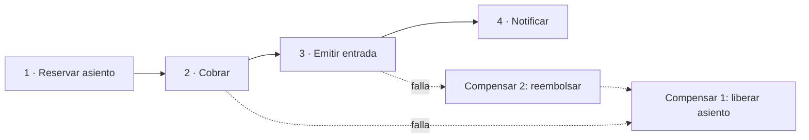
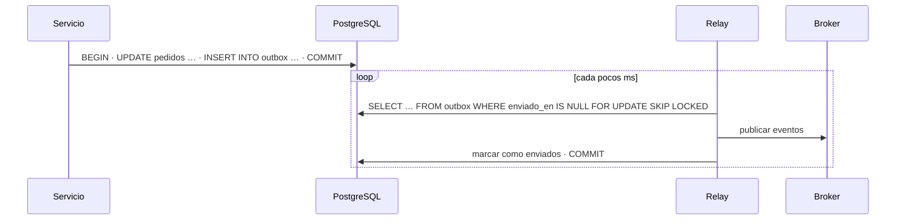

**Objetivo:** coordinar una operación que afecta a varios servicios o almacenes sin una transacción global, sin perder mensajes y sin dejar estados inconsistentes para siempre.
**Tiempo:** 1 semana
**Lecturas:** microservices.io, *Saga*, *Transactional outbox*, *Polling publisher*, *Transaction log tailing* · DDIA, capítulo de consistencia y consenso (commit atómico y 2PC) · *Software Architecture: The Hard Parts*, capítulos sobre transacciones distribuidas y sagas (opcional).

## Antes de leer: predice

1. Tu servicio guarda un pedido en PostgreSQL y, justo después, publica `PedidoConfirmado` en la cola. El proceso muere entre ambas cosas. ¿Qué ha pasado? ¿Y si inviertes el orden?
2. Una compra implica reservar el asiento (servicio de inventario), cobrar (PSP) y emitir la entrada (servicio de entradas). El cobro falla. ¿Cómo "deshaces" la reserva si no hay una transacción que abarque los tres?

```respuesta id="f4-06-predice" titulo="Mis predicciones"
Antes de leer: responde con lo que sepas o intuyas. No importa acertar.
```

## El problema de la escritura dual

Respuesta a la primera predicción: el pedido está en la base de datos pero **nadie se entera**: no se envía el email ni se emite la entrada. Si inviertes el orden, el evento sale pero el pedido **no existe**. Escribir en **dos sistemas** sin una transacción común siempre deja una ventana en la que uno tiene el cambio y el otro no. Reintentar no lo resuelve del todo: ¿y si el proceso muere antes del reintento?

## Commit en dos fases (2PC)

Un **coordinador** pide a todos los participantes que se **preparen** (dejarlo todo listo y prometer que podrán confirmar). Si todos dicen "sí", ordena **confirmar**; si alguno dice "no", ordena abortar.

- Garantiza atomicidad entre sistemas.
- **Problema grave:** si el coordinador cae después de la fase de preparación, los participantes se quedan **en duda**: no pueden confirmar ni abortar por su cuenta, y mantienen **bloqueos** hasta que el coordinador vuelve. Un solo fallo bloquea a todos.
- Latencia: varias rondas de red y `fsync`.
- Soporte limitado: las colas y las APIs externas (un PSP) no participan en 2PC.

Se usa dentro de algunas bases de datos distribuidas (con el coordinador replicado por consenso), pero **entre servicios** casi nunca.

## Sagas

Una **saga** es una secuencia de **transacciones locales**, una por servicio. Si un paso falla, se ejecutan **transacciones compensatorias** que deshacen **semánticamente** los pasos anteriores. Esto responde a la segunda predicción: la reserva no se "deshace" con un rollback; se **libera** con una nueva operación.



### Orquestación o coreografía

| | Orquestación | Coreografía |
|---|---|---|
| Cómo | Un **orquestador** dice a cada servicio qué hacer y reacciona a las respuestas | Cada servicio **reacciona a eventos** de los demás y publica los suyos |
| Visibilidad | El flujo está en un sitio: fácil de entender y monitorizar | El flujo está repartido: difícil de seguir |
| Acoplamiento | El orquestador conoce a todos | Los servicios solo conocen eventos |
| Bueno para | Flujos con muchos pasos, lógica de negocio compleja | Flujos cortos y estables |

### Diseñar compensaciones

- **No todo se puede compensar.** Un email enviado no se "desenvía" (se envía otro de disculpa). Un cobro se compensa con un **reembolso**, que no es lo mismo (comisiones, tiempo).
- Por eso se ordenan los pasos: primero los **compensables**, luego el **pivote** (el punto de no retorno) y después los que **solo pueden reintentarse** hasta tener éxito.
- En Taquilla: reservar (compensable: liberar) → **cobrar** (pivote) → emitir entrada y notificar (reintentables: deben acabar funcionando).
- **Falta de aislamiento:** entre pasos, otros ven estados intermedios. Contramedida habitual: **estados explícitos** (`reservado`, `pendiente_pago`), un *bloqueo semántico* que el resto del sistema entiende.
- Cada paso y cada compensación deben ser **idempotentes** (lección 5), porque se reintentarán.

## Outbox transaccional

¿Cómo publica cada paso de la saga su evento sin el problema de la escritura dual? Escribiendo el evento **en la misma base de datos, en la misma transacción** que el cambio de estado, en una tabla **outbox**. Un proceso aparte (*relay*) lee la outbox y publica.



- El cambio y el evento se confirman **juntos o ninguno**.
- El relay publica **al menos una vez** (si cae tras publicar y antes de marcar, republica): los consumidores deben ser idempotentes.
- Dos formas de relay: **sondeo** (*polling publisher*, lo de arriba) o **leer el log de la base de datos** (*transaction log tailing* con CDC, como Debezium, Fase 6), que no añade consultas.
- El reverso es la **inbox** (o consumidor idempotente): el receptor registra los IDs de mensaje procesados.

## Ejemplo trabajado · Reserva de un viaje

(Un problema paralelo a Taquilla: la de Taquilla la diseñas tú.)

Reservar un viaje: vuelo, hotel y coche, con tres proveedores externos. Saga **orquestada**:

| Paso | Acción | Compensación | Tipo |
|---|---|---|---|
| 1 | Crear viaje en estado `pendiente` | Marcar `cancelado` | Compensable |
| 2 | Reservar hotel (cancelación gratuita) | Cancelar hotel | Compensable |
| 3 | Reservar coche (cancelación gratuita) | Cancelar coche | Compensable |
| 4 | Emitir billete de avión (no reembolsable) | — | **Pivote** |
| 5 | Confirmar viaje y enviar documentación | — | Reintentable |

¿Por qué el vuelo es el pivote y va el último de los compensables? Porque es el único que **no se puede deshacer** gratis: si falla el coche después de emitir el billete, el cliente pierde dinero. Ordenando así, cualquier fallo antes del paso 4 se compensa sin coste.

El orquestador guarda el estado de la saga (en qué paso va) en su base de datos y usa **outbox** para enviar cada orden. Si el orquestador cae, al volver lee el estado y **continúa**; como cada paso es idempotente, repetir el último es seguro.

## Ejercicios

### Ejercicio 1 · Outbox (Go + PostgreSQL)

1. `ConfirmarPedido(ctx, db, pedidoID)`: en **una** transacción, cambia el estado del pedido e inserta el evento `PedidoConfirmado` en `outbox`.
2. `RelevarLote(ctx, db, n, publicar)`: toma hasta `n` eventos pendientes con `FOR UPDATE SKIP LOCKED`, los publica y los marca como enviados.
3. Test: confirma 500 pedidos y ejecuta **4 relays en paralelo**. Comprueba que cada evento se publica **exactamente una vez** en ausencia de fallos.

```sql
CREATE TABLE outbox (
    id         BIGSERIAL PRIMARY KEY,
    tipo       TEXT        NOT NULL,
    payload    JSONB       NOT NULL,
    creado_en  TIMESTAMPTZ NOT NULL DEFAULT now(),
    enviado_en TIMESTAMPTZ
);
```

```respuesta id="f4-06-ej1" titulo="Outbox (Go + PostgreSQL)"
Escribe aquí tu razonamiento antes de abrir las pistas.
```

<details>
<summary>Pista</summary>

`pgx.BeginFunc(ctx, db, func(tx pgx.Tx) error { ... })` hace commit si la función devuelve `nil` y rollback si devuelve error. `SKIP LOCKED` hace que cada relay tome filas que no estén bloqueadas por otro, así que pueden trabajar en paralelo sin pisarse.

</details>

<details>
<summary>Solución</summary>

```go
package outbox

import (
	"context"
	"encoding/json"

	"github.com/jackc/pgx/v5"
	"github.com/jackc/pgx/v5/pgxpool"
)

type Evento struct {
	ID      int64
	Tipo    string
	Payload json.RawMessage
}

// ConfirmarPedido cambia el estado del pedido y registra el evento en la MISMA transacción.
func ConfirmarPedido(ctx context.Context, db *pgxpool.Pool, pedidoID int64) error {
	return pgx.BeginFunc(ctx, db, func(tx pgx.Tx) error {
		if _, err := tx.Exec(ctx,
			`UPDATE pedidos SET estado = 'confirmado' WHERE id = $1`, pedidoID); err != nil {
			return err
		}
		payload, _ := json.Marshal(map[string]any{"pedido_id": pedidoID})
		_, err := tx.Exec(ctx,
			`INSERT INTO outbox (tipo, payload) VALUES ('PedidoConfirmado', $1)`, payload)
		return err
	})
}

// Publicador envía un evento al broker (Kafka, SQS…).
type Publicador func(ctx context.Context, e Evento) error

// RelevarLote publica hasta n eventos pendientes y los marca como enviados.
// Varios relevadores pueden ejecutarse a la vez gracias a SKIP LOCKED.
func RelevarLote(ctx context.Context, db *pgxpool.Pool, n int, publicar Publicador) (int, error) {
	enviados := 0
	err := pgx.BeginFunc(ctx, db, func(tx pgx.Tx) error {
		filas, err := tx.Query(ctx, `
			SELECT id, tipo, payload FROM outbox
			WHERE enviado_en IS NULL
			ORDER BY id
			LIMIT $1
			FOR UPDATE SKIP LOCKED`, n)
		if err != nil {
			return err
		}
		eventos, err := pgx.CollectRows(filas, pgx.RowToStructByPos[Evento])
		if err != nil {
			return err
		}
		for _, e := range eventos {
			if err := publicar(ctx, e); err != nil {
				return err // rollback: se reintentará todo el lote (al menos una vez)
			}
			if _, err := tx.Exec(ctx, `UPDATE outbox SET enviado_en = now() WHERE id = $1`, e.ID); err != nil {
				return err
			}
			enviados++
		}
		return nil
	})
	return enviados, err
}
```

Preguntas para pensar:

- Con varios relays en paralelo, ¿se mantiene el **orden** de los eventos de un mismo pedido? (No necesariamente. Si importa, particiona el trabajo de los relays por agregado o usa un solo relay por partición.)
- La tabla crece sin fin: añade un proceso que borre lo enviado hace más de N días.
- Si un evento falla siempre al publicarse, bloquea su lote para siempre. ¿Qué harías? (Contador de intentos y una "outbox de mensajes muertos".)

</details>

### Ejercicio 2 · Clasifica los pasos

Para una tienda online: validar el carrito, reservar stock, cobrar la tarjeta, generar la factura, pedir la recogida al transportista, enviar el email de confirmación. Clasifica cada paso como compensable, pivote o reintentable, propón su compensación y ordénalos.

```respuesta id="f4-06-ej2" titulo="Clasifica los pasos"
Escribe aquí tu razonamiento antes de abrir las pistas.
```

<details>
<summary>Solución</summary>

1. Validar el carrito: sin efectos, no necesita compensación.
2. Reservar stock: **compensable** (liberar stock).
3. Cobrar: **pivote** (compensar = reembolsar tiene coste).
4. Generar la factura: **reintentable** (una factura no se borra, se anula con una rectificativa: por eso va después del pivote).
5. Pedir la recogida: **reintentable** (si no se puede, sigue intentándose o escala a un humano).
6. Email: **reintentable**.

</details>

## Taquilla

Diseña la **saga de compra** de Taquilla v3:

1. Pasos, compensaciones y clasificación (compensable, pivote, reintentable). ¿Qué pasa si la reserva **caduca** mientras el usuario está pagando en el PSP?
2. ¿Orquestación o coreografía? Justifícalo en un ADR.
3. Diagrama de secuencia del camino feliz y de dos caminos de fallo (el cobro falla; el cobro tiene éxito pero la emisión falla).
4. Implementa el **outbox** para los eventos del pedido.

<details>
<summary>Pista (después de tu intento)</summary>

El caso más traicionero: el usuario paga en el PSP a los 9 min 55 s, el webhook llega a los 10 min 05 s, y la reserva ya caducó y el asiento **se ha vendido a otra persona**. Tienes dinero cobrado sin asiento. Opciones: extender la reserva mientras hay un pago en curso (estado `pendiente_pago` que no caduca igual), reembolsar automáticamente, u ofrecer un asiento equivalente. Cualquiera vale si está **decidida y documentada**.

</details>

## Autorrevisión

- [ ] Explico el problema de la escritura dual.
- [ ] Sé por qué 2PC bloquea y por qué casi no se usa entre servicios.
- [ ] Diseño una saga con compensaciones y un pivote bien colocado.
- [ ] Elijo entre orquestación y coreografía con argumentos.
- [ ] Implemento un outbox y sé que publica al menos una vez.

## Para la sesión de tutor

Trae tu saga de compra. Haremos el juego de "¿y si falla aquí?" en cada flecha del diagrama.
