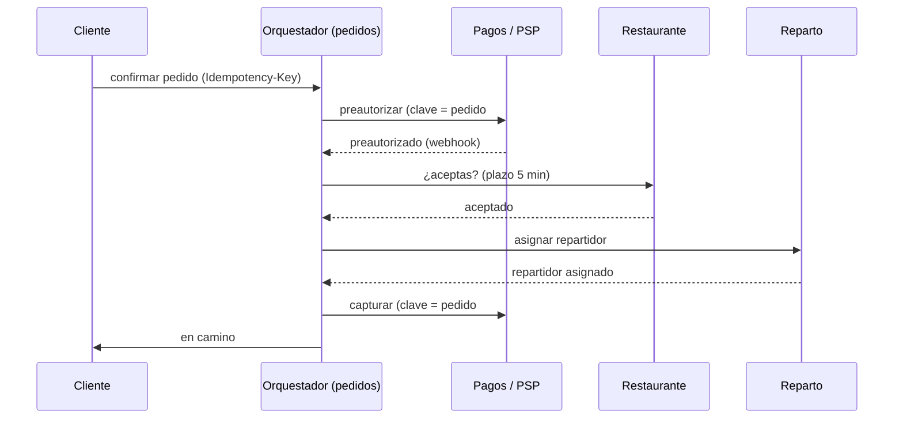

## Kata · Checkout de comida a domicilio

**Tiempo:** 60 minutos. El foco está en **fallos y coordinación**, no en la escala.

**Enunciado:** una app de comida a domicilio. Al confirmar un pedido:

1. Se cobra al cliente (PSP externo, resultado por webhook).
2. El restaurante debe **aceptar** el pedido en su tableta (puede tardar hasta 5 minutos o rechazarlo).
3. Se asigna un repartidor (servicio de asignación, que puede no encontrar a nadie).
4. Se notifica al cliente en cada paso.

Si el restaurante rechaza o no hay repartidor en 15 minutos, se cancela y se reembolsa. La app es una arquitectura de servicios: pedidos, pagos, restaurantes, reparto y notificaciones, cada uno con su base de datos.

**Entrega:** la saga (pasos, compensaciones, clasificación), orquestación o coreografía justificada, diagrama de secuencia del camino feliz y de dos fallos, dónde hay idempotencia y outbox, y qué pasa con **cada** mensaje si se pierde o se duplica.

```respuesta id="f4-cierre-kata" titulo="Checkout de comida a domicilio"
Tu diseño: requisitos, estimación, API, datos, C4, profundizar, fallos. Puedes seguir la plantilla de kata de los anexos.
```

<details>
<summary>Pista 1 · Orden de los pasos</summary>

¿Cobrar primero o esperar a que acepte el restaurante? Piensa qué es compensable: un cobro se puede hacer en dos tiempos con una **preautorización** (retener el importe) y una **captura** (cobrarlo de verdad).

</details>

<details>
<summary>Pista 2 · Tiempos</summary>

Hay dos esperas largas (restaurante y repartidor). ¿Quién lleva la cuenta del tiempo y qué pasa si ese componente cae mientras espera?

</details>

<details>
<summary>Solución de referencia</summary>

**Saga orquestada** (hay esperas, plazos y lógica de cancelación: el flujo debe estar visible en un sitio). El orquestador vive en el servicio de pedidos y guarda el estado de cada saga en su base de datos.

| Paso | Acción | Compensación | Tipo |
|---|---|---|---|
| 1 | Crear pedido `pendiente` | Marcar `cancelado` | Compensable |
| 2 | **Preautorizar** el importe en el PSP | Liberar la preautorización | Compensable (sin coste para el cliente) |
| 3 | Pedir aceptación al restaurante (plazo: 5 min) | Avisar al restaurante de la cancelación | Compensable |
| 4 | Asignar repartidor (plazo: 15 min desde la confirmación) | Liberar al repartidor | Compensable |
| 5 | **Capturar** el cobro | — | **Pivote** |
| 6 | Notificar "en camino" | — | Reintentable |

La clave es partir el cobro: la **preautorización** retiene el dinero sin cobrarlo, así que es compensable. El pivote (captura) se hace cuando todo lo incierto está resuelto. Si prefieres capturar al entregar, el pivote se mueve; también es válido si lo justificas.

**Plazos:** el orquestador guarda `expira_en` para cada espera. Un proceso periódico (con un único ejecutor: lock en la BD o elección de líder) busca sagas vencidas y dispara la cancelación. Como el estado está en la BD, si el orquestador cae, otro lo retoma.



**Fallo A: el restaurante rechaza.** Orquestador: liberar preautorización → cancelar pedido → notificar. Sin coste para el cliente.

**Fallo B: no hay repartidor en 15 min.** Igual que A, más avisar al restaurante (que quizás ya empezó a cocinar: coste de negocio que se decide con producto, no en el diagrama).

**Mensajes perdidos o duplicados:**

- Todas las órdenes del orquestador salen por **outbox**: si cae, no se pierden; se pueden duplicar.
- Cada servicio procesa las órdenes de forma **idempotente** (ID de saga + paso).
- Las llamadas al PSP llevan **clave de idempotencia derivada** (`pedido#preauth`, `pedido#captura`): repetirlas no cobra dos veces.
- Un webhook del PSP perdido: el orquestador **consulta** el estado al PSP si no llega en N segundos (reconciliación).
- Una respuesta del restaurante que llega **después** de vencer el plazo: el orquestador ve que la saga ya está en `cancelando` y la ignora (y avisa al restaurante).

</details>

### Autoevaluación

[Panel de revisión](/guia/panel-de-revision/) completo. **Fiabilidad** y **Trade-offs** deberían estar en 3 o más. Guárdala en `docs/katas/fase-4-comida.md`.

## Revisión de Taquilla v3

- [ ] `fallos.md` con timeouts, reintentos y qué pasa si se pierde cada respuesta, para cada llamada entre componentes.
- [ ] ADR de modelo de consistencia por tipo de dato, con qué pasa durante una partición.
- [ ] Decisión sobre coordinación (failover de la BD, workers de ejecución única) y fencing donde haga falta.
- [ ] Saga de compra con pasos, compensaciones y pivote; ADR de orquestación o coreografía.
- [ ] Caso "la reserva caduca mientras se paga" decidido y documentado.
- [ ] Diagrama de secuencia del camino feliz y de dos caminos de fallo.
- [ ] Pago idempotente implementado, con clave propagada al PSP y test concurrente.
- [ ] Proceso de reconciliación de pagos huérfanos diseñado.
- [ ] Outbox implementado para los eventos del pedido.

## Preguntas de repaso

1. ¿Por qué el `UPDATE` condicional de la [Fase 3](/fase-3/06-transacciones/#ejercicio-2--reserva-de-asientos-sin-doble-venta-go--postgresql) no necesita consenso, y en qué situación sí lo necesitarías para lo mismo?
2. Un compañero propone "last write wins" para resolver conflictos de inventario entre dos regiones. ¿Qué le respondes con lo aprendido en las lecciones 1 y 3?
3. ¿Qué tienen en común un token de fencing y una clave de idempotencia?
4. Tu relay de outbox y tu consumidor de la cola de emails están en producción. Enumera todos los puntos en los que un mensaje puede duplicarse y dónde se deduplica.
5. (De la Fase 2) El health check de tu orquestador de sagas comprueba la base de datos. ¿Buena idea?
6. (De la Fase 1) ¿Qué característica de arquitectura has priorizado al elegir una saga orquestada en vez de coreografiada?

```respuesta id="f4-cierre-repaso" titulo="Preguntas de repaso"
Responde sin mirar las lecciones.
```

<details>
<summary>Respuestas</summary>

1. Porque hay **una sola fuente de verdad** (el líder de PostgreSQL) que serializa las escrituras sobre esas filas. Necesitarías consenso si varias réplicas pudieran aceptar reservas a la vez (multi-líder o sin líder) y quisieras mantener la unicidad, o para decidir **quién** es el líder tras un fallo (lo que hace el failover de la base de datos por debajo).
2. Que los relojes no son fiables (una región con el reloj adelantado gana siempre) y que LWW **descarta escrituras en silencio**: en inventario, eso es vender dos veces el mismo asiento y que el sistema "olvide" una venta. El inventario necesita linearizabilidad: una única fuente de verdad por evento.
3. Ambos hacen que **el receptor** decida si una operación es válida, en lugar de confiar en que el emisor sabe lo que ha pasado. El token rechaza a un emisor desfasado; la clave rechaza una repetición.
4. Duplicados: el cliente reintenta la API (se deduplica con la clave de idempotencia); el relay publica y cae antes de marcar (consumidor idempotente); el broker reentrega por timeout de visibilidad (consumidor idempotente); el consumidor envía el email y cae antes del ack (registro de "email enviado" + clave de idempotencia del proveedor, aceptando una ventana mínima).
5. Con cuidado: si la BD tiene un problema breve, todas las instancias del orquestador se marcarían no sanas a la vez. Distingue **liveness** (solo el proceso) de **readiness**, y no dejes que una dependencia compartida tumbe la flota entera.
6. Sobre todo **mantenibilidad y observabilidad** (el flujo está en un sitio, se entiende y se monitoriza), a costa de algo de **acoplamiento** (el orquestador conoce a todos los servicios).

</details>

## Criterios de dominio

- [ ] Explico por qué un timeout no distingue "caído" de "lento".
- [ ] Explico CAP sin caer en "elige 2 de 3" y uso PACELC.
- [ ] Describo cómo Raft elige líder y por qué no puede haber dos líderes en el mismo término.
- [ ] Diseño un flujo "exactamente una vez" de extremo a extremo y señalo dónde está la idempotencia.
- [ ] Diseño sagas con compensaciones y pivote, y publico eventos con outbox.
- [ ] He completado al menos los Gossip Glomers 1 a 4.
- [ ] La kata puntúa al menos 3 en Fiabilidad y Trade-offs.

## Siguiente

[Fase 5 · Estilos de arquitectura](/fase-5/): de los datos a la estructura de la aplicación. Modularidad, estilos y fronteras.
