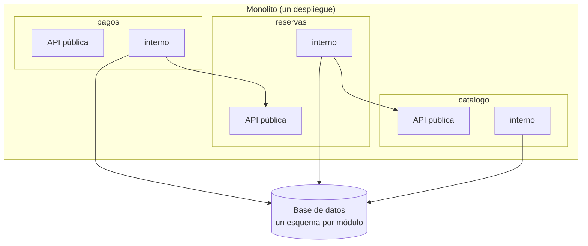

**Objetivo:** conocer los estilos que se despliegan como una sola unidad, sus puntos fuertes y débiles, y construir un monolito modular con fronteras que no se erosionen.
**Tiempo:** 1 semana
**Lecturas:** FoSA, capítulo de fundamentos de los estilos de arquitectura y capítulos de arquitectura en capas, pipeline, microkernel y monolito modular (este último solo en la 2ª edición).

## Antes de leer: predice

1. Si un monolito se despliega en una sola unidad, ¿puede estar bien modularizado? ¿Qué impide que un módulo acabe importando las tripas de otro?
2. ¿Qué tiene en común un navegador con extensiones, un IDE con plugins y un motor de reglas de descuentos?

```respuesta id="f5-03-predice" titulo="Mis predicciones"
Antes de leer: responde con lo que sepas o intuyas. No importa acertar.
```

## Arquitectura en capas

El estilo clásico: presentación → negocio → persistencia → base de datos. Cada capa solo habla con la de abajo.

- **Capas cerradas:** una petición atraviesa todas las capas en orden. Aísla los cambios: puedes cambiar la persistencia sin tocar la presentación.
- **Capas abiertas:** alguna capa se puede saltar (por ejemplo, una capa de servicios compartidos). Da flexibilidad, pero erosiona el aislamiento si no se documenta.

Puntos fuertes: **simple, barata, conocida por todos.** Buen punto de partida para aplicaciones pequeñas o cuando no se sabe mucho del dominio.

Puntos débiles:

- Es un **particionado técnico** ([lección 2](/fase-5/02-componentes-y-quantum/)): cada cambio de negocio atraviesa todas las capas.
- **Antipatrón del sumidero** (*architecture sinkhole*): peticiones que pasan por todas las capas sin que ninguna haga nada (la capa de negocio solo reenvía a la de persistencia). Si ocurre en la mayoría de peticiones, las capas son burocracia.
- Escalabilidad, elasticidad y tolerancia a fallos limitadas: todo se despliega y escala junto.

## Monolito modular

Particionado **por dominio**, pero desplegado como **una sola unidad** con una sola base de datos (o esquemas separados por módulo dentro de ella).



Reglas:

1. Cada módulo expone una **API pública** pequeña; su interior es privado.
2. Los módulos **solo se llaman a través de esas APIs** (o por eventos internos).
3. Cada módulo es dueño de **sus tablas**; nadie hace `JOIN` con las tablas de otro módulo.
4. Las dependencias entre módulos **no forman ciclos**.

Ventajas: la simplicidad operativa de un monolito (un despliegue, transacciones locales, depuración sencilla) con fronteras claras. Si algún día un módulo necesita ser un servicio aparte, ya tiene la frontera trazada. Por eso muchos autores lo recomiendan como **punto de partida por defecto**.

Respuesta a la primera predicción: **sí**, pero las fronteras se erosionan solas si nada las protege. Bajo presión, alguien importa un tipo interno de otro módulo "solo esta vez". Hay que **hacerlas cumplir automáticamente**:

- En **Go**, el directorio `internal/`: un paquete bajo `x/internal/` solo puede importarlo código dentro de `x/`. **Lo comprueba el compilador.**
- **Tests de arquitectura** que fallan si un módulo depende de otro no permitido (ArchUnit en Java; en Go, un test sencillo como el del ejercicio, o herramientas como `depguard` o `go-arch-lint`).
- Esquemas de base de datos separados con permisos por módulo.

## Pipeline (tuberías y filtros)

Datos que pasan por una secuencia de **filtros** conectados por **tuberías**, cada filtro con una única responsabilidad: **productor** (origen), **transformador**, **probador** (filtra) y **consumidor** (destino). Los *pipes* de Unix son el ejemplo canónico; los procesos ETL y el procesamiento de streams (Fase 6), también.

Bueno para procesamiento de datos en una dirección. Malo para aplicaciones interactivas.

## Microkernel (plugins)

Un **núcleo** con la funcionalidad mínima y **plugins** que añaden funcionalidad a través de puntos de extensión definidos, registrados en un **registro**. Respuesta a la segunda predicción: los tres son microkernel. El núcleo no conoce los plugins concretos; los plugins no se conocen entre sí.

Bueno para productos que se **personalizan** mucho (por cliente, por país, por regla de negocio). En Taquilla, un candidato natural: **reglas de precios y descuentos** configurables por organizador o por temporada, como plugins del cálculo de precio.

## Ejercicios

### Ejercicio 1 · Test de arquitectura (Go)

Crea un módulo Go `taquilla` con esta estructura:

```text
taquilla/
├── go.mod                              module taquilla
├── arquitectura_test.go
└── internal/
    ├── catalogo/catalogo.go
    ├── reservas/
    │   ├── reservas.go                 API pública del módulo
    │   └── internal/postgres/repo.go   privado de reservas
    └── pagos/pagos.go
```

1. Comprueba que el compilador impide que `pagos` importe `taquilla/internal/reservas/internal/postgres`.
2. Escribe `arquitectura_test.go`: define qué módulos puede importar cada uno (`catalogo`: ninguno; `reservas`: `catalogo`; `pagos`: `reservas`) y falla si algún fichero lo incumple.
3. Añade a propósito un import prohibido y comprueba que el test lo detecta.

```respuesta id="f5-03-ej1" titulo="Test de arquitectura (Go)"
Escribe aquí tu razonamiento antes de abrir las pistas.
```

<details>
<summary>Pista</summary>

Recorre `internal/` con `filepath.WalkDir`, lee solo los imports de cada fichero con `parser.ParseFile(..., parser.ImportsOnly)` y deduce el módulo de origen (el primer directorio bajo `internal/`) y el de destino (el primer segmento del import tras `taquilla/internal/`).

</details>

<details>
<summary>Solución</summary>

```go
package taquilla_test

import (
	"go/parser"
	"go/token"
	"io/fs"
	"path/filepath"
	"slices"
	"strconv"
	"strings"
	"testing"
)

const prefijo = "taquilla/internal/"

// dependenciasPermitidas: de qué módulos puede depender cada módulo.
var dependenciasPermitidas = map[string][]string{
	"catalogo": {},
	"reservas": {"catalogo"},
	"pagos":    {"reservas"},
}

func TestFronterasEntreModulos(t *testing.T) {
	err := filepath.WalkDir("internal", func(archivo string, d fs.DirEntry, err error) error {
		if err != nil || d.IsDir() || !strings.HasSuffix(archivo, ".go") {
			return err
		}
		origen := strings.Split(filepath.ToSlash(archivo), "/")[1] // internal/<módulo>/...
		f, err := parser.ParseFile(token.NewFileSet(), archivo, nil, parser.ImportsOnly)
		if err != nil {
			return err
		}
		for _, imp := range f.Imports {
			importado, _ := strconv.Unquote(imp.Path.Value)
			if !strings.HasPrefix(importado, prefijo) {
				continue // librería estándar o externa
			}
			destino := strings.Split(strings.TrimPrefix(importado, prefijo), "/")[0]
			if destino != origen && !slices.Contains(dependenciasPermitidas[origen], destino) {
				t.Errorf("%s: el módulo %q no puede depender de %q", archivo, origen, destino)
			}
		}
		return nil
	})
	if err != nil {
		t.Fatal(err)
	}
}
```

Con el import prohibido, el test falla con un mensaje como:

```text
internal/catalogo/malo.go: el módulo "catalogo" no puede depender de "pagos"
```

Y el compilador, ante el import de un `internal/` ajeno:

```text
use of internal package taquilla/internal/reservas/internal/postgres not allowed
```

Las dos defensas se complementan: `internal/` protege el **interior** de cada módulo; el test protege el **grafo** entre módulos.

</details>

### Ejercicio 2 · ¿Qué estilo?

1. Un procesador que lee ficheros CSV de ventas de 200 recintos cada noche, los limpia, los enriquece y los carga en el almacén analítico.
2. Una herramienta interna de 3 pantallas para que el equipo de soporte consulte pedidos.
3. Un sistema de facturación que se vende a empresas de distintos países, cada uno con sus reglas fiscales.
4. La primera versión de un producto nuevo, con un equipo de 5 personas y el dominio aún por descubrir.

```respuesta id="f5-03-ej2" titulo="¿Qué estilo?"
Escribe aquí tu razonamiento antes de abrir las pistas.
```

<details>
<summary>Solución</summary>

1. **Pipeline.**
2. **En capas**: simple, barato, suficiente.
3. **Microkernel**: núcleo de facturación y un plugin de reglas fiscales por país.
4. **Monolito modular**: simplicidad para moverse rápido, y fronteras por dominio que se pueden ajustar mientras se aprende. Mover código entre módulos de un monolito es mucho más barato que mover responsabilidades entre servicios.

</details>

## Taquilla

Empieza a convertir tu código de Taquilla en un **monolito modular**: un módulo por bounded context (la lección 5 te ayudará a trazarlos; empieza con catálogo, reservas y pagos), APIs públicas mínimas, interiores en `internal/`, y el test de arquitectura en CI.

## Autorrevisión

- [ ] Distingo capas cerradas y abiertas y reconozco el antipatrón del sumidero.
- [ ] Sé las reglas de un monolito modular y cómo hacerlas cumplir en Go.
- [ ] Sé cuándo usar pipeline y cuándo microkernel.
- [ ] Mi Taquilla tiene fronteras que el compilador y un test protegen.

## Para la sesión de tutor

Trae tu monolito modular. Te pediré añadir una funcionalidad que cruza dos módulos y veremos si tus fronteras aguantan.
