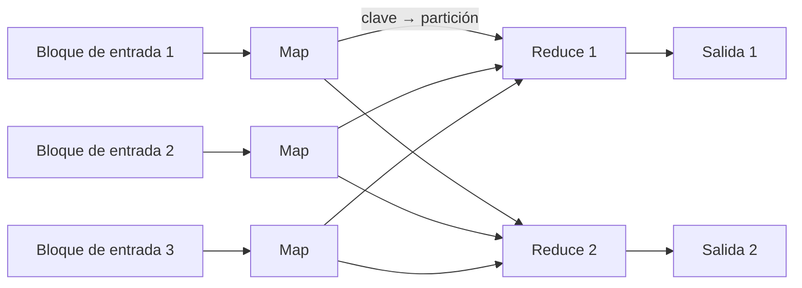

**Objetivo:** entender cómo se procesan volúmenes enormes de datos de forma fiable, y por qué la **inmutabilidad** de las entradas es el gran truco.
**Tiempo:** 1 semana
**Lecturas:** DDIA, capítulo de procesamiento batch · Paper de **MapReduce** (2004), secciones 1–3.

## Antes de leer: predice

1. Tienes 2 TB de logs de acceso y quieres las 10 URLs más visitadas. No caben en memoria. ¿Cómo lo harías con herramientas de Unix en una sola máquina?
2. Un trabajo nocturno calcula mal las comisiones por un bug. ¿Qué necesitas para poder arreglarlo y volver a calcular?

```respuesta id="f6-01-predice" titulo="Mis predicciones"
Antes de leer: responde con lo que sepas o intuyas. No importa acertar.
```

## La filosofía Unix

```bash
cat access.log | awk '{print $7}' | sort | uniq -c | sort -rn | head -10
```

Respuesta a la primera predicción: esta línea funciona con **2 TB en una máquina**. `sort` ordena por trozos en disco y fusiona (como las SSTables de la [Fase 3](/fase-3/02-motores-de-almacenamiento/#sstables-y-lsm-trees)). La filosofía que la hace posible:

- Cada programa hace **una cosa** bien.
- **Interfaz uniforme**: todos leen y escriben líneas de texto, así que se combinan libremente.
- **Las entradas no se modifican**: puedes repetir el comando cuantas veces quieras, cambiando pasos.
- Separar la lógica de **dónde vienen y adónde van** los datos (entrada y salida estándar).

Antes de montar un clúster, comprueba si esto te basta: una sola máquina moderna procesa **mucho**.

## MapReduce

MapReduce lleva la misma idea a miles de máquinas, sobre un **sistema de ficheros distribuido** (GFS, HDFS; hoy, casi siempre almacenamiento de objetos como S3):



1. **Map:** se ejecuta **donde están los datos** (mover el cálculo es más barato que mover los datos). Por cada registro, emite pares clave-valor.
2. **Shuffle:** los pares se **reparten por clave** (hash de la clave entre los reducers) y se ordenan. Todos los valores de una clave llegan al mismo reducer.
3. **Reduce:** procesa todos los valores de cada clave y escribe la salida.

Si una tarea falla, **se repite**: como las entradas son inmutables y la salida de una tarea fallida se descarta, repetir es seguro.

## Joins en batch

Unir "ventas" con "eventos" para tener la ciudad de cada venta:

- **Sort-merge join (en el reduce):** ambos lados emiten la clave del join (`evento_id`); el shuffle junta las ventas y el evento en el mismo reducer.
- **Broadcast hash join (en el map):** si un lado es **pequeño** (5.000 eventos), se carga entero en memoria en cada mapper y se une sin shuffle.
- **Join por particiones:** si ambos lados están particionados igual por la clave del join, cada mapper une su partición con la correspondiente.

**Sesgo:** si una clave concentra muchísimos registros (la gira: millones de ventas del mismo `evento_id`), su reducer tarda muchísimo más que los demás y todo el trabajo espera por él. Solución: detectar claves calientes y **repartirlas** entre varios reducers (añadiendo un sufijo aleatorio y combinando después).

## La salida de un trabajo batch

La salida típica no es un informe, sino **datos derivados**:

- Índices de búsqueda.
- Almacenes clave-valor para servir en producción (recomendaciones precalculadas).
- Tablas para el almacén analítico.

Se escribe en ficheros **nuevos**, no modificando los viejos. Cuando el trabajo termina bien, se **cambia el puntero** a la versión nueva. Si hay un bug, se vuelve a la anterior.

Respuesta a la segunda predicción: necesitas las **entradas originales intactas** (inmutables) y el código corregido. Vuelves a ejecutar y reemplazas la salida. Esto es **tolerancia al error humano**: un bug no destruye datos, solo produce una salida mala que se puede regenerar. Es una de las ideas más potentes de DDIA y la verás de nuevo con event sourcing.

## Más allá de MapReduce: dataflow

MapReduce escribe en disco entre cada paso: lento para cadenas de muchos pasos. Los motores de **dataflow** (Spark, Flink) modelan el trabajo como un **grafo** de operadores y mantienen los datos intermedios en memoria cuando pueden, con tolerancia a fallos recomputando desde entradas duraderas. Además ofrecen APIs de alto nivel (DataFrames, SQL).

Hoy lo habitual es un **data lake** o **lakehouse**: ficheros columnares (Parquet) en almacenamiento de objetos, con formatos de tabla (Iceberg, Delta Lake) que añaden esquema y transacciones, procesados por Spark, Trino o motores similares.

**ETL o ELT:** extraer, transformar y cargar (transformar antes de cargar en el almacén) o extraer, cargar y transformar (cargar en crudo y transformar dentro del almacén con SQL). La tendencia actual es ELT: el almacenamiento es barato y conservar lo crudo permite reprocesar.

## Ejercicios

### Ejercicio 1 · Unix primero

Genera un fichero de un millón de ventas de Taquilla (`fecha,ciudad,evento_id,importe_cent`) con un script y responde **solo con herramientas de Unix** (`awk`, `sort`, `uniq`, `head`):

1. Las 5 ciudades con más ingresos.
2. Los 10 eventos con más entradas vendidas.
3. Mide el tiempo con `time`. ¿Cuánto tardaría con 100 millones?

```respuesta id="f6-01-ej1" titulo="Unix primero"
Escribe aquí tu razonamiento antes de abrir las pistas.
```

<details>
<summary>Pista</summary>

Para sumar por clave, `awk -F, '{s[$2] += $4} END {for (c in s) print s[c], c}'` y luego `sort -rn | head -5`.

</details>

### Ejercicio 2 · Mini-MapReduce (Go)

Implementa `Ejecutar(entradas []string, mapf, reducef, r int) map[string]int`:

- Un mapper (goroutine) por entrada, que reparte sus pares en `r` particiones por hash de la clave.
- `r` reducers (goroutines), cada uno agrupa **su** partición de todos los mappers y aplica `reducef`.

Los tests lo usan para calcular ingresos por ciudad a partir de varios "ficheros" de líneas `ciudad,importe`.

```go practica id="f6-mapreduce" titulo="Mini-MapReduce"
package practica

type KV struct {
	Clave string
	Valor int
}

type MapFunc func(entrada string) []KV
type ReduceFunc func(clave string, valores []int) int

// Ejecutar lanza un mapper (goroutine) por entrada y r reducers, y junta sus salidas.
func Ejecutar(entradas []string, mapf MapFunc, reducef ReduceFunc, r int) map[string]int {
	return nil // TODO
}
```

```go tests id="f6-mapreduce"
package practica

import (
	"strconv"
	"strings"
	"testing"
)

func ventasMap(fichero string) []KV {
	var out []KV
	for _, linea := range strings.Split(strings.TrimSpace(fichero), "\n") {
		ciudad, importe, _ := strings.Cut(linea, ",")
		n, _ := strconv.Atoi(importe)
		out = append(out, KV{ciudad, n})
	}
	return out
}

func suma(_ string, vs []int) int {
	total := 0
	for _, v := range vs {
		total += v
	}
	return total
}

func TestIngresosPorCiudad(t *testing.T) {
	ficheros := []string{
		"madrid,40\nsevilla,25\nmadrid,60",
		"bilbao,30\nmadrid,10",
		"sevilla,5",
	}
	got := Ejecutar(ficheros, ventasMap, suma, 2)
	quiero := map[string]int{"madrid": 110, "sevilla": 30, "bilbao": 30}
	if len(got) != len(quiero) {
		t.Fatalf("got %v, quiero %v", got, quiero)
	}
	for k, v := range quiero {
		if got[k] != v {
			t.Errorf("%s = %d, quiero %d", k, got[k], v)
		}
	}
}
```

```go tests-extra id="f6-mapreduce"
package practica

import (
	"fmt"
	"strings"
	"sync/atomic"
	"testing"
)

func TestElResultadoNoDependeDeR(t *testing.T) {
	var ficheros []string
	for i := range 20 {
		var b strings.Builder
		for j := range 500 {
			fmt.Fprintf(&b, "ciudad%d,%d\n", (i*j)%37, j)
		}
		ficheros = append(ficheros, b.String())
	}
	base := Ejecutar(ficheros, ventasMap, suma, 1)
	for _, r := range []int{2, 7, 64} {
		got := Ejecutar(ficheros, ventasMap, suma, r)
		for k, v := range base {
			if got[k] != v {
				t.Fatalf("con r=%d, %s = %d; con r=1 era %d", r, k, got[k], v)
			}
		}
	}
}

func TestUnReducerPorClave(t *testing.T) {
	// Cada clave debe llegar entera a UN reducer: si se reparte, reducef se llama dos veces con ella.
	var llamadas atomic.Int32
	reducef := func(_ string, vs []int) int { llamadas.Add(1); return len(vs) }
	got := Ejecutar([]string{"a,1\nb,1", "a,1\nc,1", "a,1"}, ventasMap, reducef, 3)
	if got["a"] != 3 || llamadas.Load() != 3 {
		t.Errorf("a = %d (quiero 3 valores juntos), reducef llamada %d veces (quiero 3: una por clave)", got["a"], llamadas.Load())
	}
}
```

<details>
<summary>Pista</summary>

Estructura intermedia: `[mapper][partición][]KV`. Cada mapper escribe solo en su fila, así que no hace falta mutex. Cada reducer lee su columna.

</details>

<details>
<summary>Solución</summary>

```go solucion id="f6-mapreduce"
package practica

import (
	"hash/fnv"
	"sync"
)

type KV struct {
	Clave string
	Valor int
}

type MapFunc func(entrada string) []KV
type ReduceFunc func(clave string, valores []int) int

func particion(clave string, r int) int {
	h := fnv.New32a()
	h.Write([]byte(clave))
	return int(h.Sum32() % uint32(r))
}

// Ejecutar lanza un mapper por entrada y r reducers.
func Ejecutar(entradas []string, mapf MapFunc, reducef ReduceFunc, r int) map[string]int {
	// Fase map: cada mapper reparte su salida en r particiones (el "shuffle").
	parts := make([][][]KV, len(entradas)) // [mapper][partición][]KV
	var wg sync.WaitGroup
	for i, e := range entradas {
		wg.Go(func() {
			local := make([][]KV, r)
			for _, kv := range mapf(e) {
				p := particion(kv.Clave, r)
				local[p] = append(local[p], kv)
			}
			parts[i] = local
		})
	}
	wg.Wait()

	// Fase reduce: cada reducer agrupa por clave su partición de todos los mappers.
	salidas := make([]map[string]int, r)
	for p := range r {
		wg.Go(func() {
			grupos := map[string][]int{}
			for _, local := range parts {
				for _, kv := range local[p] {
					grupos[kv.Clave] = append(grupos[kv.Clave], kv.Valor)
				}
			}
			out := map[string]int{}
			for k, vs := range grupos {
				out[k] = reducef(k, vs)
			}
			salidas[p] = out
		})
	}
	wg.Wait()

	res := map[string]int{}
	for _, s := range salidas {
		for k, v := range s {
			res[k] = v // las claves no se repiten entre particiones
		}
	}
	return res
}
```

Uso:

```go
mapf := func(fichero string) []KV {
	var out []KV
	for _, linea := range strings.Split(fichero, "\n") {
		ciudad, importe, _ := strings.Cut(linea, ",")
		n, _ := strconv.Atoi(importe)
		out = append(out, KV{ciudad, n})
	}
	return out
}
reducef := func(_ string, vs []int) int {
	total := 0
	for _, v := range vs {
		total += v
	}
	return total
}
ingresos := Ejecutar(ficheros, mapf, reducef, 4)
```

Para pensar: ¿qué pasaría si un mapper fallara a mitad? ¿Por qué es seguro repetirlo? ¿Qué es un *combiner* y cómo reduciría los datos del shuffle aquí?

</details>

## Taquilla

Identifica en Taquilla qué procesos son naturalmente **batch** (liquidaciones mensuales a organizadores, informes para la administración, detección de reventa sospechosa…) y cuáles necesitan resultados en segundos. Anótalo para el pipeline de la lección 3.

## Autorrevisión

- [ ] Resuelvo agregaciones sobre ficheros grandes con herramientas de Unix.
- [ ] Explico map, shuffle y reduce, y por qué repetir tareas es seguro.
- [ ] Sé cuándo usar un broadcast join y cómo tratar una clave con sesgo.
- [ ] Explico por qué las entradas inmutables dan tolerancia al error humano.

## Para la sesión de tutor

Explícame por qué "no modificar las entradas" es la decisión de diseño más importante del procesamiento batch, con un ejemplo de Taquilla.
