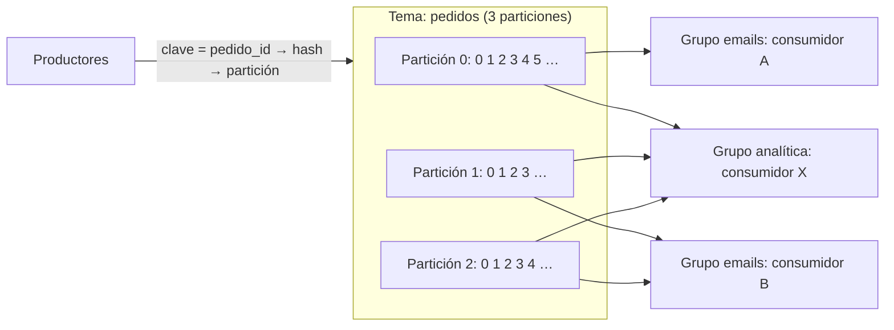

**Objetivo:** elegir entre una cola tradicional y un log particionado, y diseñar temas, claves y consumidores para garantizar el orden donde importa.
**Tiempo:** 1 semana
**Lecturas:** DDIA, capítulo de procesamiento de streams (transmisión de streams de eventos, brokers basados en logs) · Jay Kreps, *The Log* · Paper de **Kafka** (2011).

## Antes de leer: predice

1. Una cola tradicional borra el mensaje cuando el consumidor lo confirma. ¿Qué no puedes hacer entonces que sí podrías con un log que guarda los mensajes una semana?
2. Quieres procesar en orden todos los eventos de cada pedido, pero con muchos consumidores en paralelo. ¿Cómo lo consigues?

```respuesta id="f6-02-predice" titulo="Mis predicciones"
Antes de leer: responde con lo que sepas o intuyas. No importa acertar.
```

## Dos familias

En la [Fase 2](/fase-2/05-asincronia-y-colas/) viste las colas. Hay dos modelos muy distintos detrás de la palabra "mensajería":

| | Broker tradicional (RabbitMQ, SQS, ActiveMQ) | Log particionado (Kafka, Redpanda, Pulsar, Kinesis) |
|---|---|---|
| Qué guarda | Mensajes pendientes; **borra** al confirmar | Un **log append-only** por partición; **conserva** según retención |
| Cómo se lee | El broker **reparte** mensajes entre consumidores | Cada consumidor lleva su **offset** (posición) y lee secuencialmente |
| Paralelismo | Tantos consumidores como quieras, mensaje a mensaje | Como mucho **un consumidor por partición** dentro de un grupo |
| Orden | Se pierde con varios consumidores y reentregas | **Garantizado dentro de cada partición** |
| Releer el pasado | No | **Sí**: basta con mover el offset atrás |
| Un mensaje lento | Solo retrasa ese mensaje | Retrasa **toda su partición** (head-of-line blocking) |
| Bueno para | Tareas independientes y costosas, donde el orden no importa | Eventos, streams, integración de datos, orden por clave, reprocesamiento |

Respuesta a la primera predicción: con un log puedes **reprocesar**: un consumidor nuevo (un índice de búsqueda que acabas de crear) lee el historial desde el principio; un consumidor con un bug se corrige y se rebobina. Es la misma idea que la inmutabilidad del batch, aplicada a streams.

## Anatomía de un log particionado



- **Tema** (*topic*): un flujo de eventos con nombre, dividido en **particiones**.
- **Clave del mensaje:** determina la partición (hash). Todos los mensajes con la misma clave van a la misma partición y se leen **en orden**.
- **Offset:** posición de un mensaje en su partición. Cada **grupo de consumidores** guarda su offset por partición (lo *confirma*). Si un consumidor cae, otro del grupo retoma desde el último offset confirmado.
- **Grupos de consumidores:** cada grupo recibe **todos** los mensajes (pub/sub entre grupos); dentro de un grupo, las particiones se **reparten** (cola entre consumidores). Si hay más consumidores que particiones, los sobrantes quedan ociosos.
- **Rebalanceo:** cuando entra o sale un consumidor del grupo, las particiones se redistribuyen.
- **Replicación:** cada partición tiene un líder y réplicas (líder-seguidor, [Fase 3](/fase-3/04-replicacion/)).

Respuesta a la segunda predicción: **clave = `pedido_id`**. Todos los eventos de un pedido caen en la misma partición y se procesan en orden; pedidos distintos se reparten entre particiones y se procesan en paralelo. **El orden es por clave, no global.**

## Retención y compactación

- **Retención por tiempo o tamaño:** se borran los segmentos más viejos (por ejemplo, 7 días).
- **Compactación de log** (*log compaction*): para temas donde solo importa **el último valor de cada clave**, se descartan los mensajes antiguos de cada clave y se conserva el último. El tema se convierte en una **tabla** reconstruible: un consumidor nuevo lee el tema compactado y obtiene el estado actual. Borrar = publicar una lápida (valor nulo). Es la misma idea que la compactación de Bitcask.

## Entrega y exactamente una vez

- El consumidor procesa y **después** confirma el offset: **al menos una vez** (si cae entre ambos, reprocesa). Consumidores **idempotentes** ([Fase 4](/fase-4/05-entrega-e-idempotencia/)).
- **Productor idempotente:** Kafka deduplica los reintentos del propio productor (con número de secuencia por productor y partición).
- **Transacciones de Kafka:** permiten "leer de un tema, procesar y escribir en otro tema + confirmar el offset" de forma atómica. Es "exactamente una vez" **dentro de Kafka**; en cuanto el efecto sale fuera (una base de datos, un email), vuelves a necesitar idempotencia.

## Elegir el número de particiones

- Es el **límite de paralelismo** de un grupo de consumidores.
- Aumentarlo después **cambia la partición** de las claves (el hash se reparte distinto): se rompe el orden durante la transición. Conviene **sobredimensionar** un poco al principio.
- Demasiadas particiones tienen coste (memoria, ficheros, tiempo de failover).

## Ejercicios

### Ejercicio 1 · Un log en tu máquina

Levanta Kafka en modo KRaft o **Redpanda** (compatible con Kafka, un solo binario) siguiendo su guía rápida con Docker. Con la CLI (`rpk` en Redpanda o los scripts de Kafka):

1. Crea un tema `ventas` con 3 particiones.
2. Produce 20 mensajes con 4 claves distintas (`evento-1` … `evento-4`). Comprueba en qué partición cae cada clave.
3. Consume con un grupo `emails` de **2** consumidores en dos terminales. ¿Cómo se reparten las particiones?
4. Mata un consumidor y observa el rebalanceo.
5. Crea un grupo nuevo `analitica` y consume **desde el principio**. ¿Qué ve?
6. Añade un tercer y un cuarto consumidor a `emails`. ¿Qué hace el cuarto?

```respuesta id="f6-02-ej1" titulo="Un log en tu máquina"
Escribe aquí tu razonamiento antes de abrir las pistas.
```

<details>
<summary>Qué deberías observar</summary>

2. Cada clave siempre en la misma partición (varias claves pueden compartir partición).
3. Un consumidor recibe 2 particiones y otro 1.
4. El superviviente recibe las 3 tras el rebalanceo y sigue desde los offsets confirmados (quizás reprocesando algún mensaje).
5. Todos los mensajes desde el offset 0: los grupos son independientes.
6. El cuarto no recibe nada: 3 particiones = 3 consumidores activos como mucho.

</details>

### Ejercicio 2 · ¿Cola o log?

1. Generar el PDF de cada entrada (costoso, independiente, el orden no importa).
2. Los cambios de estado de cada pedido, consumidos por emails, analítica y el servicio de acceso.
3. Redimensionar las imágenes de carteles subidas por los organizadores.
4. Propagar los cambios del catálogo a un índice de búsqueda nuevo que hay que llenar desde cero.

```respuesta id="f6-02-ej2" titulo="¿Cola o log?"
Escribe aquí tu razonamiento antes de abrir las pistas.
```

<details>
<summary>Solución</summary>

1. **Cola:** tareas independientes; con una cola, un PDF lento no bloquea a otros.
2. **Log** con clave `pedido_id`: varios consumidores independientes, orden por pedido.
3. **Cola.**
4. **Log** (idealmente compactado por `evento_id`): el índice nuevo se llena leyendo desde el principio.

</details>

## Taquilla

Escribe el **ADR "Broker o log"** para los eventos de Taquilla: qué temas, con qué clave, cuántas particiones (y qué pasa con la gira: ¿clave `evento_id` en un tema de ventas? ¿Partición caliente?), qué retención y quién consume cada uno. ¿Hay algo que siga yendo mejor por una cola tradicional?

## Autorrevisión

- [ ] Comparo un broker tradicional y un log particionado en guardar, leer, orden, paralelismo y reprocesamiento.
- [ ] Sé qué son offsets, grupos de consumidores y rebalanceos.
- [ ] Elijo la clave del mensaje para garantizar el orden donde importa.
- [ ] Sé qué es la compactación de log y para qué sirve.
- [ ] Sé hasta dónde llega el "exactamente una vez" de Kafka.

## Para la sesión de tutor

Trae tu ADR. Te diré que el equipo de analítica quiere reprocesar los últimos 6 meses con una lógica nueva; explica qué necesitas para hacerlo.
