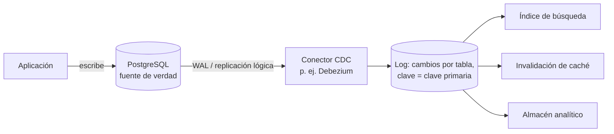

**Objetivo:** mantener cachés, índices y vistas sincronizados con la fuente de verdad sin escrituras duales, y saber cuándo compensa hacer de los eventos la fuente de verdad.
**Tiempo:** 1 semana
**Lecturas:** DDIA, capítulo de procesamiento de streams (bases de datos y streams: CDC, event sourcing, estado e inmutabilidad) · microservices.io, *Event sourcing*, *CQRS* · Opcional: Kleppmann, *Turning the database inside-out*.

## Antes de leer: predice

1. Cuando cambia un evento, tu código actualiza PostgreSQL, luego Elasticsearch y luego invalida la caché. ¿Qué puede salir mal?
2. Un banco no guarda "tu saldo es 1.250 €": guarda todos los movimientos, y el saldo se calcula. ¿Qué gana con eso? ¿Qué pierde?

```respuesta id="f6-03-predice" titulo="Mis predicciones"
Antes de leer: responde con lo que sepas o intuyas. No importa acertar.
```

## Datos derivados y escritura dual

La mayoría de sistemas tienen **una fuente de verdad** (el sistema de registro) y varios **datos derivados**: cachés, índices de búsqueda, vistas materializadas, almacenes analíticos. El problema es mantenerlos al día.

Respuesta a la primera predicción: es la **escritura dual** de la [Fase 4](/fase-4/06-sagas-y-outbox/#el-problema-de-la-escritura-dual), multiplicada por tres, y además con **condiciones de carrera**: dos actualizaciones concurrentes pueden llegar a PostgreSQL en un orden y a Elasticsearch en el contrario, dejando el índice **permanentemente** distinto de la base de datos. Nada lo detecta.

La solución de fondo: **un único orden de cambios**, el de la fuente de verdad, que todos los sistemas derivados consumen **en ese orden**.

## Change Data Capture (CDC)

La base de datos **ya tiene** ese orden: su log de replicación ([Fase 3](/fase-3/04-replicacion/#cómo-se-implementa-el-log)). CDC consiste en **leer ese log** y publicar cada cambio como un evento:



- La aplicación solo escribe en **un sitio**. Los derivados siguen al log **en el mismo orden** que la base de datos.
- Un derivado nuevo se inicializa con una **instantánea** y luego sigue el log desde la posición de la instantánea.
- Es asíncrono: los derivados van unos milisegundos o segundos por detrás (consistencia eventual, a propósito).
- **Outbox frente a CDC:** con CDC publicas **cambios de filas** (un detalle interno de tu esquema); con outbox publicas **eventos de dominio** con significado (`EntradaVendida`). A menudo se combinan: CDC **sobre la tabla outbox**, como relay sin sondeo.

## Event sourcing

Ir un paso más allá: **guardar los eventos como fuente de verdad**, y derivar el estado actual de ellos.

```text
Evento 1: ReservaCreada      {reserva: r-9, asientos: [A5, A6], expira: 20:10}
Evento 2: PagoIniciado       {reserva: r-9, importe: 90 €}
Evento 3: PagoConfirmado     {reserva: r-9}
Evento 4: EntradasEmitidas   {reserva: r-9, entradas: [e-1, e-2]}

Estado actual de r-9 = aplicar(1, 2, 3, 4) → "pagada, con 2 entradas emitidas"
```

Respuesta a la segunda predicción. Lo que se gana:

- **Auditoría completa:** sabes cómo se llegó a cada estado, no solo cuál es.
- **Tolerancia al error humano:** si un bug calculó mal algo, corriges el código y **reconstruyes** el estado desde los eventos (como en batch).
- **Nuevas vistas a posteriori:** una pregunta que no se te ocurrió al diseñar ("¿cuántas reservas caducan tras iniciar el pago?") se responde reprocesando.
- Los eventos capturan **intención** ("el comprador canceló" frente a "estado = cancelada").

Lo que se pierde, o se paga:

- **Complejidad:** leer el estado requiere reconstruirlo (con **instantáneas** periódicas para no reprocesar millones de eventos).
- **Los eventos son para siempre:** su esquema debe evolucionar con compatibilidad durante años ([Fase 3](/fase-3/03-codificacion-y-evolucion/)).
- **Borrar es difícil:** el RGPD exige poder borrar datos personales de un log inmutable. Técnica habitual: **cifrar los datos personales con una clave por persona y destruir la clave** (*crypto-shredding*).
- **Validación de comandos:** un **comando** ("reserva A5") puede rechazarse; un **evento** ("A5 reservado") es un hecho. Validar un comando contra el estado actual con concurrencia sigue necesitando lo aprendido en las Fases 3 y 4.
- Las vistas son **eventualmente consistentes**.

No es un estilo para todo el sistema. Compensa en **subdominios núcleo** donde la historia importa (contabilidad, pedidos) y casi nunca en un CRUD de soporte.

## CQRS

**Command Query Responsibility Segregation:** separar el **modelo de escritura** (optimizado para validar comandos y mantener invariantes) de uno o varios **modelos de lectura** (optimizados para cada consulta), alimentados por eventos.

- El modelo de escritura puede ser relacional y normalizado; los de lectura, desnormalizados, en una caché, en un índice de búsqueda o en memoria.
- Cada vista se diseña para **una** pantalla o consulta, y se puede reconstruir desde los eventos.
- Va muy bien con event sourcing, pero **no lo necesita**: basta con CDC o outbox.
- Coste: consistencia eventual entre escritura y lectura (el usuario que acaba de escribir puede no verlo: read-your-writes, otra vez).

## La base de datos "del revés"

La idea de fondo de DDIA y Kreps: una base de datos ya es un **log** (el WAL) más **vistas materializadas** (tablas, índices, cachés). Sacar ese log fuera, como un componente de primera clase, y construir los demás almacenes como **vistas derivadas** de él es "darle la vuelta a la base de datos" (*unbundling*). Pensar en tu sistema como **flujos de datos** entre un sistema de registro y derivados es la perspectiva más útil de esta fase.

## Ejercicios

### Ejercicio 1 · CDC con PostgreSQL

PostgreSQL trae decodificación lógica de serie. Sin montar Debezium, puedes ver el stream de cambios:

```bash
docker run -d --name pgcdc -e POSTGRES_PASSWORD=pg postgres:17 -c wal_level=logical
docker exec -it pgcdc psql -U postgres
```

```sql
CREATE TABLE pedidos (id BIGINT PRIMARY KEY, estado TEXT NOT NULL);
SELECT * FROM pg_create_logical_replication_slot('taquilla', 'test_decoding');

INSERT INTO pedidos VALUES (1, 'pendiente');
UPDATE pedidos SET estado = 'pagado' WHERE id = 1;
BEGIN;
  INSERT INTO pedidos VALUES (2, 'pendiente');
  DELETE FROM pedidos WHERE id = 1;
COMMIT;

SELECT lsn, xid, data FROM pg_logical_slot_get_changes('taquilla', NULL, NULL);
```

1. ¿Qué ves? ¿Se respetan las transacciones?
2. Ejecuta `pg_logical_slot_get_changes` otra vez. ¿Por qué no devuelve nada?
3. Si el consumidor de este slot se para una semana, ¿qué le pasa al disco de PostgreSQL? (Pista: el slot impide borrar el WAL que no ha consumido.)

```respuesta id="f6-03-ej1" titulo="CDC con PostgreSQL"
Escribe aquí tu razonamiento antes de abrir las pistas.
```

<details>
<summary>Qué deberías observar</summary>

1. Cada transacción aparece entre `BEGIN xid` y `COMMIT xid`, con sus cambios en orden: `INSERT`, `UPDATE`, y la última transacción con su `INSERT` y su `DELETE` juntos. Es el orden de la fuente de verdad.
2. `get_changes` **consume** los cambios y avanza la posición del slot (existe `pg_logical_slot_peek_changes` para mirar sin consumir). Es un offset, como en Kafka.
3. El WAL se **acumula** hasta que el consumidor vuelva: un slot abandonado puede llenar el disco del servidor principal. Hay que monitorizar el retraso de los slots (y PostgreSQL permite limitarlo con `max_slot_wal_keep_size`).

Para terminar: `SELECT pg_drop_replication_slot('taquilla');` y `docker rm -f pgcdc`.

</details>

### Ejercicio 2 · ¿Event sourcing?

¿Usarías event sourcing en cada caso? Justifica.

1. El inventario de asientos de Taquilla.
2. El perfil de usuario (nombre, email, preferencias).
3. El libro contable de liquidaciones a organizadores.
4. El carrito de la compra.

```respuesta id="f6-03-ej2" titulo="¿Event sourcing?"
Escribe aquí tu razonamiento antes de abrir las pistas.
```

<details>
<summary>Solución</summary>

1. **Discutible.** La historia es valiosa (auditoría de quién reservó qué y cuándo, análisis de caducidades), pero la validación concurrente de comandos bajo contención extrema es lo crítico, y event sourcing no la simplifica. Una opción equilibrada: estado en tablas (Fase 3) + eventos publicados por outbox para las vistas.
2. **No.** CRUD sin historia valiosa, y con datos personales que hay que poder borrar.
3. **Sí.** Un libro contable **es** una secuencia de asientos inmutables: nunca se modifica un movimiento, se añade uno que lo corrige.
4. **Probablemente no** para el estado, aunque los eventos del carrito (añadido, eliminado) son oro para analítica: publícalos sin hacerlos fuente de verdad.

</details>

## Taquilla

1. Escribe el **catálogo de eventos de dominio** de Taquilla (nombre, cuándo se emite, campos, clave de partición) en `docs/eventos.md`, con las reglas de evolución del ADR de la Fase 3.
2. Diseña la **vista de disponibilidad por CQRS**: el modelo de escritura es tu inventario (Fase 3); la vista de lectura es el mapa de asientos. ¿De dónde salen los eventos (outbox o CDC)? ¿Dónde vive la vista (Redis, memoria de los servidores de SSE, tabla desnormalizada)? ¿Cuánto va por detrás y qué ve el usuario?

## Autorrevisión

- [ ] Explico por qué la escritura dual deja derivados inconsistentes de forma permanente.
- [ ] Sé qué es CDC y cómo se inicializa un derivado nuevo.
- [ ] Distingo CDC de outbox y sé combinarlos.
- [ ] Enumero ventajas y costes de event sourcing, incluido el borrado de datos personales.
- [ ] Sé qué es CQRS y que no exige event sourcing.

## Para la sesión de tutor

Trae tu catálogo de eventos. Te pediré añadir un campo obligatorio a `EntradaVendida` dentro de un año, con 6 meses de eventos ya guardados; explica cómo.
