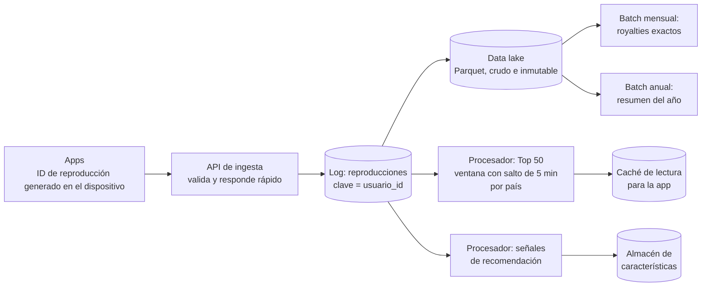

## Kata · Reproducciones de un servicio de música

**Tiempo:** 60 minutos.

**Enunciado:** un servicio de streaming de música con 50 millones de usuarios activos diarios necesita, a partir de cada reproducción:

1. **Pagos a artistas** (royalties): una reproducción cuenta si dura más de 30 s. Se liquida **mensualmente** y debe ser **exacto** (hay auditorías).
2. **Top 50 por país** actualizado cada 5 minutos, visible en la app.
3. **"Tu resumen del año"** personalizado, en diciembre.
4. **Recomendaciones** que reaccionen en minutos a lo que el usuario escucha.

Las apps móviles reproducen **sin conexión** y envían las reproducciones al reconectar (a veces días después). Las apps reintentan los envíos si no reciben confirmación.

**Entrega:** estimación de volumen, pipeline (fuentes, log, procesadores, destinos), qué es batch y qué streaming, cómo garantizas que **cada reproducción cuenta una vez** para royalties, tratamiento de los tardíos, y un ADR.

```respuesta id="f6-cierre-kata" titulo="Reproducciones de un servicio de música"
Tu diseño: requisitos, estimación, API, datos, C4, profundizar, fallos. Puedes seguir la plantilla de kata de los anexos.
```

<details>
<summary>Pista 1 · Volumen</summary>

50 millones × ~40 reproducciones al día = 2 × 10⁹ eventos/día ≈ 23.000/s de media. ¿Cabe en un log particionado? ¿Con qué clave?

</details>

<details>
<summary>Pista 2 · Contar una vez</summary>

La app reintenta. ¿Quién genera el identificador de cada reproducción? ¿Dónde se deduplica?

</details>

<details>
<summary>Solución de referencia</summary>

**Estimación:** ~2 × 10⁹ eventos/día, ~23.000/s de media, ~70.000/s en pico. A ~200 bytes: ~400 GB/día → ~150 TB/año en crudo (mucho menos comprimido en columnar).

**Pipeline**



**Batch o streaming**

| Necesidad | Modo | Por qué |
|---|---|---|
| Royalties | **Batch** mensual sobre el data lake | Exactitud y auditoría; los tardíos de días ya han llegado; reprocesable si hay un bug |
| Top 50 | Streaming, ventanas con salto (tamaño 24 h, salto 5 min) por país | Frescura; aproximado es aceptable |
| Resumen del año | Batch | Una vez al año, sobre todo el historial |
| Recomendaciones | Streaming | Reaccionar en minutos |

**Contar una vez:** la app genera un **ID de reproducción** (UUID) al empezar a reproducir, y lo reenvía en cada reintento. El batch de royalties **deduplica por ID** (un `DISTINCT` o un `GROUP BY` sobre el ID) antes de contar. El streaming puede deduplicar de forma aproximada (ventana de IDs vistos recientemente) porque el Top 50 tolera errores pequeños.

**Tardíos:** royalties, sin problema (el batch corre después de cerrar el mes, con un margen de días; lo que llegue más tarde entra en una liquidación de ajuste). Top 50: se descartan los de más de unas horas (irrelevantes para "lo más escuchado ahora"). Se usa **tiempo de evento** en ambos.

**ADR:** "Log como columna vertebral, con data lake inmutable como fuente de verdad para los cálculos exactos (arquitectura Kappa con batch sobre el lake)". Alternativa descartada: calcular royalties en streaming (tardíos de días, correcciones difíciles de auditar). Consecuencia: dos tecnologías de cálculo (streaming y batch), pero **con la misma fuente de datos**, así que un error en cualquiera se corrige reprocesando.

</details>

### Autoevaluación

[Panel de revisión](/guia/panel-de-revision/). Pesan especialmente **Datos**, **Fiabilidad** (duplicados y tardíos) y **Trade-offs**. Guárdala en `docs/katas/fase-6-musica.md`.

## Revisión de Taquilla v5

- [ ] `eventos.md`: catálogo de eventos de dominio con campos, clave de partición y reglas de evolución.
- [ ] ADR "broker o log": temas, claves, particiones, retención y consumidores.
- [ ] Vista de disponibilidad por CQRS: fuente de eventos, dónde vive la vista, cuánto va por detrás y qué ve el usuario.
- [ ] Pipeline de eventos con diagrama: fuentes, temas, procesadores (con ventanas) y destinos.
- [ ] Analítica de ventas: batch, streaming o ambas, con frescura justificada.
- [ ] Decisión explícita sobre event sourcing (dónde sí y dónde no).

## Preguntas de repaso

1. ¿Qué tienen en común la compactación de Bitcask (Fase 3), la compactación de un tema de Kafka y un tema de "estado actual por clave"?
2. Un consumidor de CDC lleva 3 días parado. ¿Qué le pasa al PostgreSQL de origen y qué le pasa al consumidor cuando vuelve?
3. ¿Por qué el orden por partición de un log resuelve la carrera "PostgreSQL en un orden, Elasticsearch en otro"?
4. El panel del organizador cuenta las ventas por tiempo de procesamiento. ¿Qué verá tras una caída de 10 minutos del procesador?
5. (De la Fase 4) ¿Qué tiene en común la marca de agua con el timeout de un detector de fallos?
6. (De la Fase 5) ¿En qué bounded context de Taquilla vive la vista de disponibilidad, y quién es su dueño?

```respuesta id="f6-cierre-repaso" titulo="Preguntas de repaso"
Responde sin mirar las lecciones.
```

<details>
<summary>Respuestas</summary>

1. Los tres conservan **el último valor de cada clave** y descartan el resto. Un log compactado es una tabla; una tabla es un log compactado.
2. El WAL se acumula en el origen (el slot impide borrarlo) y puede llenar el disco. Al volver, el consumidor lee todo lo acumulado desde su posición y se pone al día (si el WAL sigue ahí).
3. Porque ambos derivados leen los cambios **en el mismo orden** en que se confirmaron en la fuente de verdad, para cada clave. Ya no hay dos escritores independientes compitiendo.
4. Un hueco de 10 minutos sin ventas y luego un pico enorme cuando procesa lo acumulado. Con tiempo de evento, las ventas se colocarían en sus minutos reales (con los tardíos tratados según el retraso tolerado).
5. Ambos **deciden bajo incertidumbre** que algo ya no va a llegar (un evento, un heartbeat) a partir de un tiempo de espera. Ambos intercambian rapidez por errores: cerrar pronto produce tardíos; declarar muerto pronto produce falsos positivos.
6. Es una vista de lectura derivada del inventario. Lo razonable es que sea del contexto de **inventario y reservas** (que es quien conoce su semántica) aunque se sirva desde otro sitio (una caché o los servidores de SSE). Si la construyera otro contexto, dependería del modelo interno del inventario, salvo que se alimente de eventos publicados como contrato.

</details>

## Criterios de dominio

- [ ] Explico por qué un log particionado garantiza orden solo dentro de la partición y cómo elegir la clave.
- [ ] Distingo event sourcing de "publicar eventos" y conozco su coste real.
- [ ] Explico qué problema resuelve CDC frente a la escritura dual.
- [ ] Diseño procesamiento de streams con tiempo de evento, ventanas y tratamiento de tardíos.
- [ ] La kata puntúa al menos 3 en Datos, Fiabilidad y Trade-offs.

## Siguiente

[Fase 7 · Fiabilidad y operación](/fase-7/): que el sistema sobreviva en producción.
