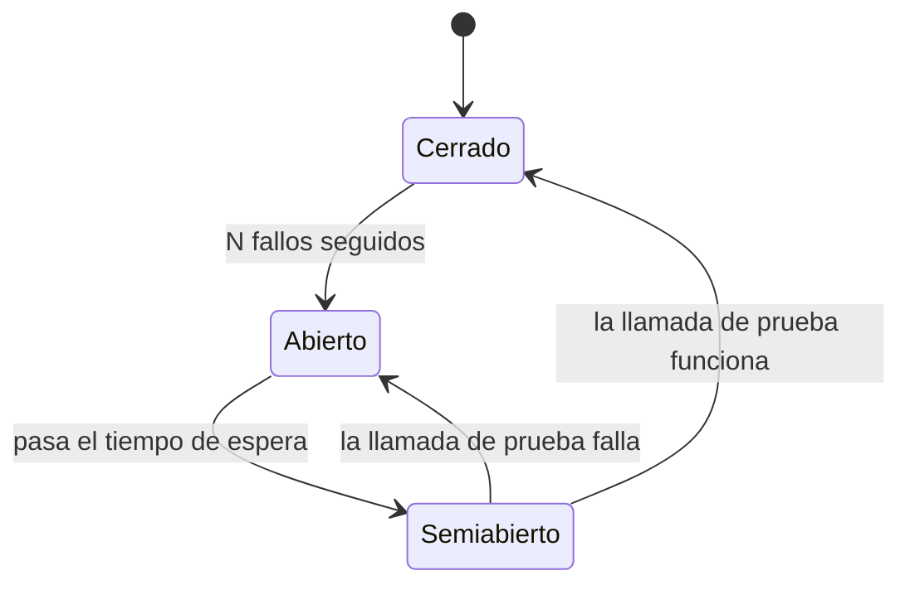

**Objetivo:** evitar que un fallo local se convierta en una caída total, y sobrevivir a picos de carga superiores a la capacidad.
**Tiempo:** 1 semana (es la lección más práctica de la fase)
**Lecturas:** *Release It!*, capítulos de antipatrones y patrones de estabilidad · Amazon Builders' Library, *Timeouts, retries, and backoff with jitter* y *Using load shedding to avoid overload* · *SRE*, capítulos de manejo de sobrecarga y fallos en cascada · Alex Xu vol. 1, *Design a rate limiter*.

## Antes de leer: predice

1. El servicio de precios empieza a tardar 30 s por petición (sin fallar). Tu servicio de reservas lo llama sin timeout con un pool de 100 conexiones. ¿Qué le pasa a reservas? ¿Y a lo que depende de reservas?
2. 10.000 clientes pierden la conexión a la vez y reintentan cada uno exactamente 1 s después. ¿Qué ve el servidor?
3. Te llega el triple de tráfico del que puedes atender. ¿Es mejor intentar atenderlo todo o rechazar parte?

```respuesta id="f7-03-predice" titulo="Mis predicciones"
Antes de leer: responde con lo que sepas o intuyas. No importa acertar.
```

## Cómo se propaga un fallo

Respuesta a la primera predicción: cada petición a reservas se queda **esperando** a precios. En segundos, las 100 conexiones y los hilos (o goroutines, y su memoria) de reservas están **bloqueados**. Reservas deja de responder, aunque su código no tenga ningún problema. Lo que depende de reservas se bloquea igual. Un servicio **lento** ha tumbado toda la cadena: es un **fallo en cascada**.

Antipatrones de *Release It!* que lo favorecen:

- **Puntos de integración** sin protección: cada llamada de red es un riesgo.
- **Reacciones en cadena:** cuando cae una instancia, su carga pasa a las demás, que caen a su vez.
- **Hilos bloqueados:** recursos retenidos esperando algo que no llega.
- **Resultados sin límite:** una consulta que un día devuelve un millón de filas.
- **Ataques de autodenegación:** una campaña de marketing (o la salida a la venta que tú mismo anuncias) que genera un pico que tú no dimensionaste.
- **Estampidas** (*dogpile*): muchos clientes haciendo lo mismo a la vez (caché que caduca, reinicio simultáneo, reintentos sincronizados).

## Timeouts y plazos

- **Ninguna llamada de red sin timeout.** Ya lo aplicaste desde la [Fase 0](/go/04-red-y-testing/#timeouts-la-configuración-que-todos-olvidan).
- **Propagar el plazo** (*deadline*): si el cliente solo esperará 2 s, no tiene sentido que el tercer servicio de la cadena trabaje 5 s. En Go, `context.WithTimeout` pasado hacia abajo; en gRPC, los *deadlines* viajan solos.
- El timeout de una llamada debe ser **menor** que el de quien te llama.

## Reintentos

Reintentar arregla fallos **transitorios**, pero **multiplica la carga** justo cuando el sistema está peor ([Fase 4](/fase-4/01-fallos-parciales/#ejercicio-3--timeouts-con-números)). Reglas:

1. **Solo lo idempotente** (o con clave de idempotencia).
2. **Solo errores transitorios** (timeouts, `503`, `429`), nunca un `400`.
3. **Backoff exponencial:** esperar `base · 2ⁱ` entre intentos, con tope.
4. **Jitter:** añadir aleatoriedad. Respuesta a la segunda predicción: sin jitter, los 10.000 reintentos llegan **en el mismo instante**, una y otra vez, como un martillo. Con **jitter completo** (`espera = aleatorio(0, min(tope, base · 2ⁱ))`) se reparten en el tiempo.
5. **Presupuesto de reintentos:** reintentar en **una sola capa** (no en cada una: 3 reintentos en 4 capas son 3⁴ = 81 llamadas por petición) y limitar la proporción de reintentos (por ejemplo, como mucho el 10 % de las peticiones).

## Circuit breaker

Como un interruptor eléctrico: si una dependencia falla repetidamente, **deja de llamarla** durante un tiempo y falla rápido.



- **Cerrado:** las llamadas pasan; se cuentan los fallos.
- **Abierto:** las llamadas fallan **inmediatamente**, sin tocar la dependencia (que así puede recuperarse), y sin gastar recursos propios esperando.
- **Semiabierto:** se deja pasar una llamada de prueba.

Mientras está abierto, ¿qué devuelves? Un **fallback** (degradación elegante).

## Bulkheads (mamparos)

Como los compartimentos estancos de un barco: **aislar recursos** para que un fallo no los agote todos. Pools de conexiones o de workers **separados por dependencia** o por tipo de cliente. Si el PSP se atasca, solo se bloquea el pool de pagos; la navegación del catálogo sigue funcionando.

## Rate limiting

Limitar cuántas peticiones acepta cada cliente (por IP, usuario, clave de API) para protegerte del abuso y repartir la capacidad.

| Algoritmo | Cómo | Notas |
|---|---|---|
| **Token bucket** | Un cubo de capacidad C se rellena a R tokens/s; cada petición consume uno | Permite **ráfagas** de hasta C. El más usado |
| Leaky bucket | Las peticiones entran en una cola que se vacía a ritmo constante | Suaviza la salida; no permite ráfagas |
| Ventana fija | Contador por minuto natural | Simple; permite el doble de ráfaga en el cambio de ventana |
| Ventana deslizante | Registro o contadores ponderados de la ventana anterior y la actual | Más preciso, algo más caro |

Con varias instancias, el estado del limitador debe ser **compartido** (Redis) y actualizarse de forma **atómica** (un script Lua), o repartir el límite entre instancias de forma aproximada. Responder `429` con `Retry-After`.

## Load shedding y degradación elegante

Respuesta a la tercera predicción: **rechazar parte**. Un servidor que intenta atenderlo todo por encima de su capacidad acumula colas, la latencia se dispara, los clientes hacen timeout y reintentan, y al final **no atiende a nadie** (el trabajo se completa cuando ya nadie espera el resultado). Es preferible atender bien al 70 % y rechazar **rápido** al 30 %.

- **Load shedding:** rechazar trabajo cuando se detecta sobrecarga (cola interna llena, latencia por encima de un umbral, CPU saturada), **lo antes posible** (en el borde) y de forma **barata**.
- **Priorizar:** rechazar primero lo menos importante (analítica, recomendaciones) y proteger lo crítico (completar pagos en curso).
- **Degradación elegante:** servir algo peor pero útil. El mapa de asientos por zonas en lugar de asiento a asiento; resultados de búsqueda cacheados; ocultar las recomendaciones.

### Colas virtuales (salas de espera)

Para picos **anunciados** y muy superiores a la capacidad (salidas a la venta, rebajas), en lugar de rechazar al azar se **ordena** la llegada: los usuarios entran en una sala de espera (normalmente servida desde el borde o la CDN, que aguanta millones de conexiones baratas) y se les **admite** a un ritmo que el sistema puede atender. Es load shedding convertido en una experiencia justa y comprensible ("tu posición: 12.345, tiempo estimado: 8 min"). Diseñarla es parte de tu entregable.

## Ejercicios

### Ejercicio 1 · Token bucket (Go)

1. En el editor: un `Cubo` con capacidad y tasa de reposición, y `Permitir() bool`. Los tests comprueban la ráfaga y la reposición con un reloj simulado.
2. En tu repositorio, la versión **distribuida** con Redis: un script Lua que lee el estado, repone, consume y guarda de forma atómica. Test: 50 goroutines piden a la vez con capacidad 10 → exactamente 10 permitidas.
3. Úsalo como middleware HTTP por IP, respondiendo `429` con `Retry-After`.

```go practica id="f7-cubo" titulo="Token bucket en memoria"
package practica

import (
	"sync"
	"time"
)

type Cubo struct {
	mu        sync.Mutex
	capacidad float64 // ráfaga máxima
	tasa      float64 // tokens que se reponen por segundo
	ahora     func() time.Time // los tests la sustituyen por un reloj simulado
	// TODO
}

// NuevoCubo empieza lleno.
func NuevoCubo(capacidad, tasa float64) *Cubo {
	return &Cubo{capacidad: capacidad, tasa: tasa, ahora: time.Now} // TODO
}

// Permitir consume un token si lo hay. Ojo: si el reloj retrocede (una corrección de NTP),
// el tiempo transcurrido sale negativo: no dejes que eso reste tokens.
func (c *Cubo) Permitir() bool {
	return true // TODO
}
```

```go tests id="f7-cubo"
package practica

import (
	"testing"
	"time"
)

func cuboConReloj(capacidad, tasa float64) (*Cubo, *time.Time) {
	ahora := time.Unix(1000, 0)
	c := NuevoCubo(capacidad, tasa)
	c.ahora = func() time.Time { return ahora }
	c.Permitir() // primera llamada con el reloj simulado: fija la hora de referencia
	return c, &ahora
}

func TestRafagaYReposicion(t *testing.T) {
	c, ahora := cuboConReloj(5, 1) // 5 de ráfaga, 1 token por segundo
	permitidas := 1                // la llamada de cuboConReloj ya consumió uno
	for range 10 {
		if c.Permitir() {
			permitidas++
		}
	}
	if permitidas != 5 {
		t.Fatalf("ráfaga: %d permitidas, quiero 5", permitidas)
	}
	*ahora = ahora.Add(2 * time.Second) // se reponen 2 tokens
	if !c.Permitir() || !c.Permitir() {
		t.Fatal("tras 2 s deberían reponerse 2 tokens")
	}
	if c.Permitir() {
		t.Fatal("solo se repusieron 2: la tercera debe rechazarse")
	}
}
```

```go tests-extra id="f7-cubo"
package practica

import (
	"sync"
	"sync/atomic"
	"testing"
	"time"
)

func TestNoSuperaLaCapacidad(t *testing.T) {
	c, ahora := cuboConReloj(3, 10)
	*ahora = ahora.Add(time.Hour) // mucho tiempo inactivo
	n := 0
	for range 10 {
		if c.Permitir() {
			n++
		}
	}
	if n != 3 {
		t.Errorf("tras una hora inactivo: %d permitidas; la ráfaga no puede superar la capacidad (3)", n)
	}
}

func TestTasaFraccionaria(t *testing.T) {
	c, ahora := cuboConReloj(1, 0.5) // un token cada 2 s
	*ahora = ahora.Add(time.Second)
	if c.Permitir() {
		t.Error("tras 1 s solo hay medio token")
	}
	*ahora = ahora.Add(time.Second)
	if !c.Permitir() {
		t.Error("tras 2 s debe haber un token")
	}
}

func TestCuboConcurrente(t *testing.T) {
	c := NuevoCubo(100, 0.0001)
	var ok atomic.Int32
	var wg sync.WaitGroup
	for range 500 {
		wg.Go(func() {
			if c.Permitir() {
				ok.Add(1)
			}
		})
	}
	wg.Wait()
	if ok.Load() != 100 {
		t.Errorf("%d permitidas en paralelo; quiero exactamente 100", ok.Load())
	}
}
```

<details>
<summary>Pista 1</summary>

No hace falta un temporizador que añada tokens: al llegar cada petición, calcula cuántos tokens se habrían repuesto desde la última (`transcurrido × tasa`), súmalos (sin pasar de la capacidad) y guarda la hora.

</details>

<details>
<summary>Pista 2</summary>

En el script Lua, usa el reloj de **Redis** (`redis.call('TIME')`) en lugar del de cada instancia: así los relojes desfasados de las instancias no afectan. Pon una caducidad a la clave para que los clientes inactivos no ocupen memoria.

</details>

<details>
<summary>Solución</summary>

```go solucion id="f7-cubo"
package practica

import (
	"sync"
	"time"
)

type Cubo struct {
	mu        sync.Mutex
	capacidad float64 // ráfaga máxima
	tasa      float64 // tokens que se reponen por segundo
	tokens    float64
	ultimo    time.Time
	ahora     func() time.Time
}

func NuevoCubo(capacidad, tasa float64) *Cubo {
	return &Cubo{capacidad: capacidad, tasa: tasa, tokens: capacidad, ultimo: time.Now(), ahora: time.Now}
}

func (c *Cubo) Permitir() bool {
	c.mu.Lock()
	defer c.mu.Unlock()
	t := c.ahora()
	transcurrido := max(0, t.Sub(c.ultimo).Seconds()) // si el reloj retrocede (NTP), no restar tokens
	c.tokens = min(c.capacidad, c.tokens+transcurrido*c.tasa)
	c.ultimo = t
	if c.tokens < 1 {
		return false
	}
	c.tokens--
	return true
}
```

Y la versión distribuida, que necesita un Redis en marcha (hazla en tu repositorio, con el test de 50 goroutines y capacidad 10):

```go
package estabilidad

import (
	"context"

	"github.com/redis/go-redis/v9"
)

// ---------- Token bucket distribuido (Redis + Lua) ----------

// El script se ejecuta de forma atómica en Redis: no hay carreras entre instancias.
// Usa el reloj de Redis (TIME) para no depender del reloj de cada instancia.
var scriptCubo = redis.NewScript(`
local capacidad = tonumber(ARGV[1])
local tasa = tonumber(ARGV[2])
local t = redis.call('TIME')
local ahora = tonumber(t[1]) * 1000 + math.floor(tonumber(t[2]) / 1000)
local datos = redis.call('HMGET', KEYS[1], 'tokens', 'ts')
local tokens = tonumber(datos[1]) or capacidad
local ts = tonumber(datos[2]) or ahora
tokens = math.min(capacidad, tokens + (ahora - ts) / 1000 * tasa)
local permitido = 0
if tokens >= 1 then
  tokens = tokens - 1
  permitido = 1
end
redis.call('HSET', KEYS[1], 'tokens', tostring(tokens), 'ts', tostring(ahora))
redis.call('PEXPIRE', KEYS[1], math.ceil(capacidad / tasa * 1000) + 1000)
return permitido
`)

func PermitirDistribuido(ctx context.Context, rdb *redis.Client, clave string, capacidad, tasa float64) (bool, error) {
	n, err := scriptCubo.Run(ctx, rdb, []string{"cubo:" + clave}, capacidad, tasa).Int()
	return n == 1, err
}
```

Decisión a tomar: si Redis no responde, ¿dejas pasar las peticiones (*fail open*: disponibilidad) o las rechazas (*fail closed*: protección)? Para un límite antiabuso, normalmente *fail open* con un límite local de respaldo.

</details>

### Ejercicio 2 · Reintentos y circuit breaker (Go)

1. `Reintentar(ctx, intentos, base, tope, fn)`: backoff exponencial con jitter completo, que respeta la cancelación del `ctx` y no reintenta errores marcados como no reintentables.
2. `Circuito` con estados cerrado, abierto y semiabierto (umbral de fallos seguidos y tiempo de espera), que deja pasar **una sola** llamada de prueba en semiabierto. Los tests usan un reloj simulado (el campo `ahora`).

```go practica id="f7-reintentos" titulo="Reintentos y circuit breaker"
package practica

import (
	"context"
	"errors"
	"sync"
	"time"
)

var ErrNoReintentable = errors.New("error no reintentable")

// Reintentar llama a fn hasta `intentos` veces, esperando entre intentos un tiempo aleatorio
// en [0, min(tope, base·2^i)). No reintenta errores que envuelvan ErrNoReintentable y
// se detiene si se cancela ctx.
func Reintentar(ctx context.Context, intentos int, base, tope time.Duration, fn func(context.Context) error) error {
	return fn(ctx) // TODO
}

var ErrCircuitoAbierto = errors.New("circuito abierto")

// Circuito: cerrado → (umbral fallos seguidos) → abierto → (pasa `espera`) → semiabierto,
// que deja pasar UNA llamada de prueba: si va bien se cierra; si falla, vuelve a abrirse.
type Circuito struct {
	mu     sync.Mutex
	umbral int
	espera time.Duration
	ahora  func() time.Time
	// TODO
}

func NuevoCircuito(umbral int, espera time.Duration) *Circuito {
	return &Circuito{umbral: umbral, espera: espera, ahora: time.Now}
}

// Llamar ejecuta fn si el circuito lo permite; si no, devuelve ErrCircuitoAbierto sin ejecutarla.
func (c *Circuito) Llamar(fn func() error) error {
	return fn() // TODO
}
```

```go tests id="f7-reintentos"
package practica

import (
	"context"
	"errors"
	"fmt"
	"testing"
	"time"
)

func TestReintentarHastaExito(t *testing.T) {
	n := 0
	err := Reintentar(context.Background(), 5, time.Millisecond, 10*time.Millisecond, func(context.Context) error {
		n++
		if n < 3 {
			return errors.New("transitorio")
		}
		return nil
	})
	if err != nil || n != 3 {
		t.Fatalf("err = %v, intentos = %d; quiero éxito al tercer intento", err, n)
	}
}

func TestNoReintentaLoNoReintentable(t *testing.T) {
	n := 0
	err := Reintentar(context.Background(), 5, time.Millisecond, time.Millisecond, func(context.Context) error {
		n++
		return fmt.Errorf("400 Bad Request: %w", ErrNoReintentable)
	})
	if n != 1 || !errors.Is(err, ErrNoReintentable) {
		t.Fatalf("intentos = %d, err = %v; un error no reintentable no se repite", n, err)
	}
}

func TestCircuito(t *testing.T) {
	ahora := time.Unix(0, 0)
	c := NuevoCircuito(3, 10*time.Second)
	c.ahora = func() time.Time { return ahora }
	fallo := errors.New("dependencia caída")
	for range 3 {
		c.Llamar(func() error { return fallo })
	}
	llamada := false
	if err := c.Llamar(func() error { llamada = true; return nil }); !errors.Is(err, ErrCircuitoAbierto) || llamada {
		t.Fatalf("tras 3 fallos: err = %v, ¿se llamó a fn? %v; quiero ErrCircuitoAbierto sin llamar", err, llamada)
	}
	ahora = ahora.Add(11 * time.Second)
	if err := c.Llamar(func() error { return nil }); err != nil {
		t.Fatalf("pasado el tiempo de espera, la llamada de prueba debe pasar: %v", err)
	}
	if err := c.Llamar(func() error { return nil }); err != nil {
		t.Fatalf("tras una prueba correcta el circuito debe estar cerrado: %v", err)
	}
}
```

```go tests-extra id="f7-reintentos"
package practica

import (
	"context"
	"errors"
	"sync"
	"sync/atomic"
	"testing"
	"time"
)

func TestReintentarRespetaElContexto(t *testing.T) {
	ctx, cancel := context.WithTimeout(context.Background(), 50*time.Millisecond)
	defer cancel()
	inicio := time.Now()
	err := Reintentar(ctx, 100, 20*time.Millisecond, time.Second, func(context.Context) error { return errors.New("siempre falla") })
	if !errors.Is(err, context.DeadlineExceeded) {
		t.Errorf("err = %v; quiero que incluya context.DeadlineExceeded", err)
	}
	if d := time.Since(inicio); d > 500*time.Millisecond {
		t.Errorf("tardó %v: debe parar al vencer el contexto", d)
	}
}

func TestPruebaFallidaReabre(t *testing.T) {
	ahora := time.Unix(0, 0)
	c := NuevoCircuito(1, 10*time.Second)
	c.ahora = func() time.Time { return ahora }
	boom := errors.New("x")
	c.Llamar(func() error { return boom })
	ahora = ahora.Add(11 * time.Second)
	c.Llamar(func() error { return boom }) // la prueba falla
	if err := c.Llamar(func() error { return nil }); !errors.Is(err, ErrCircuitoAbierto) {
		t.Errorf("si la prueba falla, el circuito debe volver a abrirse; err = %v", err)
	}
}

func TestUnaSolaPruebaEnSemiabierto(t *testing.T) {
	ahora := time.Unix(0, 0)
	c := NuevoCircuito(1, time.Second)
	c.ahora = func() time.Time { return ahora }
	c.Llamar(func() error { return errors.New("x") })
	ahora = ahora.Add(2 * time.Second)

	var ejecutadas atomic.Int32
	liberar := make(chan struct{})
	var wg sync.WaitGroup
	for range 10 {
		wg.Go(func() {
			c.Llamar(func() error { ejecutadas.Add(1); <-liberar; return nil })
		})
	}
	time.Sleep(100 * time.Millisecond)
	close(liberar)
	wg.Wait()
	if ejecutadas.Load() != 1 {
		t.Errorf("en semiabierto se ejecutaron %d llamadas a la vez; quiero 1", ejecutadas.Load())
	}
}
```

<details>
<summary>Solución</summary>

```go solucion id="f7-reintentos"
package practica

import (
	"context"
	"errors"
	"math/rand/v2"
	"sync"
	"time"
)

// ---------- Reintentos con backoff exponencial y jitter completo ----------

var ErrNoReintentable = errors.New("error no reintentable")

func Reintentar(ctx context.Context, intentos int, base, tope time.Duration, fn func(context.Context) error) error {
	var err error
	for i := range intentos {
		if err = fn(ctx); err == nil || errors.Is(err, ErrNoReintentable) {
			return err
		}
		if i == intentos-1 {
			break
		}
		espera := rand.N(min(tope, base<<i)) // jitter completo: aleatorio en [0, min(tope, base·2^i))
		select {
		case <-time.After(espera):
		case <-ctx.Done():
			return errors.Join(err, ctx.Err())
		}
	}
	return err
}

// ---------- Circuit breaker ----------

var ErrCircuitoAbierto = errors.New("circuito abierto")

type estado int

const (
	cerrado estado = iota
	abierto
	semiabierto
)

type Circuito struct {
	mu           sync.Mutex
	estado       estado
	fallos       int
	umbral       int           // fallos consecutivos para abrir
	espera       time.Duration // tiempo abierto antes de probar
	abiertoDesde time.Time
	probando     bool
	ahora        func() time.Time
}

func NuevoCircuito(umbral int, espera time.Duration) *Circuito {
	return &Circuito{umbral: umbral, espera: espera, ahora: time.Now}
}

func (c *Circuito) Llamar(fn func() error) error {
	if !c.permitir() {
		return ErrCircuitoAbierto
	}
	err := fn()
	c.registrar(err)
	return err
}

func (c *Circuito) permitir() bool {
	c.mu.Lock()
	defer c.mu.Unlock()
	switch c.estado {
	case abierto:
		if c.ahora().Sub(c.abiertoDesde) < c.espera {
			return false // fallar rápido sin molestar a la dependencia
		}
		c.estado = semiabierto
		fallthrough
	case semiabierto:
		if c.probando {
			return false // solo una llamada de prueba a la vez
		}
		c.probando = true
	}
	return true
}

func (c *Circuito) registrar(err error) {
	c.mu.Lock()
	defer c.mu.Unlock()
	c.probando = false
	if err == nil {
		c.estado, c.fallos = cerrado, 0
		return
	}
	c.fallos++
	if c.estado == semiabierto || c.fallos >= c.umbral {
		c.estado, c.abiertoDesde = abierto, c.ahora()
	}
}
```

En producción usarías una librería probada (por ejemplo `sony/gobreaker`) y contarías **proporciones** de fallo en una ventana en lugar de fallos seguidos. Pero ahora sabes qué hace por dentro.

</details>

### Ejercicio 3 · Prueba de caos

Pon tu balanceador de la [Fase 2](/fase-2/01-escalado-y-balanceo/) delante de 3 instancias. Inyecta en una dependencia simulada un 50 % de latencia de 5 s. Mide con y sin: timeout, reintentos con jitter, circuit breaker y un bulkhead. Anota qué cambia en la latencia y la tasa de errores que ve el cliente.

```respuesta id="f7-03-ej3" titulo="Prueba de caos"
Escribe aquí tu razonamiento antes de abrir las pistas.
```

## Taquilla

Diseña la **protección de la gran salida a la venta** de Taquilla v6:

1. **Cola virtual:** dónde vive (borde o CDN, servicio propio), cómo se asigna el orden (¿qué pasa con los que llegan antes de la hora?), cómo se admite (ritmo ligado a la capacidad real del inventario), cómo se evita saltársela (token firmado de admisión con caducidad) y qué ve el usuario.
2. **Rate limiting:** qué límites, por qué clave y dónde.
3. **Load shedding y degradación:** qué se apaga primero cuando todo va mal.
4. **Timeouts, reintentos, circuit breakers y bulkheads** en el camino de compra, sobre tu `fallos.md` de la Fase 4.

<details>
<summary>Pista (después de tu intento)</summary>

Llegar 2 minutos antes que otro no debería darte ventaja **injusta** si los bots llegan primero. Muchas colas virtuales asignan un orden **aleatorio** a todos los que están en la sala antes de la hora de apertura, y orden de llegada a partir de entonces.

</details>

## Autorrevisión

- [ ] Explico cómo un servicio lento provoca un fallo en cascada.
- [ ] Aplico timeouts con plazos propagados.
- [ ] Reintento con backoff, jitter y presupuesto, solo lo idempotente y transitorio.
- [ ] Sé cuándo y cómo usar circuit breakers y bulkheads.
- [ ] Implemento un token bucket distribuido.
- [ ] Explico por qué rechazar pronto es mejor que intentar atenderlo todo.

## Para la sesión de tutor

Trae tu diseño de cola virtual. Haré de bot que intenta saltársela de todas las formas que se me ocurran.
