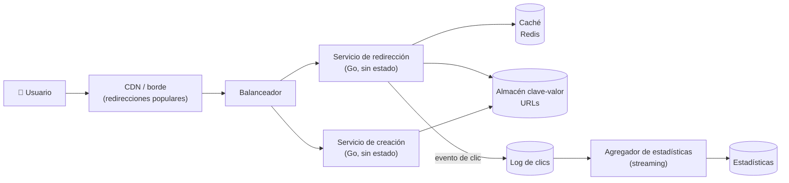

**Tiempo:** 60 minutos · **Referencia después de tu intento:** Alex Xu vol. 1, *Design a URL shortener* · Primer, *Design Pastebin.com (or Bit.ly)*.

## Enunciado

Un servicio que convierte una URL larga en una corta (`sho.rt/aB3xK9q`) y redirige a la original.

- Crear una URL corta (opcionalmente con un alias personalizado: `sho.rt/concierto-rock`).
- Redirigir al visitar la URL corta.
- Caducidad opcional.
- Estadísticas de clics por URL (para quien la creó).

**Carga:** 100 millones de URLs nuevas al mes; 100 redirecciones por URL creada; retención de 10 años.

Ya estimaste este sistema en la [Fase 1](/fase-1/03-estimacion/#ejercicio-1--acortador-de-urls). Reutiliza tus números.

## Tu diseño

```respuesta id="f8-caso-01-diseno" titulo="Tu diseño"
Sigue el método: requisitos, estimación, API, datos, arquitectura, profundizar, fallos. 60 minutos, sin mirar.
```

## Pistas escalonadas

<details>
<summary>Pista 1 · Requisitos</summary>

¿Qué es más importante: que crear sea rápido o que redirigir sea rápido? ¿Qué pasa si una redirección falla? ¿Pueden dos URLs largas iguales compartir código corto?

</details>

<details>
<summary>Pista 2 · Generar el código</summary>

Tres familias: **contador** codificado en base62, **hash** de la URL truncado, **aleatorio**. Para cada una: ¿colisiones? ¿coordinación entre servidores? ¿se pueden adivinar códigos?

</details>

<details>
<summary>Pista 3 · 301 o 302</summary>

Una redirección `301` (permanente) la cachea el navegador. Una `302` (temporal), no. ¿Qué implica para las estadísticas de clics?

</details>

## Solución de referencia

<details>
<summary>Abrir solución</summary>

### Requisitos y características

- Funcionales: crear (con alias opcional y caducidad), redirigir, estadísticas.
- Características: **baja latencia y disponibilidad en la redirección** (es lo que ven millones de personas), escalabilidad de lectura. Crear puede ser algo más lento.
- Fuera de alcance: edición de URLs, cuentas complejas.

### Estimación (de la Fase 1)

- Escrituras ~40/s (pico ~200/s). Lecturas ~4.000/s (pico ~20.000/s). Ratio 100:1.
- 1,2 × 10¹⁰ URLs en 10 años, ~6 TB sin réplicas.
- Conclusión: **dominado por lecturas**; las URLs populares siguen una ley de potencias: **caché** muy eficaz.

### API

```text
POST /api/urls            {"url": "...", "alias": "opcional", "expira": "opcional"}
                          → 201 {"corta": "https://sho.rt/aB3xK9q"}
GET  /{codigo}            → 302 Location: <url larga>   (404 si no existe o caducó)
GET  /api/urls/{codigo}/estadisticas
```

### Datos

`urls(codigo PK, url_larga, creador_id, creado_en, expira_en)`. Acceso casi exclusivamente **por clave**: un almacén clave-valor particionable (DynamoDB, Cassandra) o PostgreSQL particionado por hash del código. 6 TB y 40 escrituras/s: cualquiera sirve; el clave-valor escala más sencillo a largo plazo.

### Generación del código

| Opción | Pros | Contras |
|---|---|---|
| Contador global + base62 | Sin colisiones, códigos cortos | Punto de coordinación; **enumerable** (se pueden recorrer todas las URLs) |
| Rangos de contador por servidor (cada servidor reserva bloques de 1.000 IDs en un almacén central) | Sin colisiones, sin coordinación por petición | Sigue siendo enumerable si no se ofusca |
| Hash (MD5/SHA) truncado a 7 caracteres | Sin coordinación | **Colisiones** que hay que detectar y resolver |
| Aleatorio de 7 caracteres base62 + `INSERT` condicional | Sin coordinación, no enumerable | Colisiones (raras con 3,5 × 10¹² combinaciones), se reintenta |

**Elección:** aleatorio de 7 caracteres con inserción condicional (falla si existe → reintentar). Con 1,2 × 10¹⁰ URLs sobre 3,5 × 10¹² combinaciones, la probabilidad de colisión por intento es ~0,3 %: se reintenta sin problema. Los alias personalizados usan el mismo espacio de claves con la misma inserción condicional.

### Arquitectura



- **Redirección y creación separadas**: características distintas (lectura masiva frente a escritura moderada), escalan por separado.
- **302** para poder contar clics (con `301` los navegadores dejarían de preguntar). Si las estadísticas no importaran, `301` ahorraría tráfico.
- **Caché** cache-aside de `codigo → url`, con TTL acotado por `expira_en`. Caché negativa para códigos inexistentes (bots que prueban).
- **Clics** asíncronos: la redirección publica un evento y responde; la analítica se agrega en streaming (ventanas por URL).

### Profundizar: códigos virales

Una URL enlazada desde una red social recibe decenas de miles de clics por segundo: **clave caliente** en la caché. Servir la redirección desde el **borde** (la CDN cachea la respuesta `302` unos segundos) o una caché local en proceso delante de Redis.

### Fallos y evolución

- Si cae Redis: el almacén clave-valor aguanta la carga media; los picos los absorbe el borde.
- Si cae el log de clics: la redirección **no debe fallar** por ello (se descartan eventos o se guardan en un buffer local).
- **Abuso:** acortadores usados para phishing: comprobar las URLs contra listas de dominios maliciosos al crear, y poder desactivar códigos.
- 10×: más particiones en el clave-valor; nada cambia estructuralmente.

</details>

## Autoevaluación

Guarda tu [panel de revisión](/guia/panel-de-revision/) en `docs/katas/caso-01-acortador.md`. ¿Elegiste un contador? Revisa por qué sus códigos son enumerables y qué implica.
