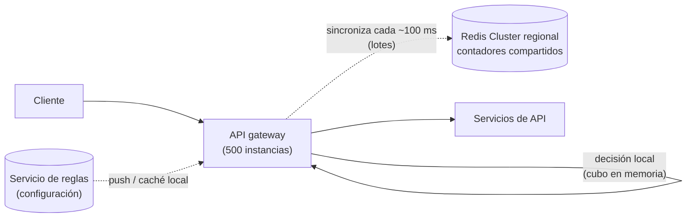

**Tiempo:** 60 minutos · **Referencia después de tu intento:** Alex Xu vol. 1, *Design a rate limiter* · Stripe Engineering, *Scaling your API with rate limiters*.

## Enunciado

Una plataforma de APIs públicas (como la de un proveedor de pagos) necesita limitar las peticiones:

- Límites por **clave de API**, por **IP** y por **endpoint** (por ejemplo: 100 peticiones/s por clave; 10 creaciones de pagos/s por clave; 1.000 peticiones/min por IP sin autenticar).
- Reglas **configurables** sin desplegar.
- El cliente debe saber cuánto le queda y cuándo reintentar.
- La plataforma recibe **1 millón de peticiones por segundo** en 3 regiones, con 500 instancias de API gateway.
- El limitador **no puede** añadir más de ~1 ms de latencia ni convertirse en un punto único de fallo.

En la [Fase 7](/fase-7/03-patrones-de-estabilidad/#ejercicio-1--token-bucket-go) implementaste el algoritmo. Aquí diseñas el **sistema**.

## Tu diseño

```respuesta id="f8-caso-02-diseno" titulo="Tu diseño"
Sigue el método: requisitos, estimación, API, datos, arquitectura, profundizar, fallos. 60 minutos, sin mirar.
```

## Pistas escalonadas

<details>
<summary>Pista 1 · Dónde</summary>

¿En cada servicio, en el gateway o en un servicio aparte al que el gateway consulta? ¿Qué implica cada opción en latencia y en disponibilidad?

</details>

<details>
<summary>Pista 2 · Estado</summary>

1 millón de consultas por segundo a un almacén central, cada una con un viaje de red. ¿Cabe en 1 ms? ¿Hace falta que el conteo sea exacto?

</details>

<details>
<summary>Pista 3 · Regiones</summary>

Un cliente puede enviar peticiones a las 3 regiones. ¿Compartes el contador entre regiones (latencia transatlántica) o repartes el límite?

</details>

## Solución de referencia

<details>
<summary>Abrir solución</summary>

### Requisitos y características

- **Latencia** mínima (está en el camino de cada petición), **disponibilidad** (si falla, no puede tumbar la API), precisión **razonable** (un 5–10 % de desviación es aceptable; es protección, no facturación).

### Estimación

- 1 M decisiones/s. Claves activas: supongamos 1 M de claves de API y 10 M de IPs en una hora → estado de ~11 M contadores × ~100 bytes ≈ **1 GB**: cabe en memoria.

### Diseño



- **En el gateway**, como librería, no como servicio remoto por petición (evita un salto de red y un punto único de fallo).
- **Estado híbrido:** cada gateway decide **localmente** con un token bucket en memoria y **sincroniza por lotes** con Redis regional cada ~100 ms (envía lo que ha consumido y recibe el total global). Precisión aproximada a cambio de latencia casi nula. Para límites **estrictos y bajos** (10 creaciones de pago por segundo), consulta directa y atómica a Redis con un script Lua (el de la Fase 7), aceptando ~1 ms.
- **Redis Cluster** particionado por clave de límite (`clave_api:endpoint`), con réplica por partición.
- **Regiones:** el límite global se **reparte** entre regiones según el tráfico observado (por ejemplo, 50 % / 30 % / 20 %) y se reequilibra periódicamente. Sincronizar contadores entre continentes en cada petición es inviable.
- **Reglas** en un servicio de configuración, cacheadas en cada gateway y actualizadas por push (o sondeo cada pocos segundos).
- **Respuestas:** `429` con cabeceras `RateLimit-Limit`, `RateLimit-Remaining`, `RateLimit-Reset` (o las `X-RateLimit-*` habituales) y `Retry-After`.

### Profundizar: si Redis falla

**Fail open** con un límite local conservador (cada gateway aplica límite / número de gateways de la región). La API sigue disponible y aproximadamente protegida. Para los límites de seguridad críticos (intentos de inicio de sesión), valorar **fail closed**.

### Profundizar: algoritmo

Token bucket para permitir ráfagas razonables. Para límites "por minuto" que se muestran al cliente, ventana deslizante con dos contadores (ventana actual y anterior, ponderada), que evita el doble pico del cambio de ventana fija.

### Fallos y evolución

- Clave caliente (un cliente enorme): su contador en un solo nodo de Redis → los gateways agregan localmente antes de sincronizar (ya lo hace el diseño por lotes).
- Observabilidad: métricas de decisiones (permitidas y rechazadas por regla), latencia del limitador, desviación entre local y global.
- 10×: más particiones de Redis y lotes más grandes.

</details>

## Autoevaluación

Guarda tu [panel de revisión](/guia/panel-de-revision/) en `docs/katas/caso-02-rate-limiter.md`. Pregunta clave: ¿tu diseño añade un salto de red a **cada** petición? Si es así, ¿lo justificaste?
