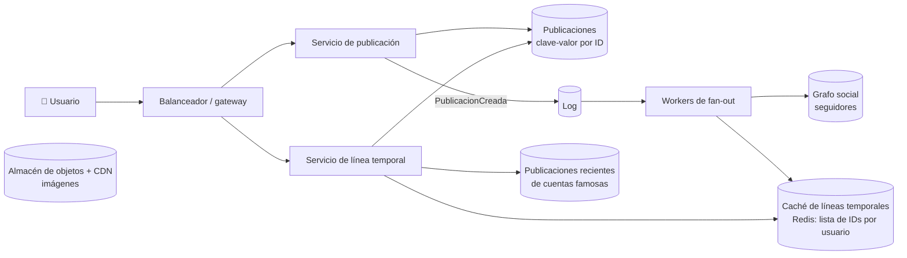

**Tiempo:** 60 minutos · **Referencia después de tu intento:** Alex Xu vol. 1, *Design a news feed system* · DDIA, el ejemplo de la línea temporal de Twitter (capítulos iniciales) · Primer, *Design the Twitter timeline and search*.

## Enunciado

Una red social donde los usuarios publican textos (con imágenes opcionales) y ven una **línea temporal** con las publicaciones de las cuentas que siguen.

- Publicar.
- Ver la línea temporal (las más recientes primero; en una segunda versión, ordenadas por relevancia).
- Seguir y dejar de seguir.

**Carga:** 300 millones de usuarios activos diarios. Cada uno publica 0,5 veces al día y abre la línea temporal 10 veces al día. Media de 200 seguidos por usuario; algunas cuentas tienen **decenas de millones** de seguidores.

## Tu diseño

```respuesta id="f8-caso-03-diseno" titulo="Tu diseño"
Sigue el método: requisitos, estimación, API, datos, arquitectura, profundizar, fallos. 60 minutos, sin mirar.
```

## Pistas escalonadas

<details>
<summary>Pista 1 · Estimación</summary>

Publicaciones/s y lecturas de línea temporal/s. ¿Cuántas escrituras genera **una** publicación si copias en la línea temporal de cada seguidor?

</details>

<details>
<summary>Pista 2 · Fan-out</summary>

Recuerda la [Fase 1](/fase-1/02-fiabilidad-escalabilidad-mantenibilidad/#el-ejemplo-de-la-línea-temporal). ¿Qué pasa con la cuenta de 50 millones de seguidores en cada opción?

</details>

<details>
<summary>Pista 3 · Qué guarda la línea temporal</summary>

¿Copias el texto completo en cada línea temporal o solo el ID de la publicación? ¿Cuántas entradas guardas por usuario?

</details>

## Solución de referencia

<details>
<summary>Abrir solución</summary>

### Estimación

- Publicaciones: 3 × 10⁸ × 0,5 = 1,5 × 10⁸/día ≈ **1.700/s** (pico ~5.000/s).
- Lecturas de línea temporal: 3 × 10⁹/día ≈ **35.000/s** (pico ~100.000/s).
- Fan-out en escritura: 1.700/s × 200 seguidores medios = **340.000 escrituras/s** en líneas temporales. Manejable con un almacén en memoria particionado… salvo las cuentas enormes: una sola publicación de 50 M de seguidores = 50 M escrituras.
- Línea temporal cacheada: 800 IDs × 8 bytes × 3 × 10⁸ usuarios ≈ **2 TB** en memoria (solo para usuarios activos; se puede reconstruir para los inactivos).

### API

```text
POST /publicaciones                         {"texto": "...", "media": ["id"]}
GET  /lineatemporal?cursor=...&limite=20    (paginación por cursor)
POST /usuarios/{id}/seguir   ·   DELETE /usuarios/{id}/seguir
```

### Arquitectura



### Profundizar: fan-out híbrido

- **Cuentas normales → fan-out en escritura**: al publicar, un worker inserta el ID en la lista de cada seguidor (cola asíncrona: publicar responde en milisegundos; la línea temporal se actualiza en segundos).
- **Cuentas con más de N seguidores (por ejemplo, 100.000) → fan-out en lectura**: no se copian; al leer la línea temporal, se mezclan las publicaciones recientes de las cuentas famosas que sigue el usuario (pocas) con su lista precalculada.
- Las líneas temporales guardan **solo IDs** (y quizás el ID del autor), limitadas a las ~800 más recientes. Los datos de cada publicación se "hidratan" desde su almacén (con caché), así un cambio o borrado no obliga a tocar millones de listas.
- **Usuarios inactivos**: no se les hace fan-out; su línea temporal se reconstruye al volver (fan-out en lectura puntual).

### Profundizar: ranking

La versión por relevancia: generar **candidatos** (la lista anterior) y **ordenarlos** con un modelo (interacciones con el autor, recencia, tipo de contenido) en el momento de leer. Las señales se calculan en streaming y batch (Fase 6).

### Fallos y evolución

- Fan-out atrasado (cola que crece en un pico): la línea temporal va con retraso, pero **nadie pierde publicaciones** (el log las conserva). Métrica: edad del mensaje más antiguo de la cola.
- Caché de líneas temporales caída: reconstrucción en lectura (más cara) con load shedding; por eso se replica.
- Paginación por **cursor** (ID de la última publicación vista), nunca por offset.
- Borrado: se borra la publicación; las listas conservan un ID que al hidratar ya no existe y se filtra.

</details>

## Autoevaluación

Guarda tu [panel de revisión](/guia/panel-de-revision/) en `docs/katas/caso-03-news-feed.md`. ¿Trataste a las cuentas con millones de seguidores de forma distinta? Si no, calcula cuánto cuesta una publicación suya en tu diseño.
