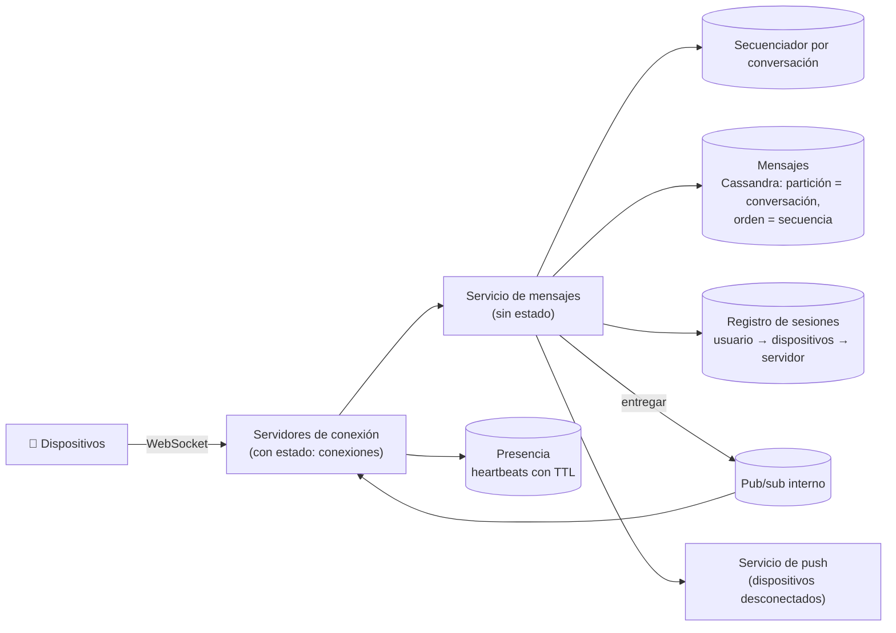

**Tiempo:** 60 minutos · **Referencia después de tu intento:** Alex Xu vol. 1, *Design a chat system* · Blog de ingeniería de Discord, *How Discord stores trillions of messages*.

## Enunciado

Una app de mensajería:

- Conversaciones uno a uno y **grupos** de hasta 500 personas.
- Entrega en tiempo real si el destinatario está conectado; si no, al conectarse (y notificación push).
- Estado "entregado" y "leído".
- **Presencia**: en línea o última conexión.
- **Varios dispositivos** por usuario (móvil y web), sincronizados.
- Historial persistente.

**Carga:** 100 millones de usuarios activos diarios, 40 mensajes enviados por usuario al día, 20 millones de conexiones simultáneas en pico.

## Tu diseño

```respuesta id="f8-caso-04-diseno" titulo="Tu diseño"
Sigue el método: requisitos, estimación, API, datos, arquitectura, profundizar, fallos. 60 minutos, sin mirar.
```

## Pistas escalonadas

<details>
<summary>Pista 1 · Conexiones</summary>

20 millones de conexiones abiertas. ¿Qué protocolo? ¿Cuántas conexiones aguanta un servidor? ¿Cómo sabe el servidor de A en qué servidor está conectado B?

</details>

<details>
<summary>Pista 2 · Orden</summary>

¿Orden global de todos los mensajes, o por conversación? ¿Quién asigna el orden: el cliente (con su reloj) o el servidor?

</details>

<details>
<summary>Pista 3 · Multidispositivo</summary>

El móvil estuvo desconectado 2 días. ¿Cómo sabe qué mensajes le faltan de cada conversación?

</details>

## Solución de referencia

<details>
<summary>Abrir solución</summary>

### Estimación

- Mensajes: 4 × 10⁹/día ≈ **46.000/s** (pico ~150.000/s). Con grupos, las **entregas** son más (un mensaje en un grupo de 500 = 500 entregas).
- Almacenamiento: 4 × 10⁹ × ~200 bytes = **800 GB/día** → ~300 TB/año. Escrituras masivas y lectura por conversación y tiempo → **almacén columnar ancho** (Cassandra, ScyllaDB).
- Conexiones: 20 M; un servidor de conexiones bien afinado aguanta del orden de cientos de miles → **~100–200 servidores** de conexiones.

### Arquitectura



### Flujo de un mensaje

1. El dispositivo envía el mensaje por su WebSocket con un **ID de cliente** (idempotencia: reenviar no duplica).
2. El servicio de mensajes le asigna un **número de secuencia creciente por conversación** (un contador atómico por conversación, por ejemplo en el propio almacén o en Redis) y lo guarda. **El orden lo decide el servidor, no el reloj del cliente.**
3. Confirma al emisor (con la secuencia asignada).
4. Consulta el registro de sesiones: para cada dispositivo destinatario conectado, publica en el canal de su servidor de conexión; para los desconectados, notificación push.

### Profundizar: sincronización multidispositivo

Cada dispositivo guarda, por conversación, **la última secuencia recibida** (un cursor). Al reconectar, pide "mensajes con secuencia mayor que X" en cada conversación con novedades. Como la secuencia es por conversación y sin huecos, detectar mensajes perdidos es trivial. "Leído" es otro cursor por usuario y conversación.

### Profundizar: presencia

Cada dispositivo envía un **heartbeat** cada ~30 s; la presencia es una clave con TTL de ~60 s en un almacén en memoria. Sin heartbeat → "desconectado, última vez a las X". Difundir cambios de presencia a todos los contactos es caro: solo a los que tienen la conversación **abierta** (suscripción), o se consulta al abrir.

### Grupos

Fan-out en escritura (un mensaje, una entrada en la conversación; la entrega a cada miembro conectado vía pub/sub). Para grupos muy grandes (canales de miles), los clientes **tiran** de los mensajes nuevos en lugar de recibir un empujón por mensaje.

### Fallos y evolución

- Cae un servidor de conexiones: sus clientes reconectan (con espera aleatoria) a otro y sincronizan con su cursor. No se pierde nada porque la fuente de verdad es el almacén.
- Duplicados por reintentos: deduplicación por ID de cliente.
- Cifrado de extremo a extremo: cambia mucho (el servidor no ve el contenido; gestión de claves por dispositivo). Mencionarlo como evolución.

</details>

## Autoevaluación

Guarda tu [panel de revisión](/guia/panel-de-revision/) en `docs/katas/caso-04-chat.md`. ¿Usaste marcas de tiempo del cliente para ordenar? Repasa la [Fase 4](/fase-4/01-fallos-parciales/#relojes-no-fiables).
