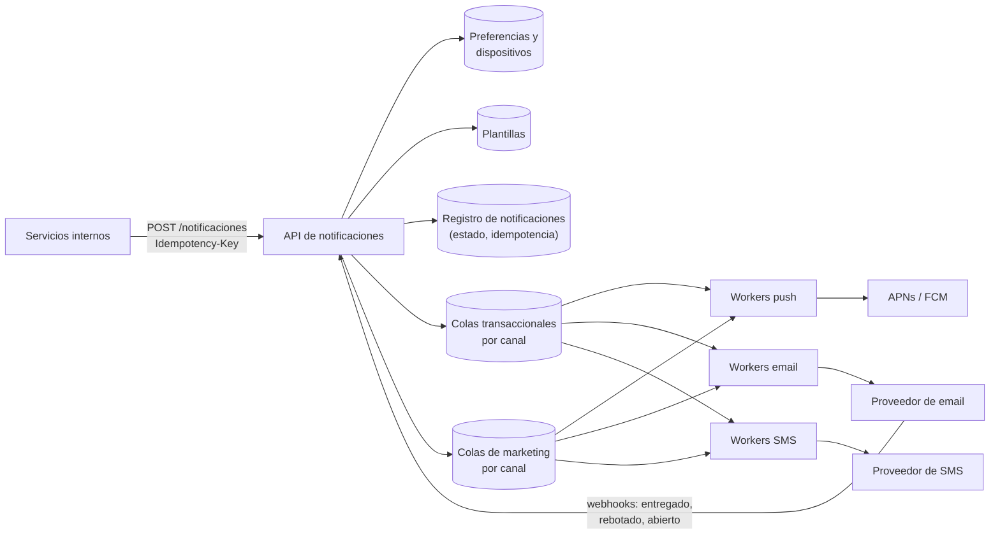

**Tiempo:** 60 minutos · **Referencia después de tu intento:** Alex Xu vol. 1, *Design a notification system*.

## Enunciado

Un servicio interno que el resto de equipos usa para notificar a los usuarios:

- Canales: **push** móvil (APNs, FCM), **email** y **SMS**, a través de proveedores externos.
- **Plantillas** con variables e idiomas.
- **Preferencias** del usuario (canales activos, horario de no molestar, bajas por tipo).
- Tipos con distinta **prioridad**: transaccionales (código de verificación, "tu entrada está lista") y marketing (campañas).
- Seguimiento: enviado, entregado, abierto, fallido.

**Carga:** 10 millones de notificaciones transaccionales al día; campañas de marketing de hasta 50 millones de destinatarios lanzadas de golpe.

## Tu diseño

```respuesta id="f8-caso-05-diseno" titulo="Tu diseño"
Sigue el método: requisitos, estimación, API, datos, arquitectura, profundizar, fallos. 60 minutos, sin mirar.
```

## Pistas escalonadas

<details>
<summary>Pista 1 · Prioridades</summary>

Una campaña de 50 millones se lanza a las 10:00. A las 10:01, un usuario pide un código de verificación. ¿Llega en segundos o detrás de los 50 millones?

</details>

<details>
<summary>Pista 2 · Proveedores</summary>

El proveedor de SMS tiene un límite de 100 mensajes/s y a veces tarda 10 s o falla. ¿Qué protege al resto del sistema?

</details>

<details>
<summary>Pista 3 · Duplicados</summary>

Un equipo llama a tu API, no recibe respuesta y reintenta. Un worker envía el email y cae antes de confirmar. ¿Cuántos emails recibe el usuario?

</details>

## Solución de referencia

<details>
<summary>Abrir solución</summary>

### Arquitectura



### Decisiones clave

- **API asíncrona:** valida, aplica preferencias (si el usuario ha dado de baja ese tipo, se descarta aquí), renderiza la plantilla, registra y **encola**. Responde `202`.
- **Idempotencia de extremo a extremo** ([Fase 4](/fase-4/05-entrega-e-idempotencia/)): clave de idempotencia en la API; el registro guarda el estado por notificación; los workers consultan el registro antes de enviar y pasan la clave al proveedor si lo admite. Se acepta una ventana residual de duplicado (enviar y caer antes de registrar).
- **Colas separadas por prioridad y canal** (bulkheads, [Fase 7](/fase-7/03-patrones-de-estabilidad/#bulkheads-mamparos)): la campaña de marketing llena **su** cola; el código de verificación va por la transaccional, que tiene workers propios. Respuesta a la pista 1: llega en segundos.
- **Protección de cada proveedor:** rate limiting a su límite contratado, timeouts, reintentos con backoff y jitter, circuit breaker por proveedor, y **proveedor secundario** para los canales críticos (failover). DLQ para lo que falla siempre.
- **Marketing:** la campaña se trocea (un "expansor" lee los 50 M destinatarios por lotes y encola) y se envía a un ritmo controlado, respetando el horario de no molestar de cada zona horaria.
- **Seguimiento:** los webhooks de los proveedores actualizan el estado; la analítica (aperturas, rebotes) va a un log para procesarla en streaming. Los rebotes permanentes desactivan la dirección.

### Estimación rápida

- Transaccional: 10 M/día ≈ 120/s de media; picos de pocos miles/s.
- Campaña: 50 M a, por ejemplo, 5.000/s → ~3 horas. El límite lo marcan los proveedores, no nosotros.

### Fallos y evolución

- Proveedor de email caído: circuit breaker abierto, failover al secundario; si ambos caen, la cola retiene y se vacía al volver (vigilar la **edad** de los mensajes: un código de verificación de hace 15 min ya no sirve → **descartar lo caducado**).
- Tokens de push inválidos: el proveedor los rechaza; se limpian del registro de dispositivos.
- Nuevo canal (WhatsApp, in-app): un worker y un adaptador más, sin tocar la API (extensibilidad).

</details>

## Autoevaluación

Guarda tu [panel de revisión](/guia/panel-de-revision/) en `docs/katas/caso-05-notificaciones.md`. ¿Tu código de verificación compite con la campaña? ¿Caduca en la cola?
