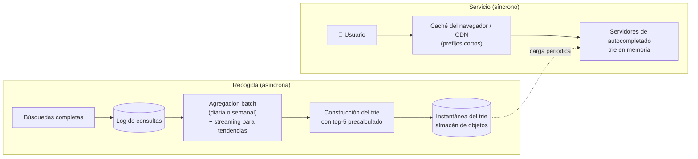

**Tiempo:** 60 minutos · **Referencia después de tu intento:** Alex Xu vol. 1, *Design a search autocomplete system*.

## Enunciado

Mientras el usuario escribe en el buscador de una plataforma grande (por ejemplo, el buscador de eventos de Taquilla a escala mundial), se muestran las **5 sugerencias más populares** que empiezan por lo escrito.

- Sugerencias por popularidad de las búsquedas reales.
- Respuesta en menos de **100 ms** (si no, se nota al escribir).
- Solo minúsculas, sin corrección ortográfica (en esta versión).
- Filtrar sugerencias ofensivas.

**Carga:** 10 millones de usuarios activos diarios, 10 búsquedas por usuario al día, **cada búsqueda genera ~20 peticiones** (una por carácter tecleado, con algo de *debounce*).

## Tu diseño

```respuesta id="f8-caso-06-diseno" titulo="Tu diseño"
Sigue el método: requisitos, estimación, API, datos, arquitectura, profundizar, fallos. 60 minutos, sin mirar.
```

## Pistas escalonadas

<details>
<summary>Pista 1 · Estimación</summary>

10⁷ × 10 × 20 = 2 × 10⁹ peticiones/día. ¿Por segundo? ¿Puede cada una consultar una base de datos?

</details>

<details>
<summary>Pista 2 · Estructura</summary>

¿Qué estructura de datos encuentra todo lo que empieza por un prefijo? ¿Cómo evitas recorrer todo el subárbol en cada petición para encontrar los 5 más populares?

</details>

<details>
<summary>Pista 3 · Actualización</summary>

¿Hace falta que una búsqueda de hace 1 segundo influya ya en las sugerencias? ¿Cada cuánto actualizarías?

</details>

## Solución de referencia

<details>
<summary>Abrir solución</summary>

### Estimación

- 2 × 10⁹ peticiones/día ≈ **23.000/s** (pico ~50.000/s). Latencia < 100 ms → servir **desde memoria**.
- Búsquedas completas: 10⁸/día para alimentar la popularidad.
- Datos: los prefijos útiles son, por ejemplo, los de las 10–100 millones de consultas más frecuentes: el índice cabe en la memoria de una máquina (o unas pocas).

### Dos caminos separados



- **Trie** (árbol de prefijos) en memoria, con el **top-5 precalculado en cada nodo**: una consulta = recorrer los caracteres del prefijo (longitud acotada) y devolver la lista del nodo. O(longitud del prefijo), sin recorrer subárboles.
- **Recogida desacoplada:** las búsquedas se registran en un log; un trabajo batch agrega frecuencias (con un decaimiento temporal para que lo viejo pierda peso) y construye un **trie nuevo**, que se publica como instantánea. Los servidores cargan la nueva versión y cambian el puntero (inmutable, como las salidas batch de la [Fase 6](/fase-6/01-batch/#la-salida-de-un-trabajo-batch)).
- **Tendencias** (lo que explota en la última hora): un procesador de streams con ventanas mantiene un pequeño conjunto de consultas en auge que se mezcla con el resultado del trie.
- **Caché** agresiva: las respuestas para prefijos de 1–2 caracteres son idénticas para todos → caché del navegador y de la CDN con TTL de minutos.
- **Filtro** de términos ofensivos aplicado al construir (y una lista de bloqueo aplicada al servir, para retirar algo al instante).

### Profundizar: escalar el trie

Si no cabe en una máquina, **particionar por prefijo** (por rangos de la primera o las dos primeras letras), con cuidado del sesgo (hay muchas más consultas que empiezan por "s" que por "x": rangos ajustados a la distribución real). Replicar cada partición para el throughput de lectura.

### Fallos y evolución

- Si falla la construcción del trie, los servidores siguen con la versión anterior.
- Personalización (sugerencias según el historial del usuario): mezclar el top global con un pequeño top personal guardado por usuario.
- Varios idiomas: un trie por idioma o región.

</details>

## Autoevaluación

Guarda tu [panel de revisión](/guia/panel-de-revision/) en `docs/katas/caso-06-autocompletado.md`. ¿Consultabas una base de datos por cada tecla? ¿Separaste la recogida del servicio?
