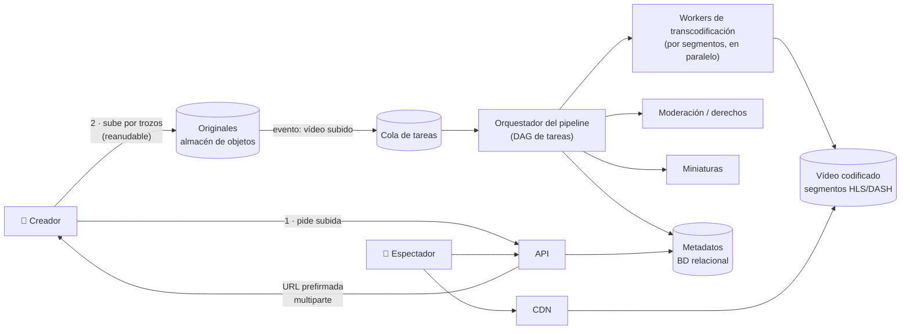

**Tiempo:** 60 minutos · **Referencia después de tu intento:** Alex Xu vol. 1, *Design YouTube* · Netflix Tech Blog (artículos sobre codificación y Open Connect).

## Enunciado

Una plataforma donde los usuarios suben vídeos y otros los ven:

- Subir vídeos de hasta 10 GB, desde conexiones inestables.
- Ver vídeos con calidad adaptada a la conexión del usuario, en móvil, web y TV.
- Metadatos: título, descripción, miniaturas, visualizaciones.
- Moderación de contenido.

**Carga:** 5 millones de usuarios activos diarios; 150.000 vídeos subidos al día (300 MB de media en el original); cada usuario ve 5 vídeos al día. Los espectadores están en todo el mundo.

## Tu diseño

```respuesta id="f8-caso-07-diseno" titulo="Tu diseño"
Sigue el método: requisitos, estimación, API, datos, arquitectura, profundizar, fallos. 60 minutos, sin mirar.
```

## Pistas escalonadas

<details>
<summary>Pista 1 · Estimación</summary>

¿Cuánto almacenamiento al día, contando que cada vídeo se guarda en varias resoluciones? ¿Cuánto ancho de banda de salida? ¿Qué cuesta más?

</details>

<details>
<summary>Pista 2 · Subida</summary>

Un vídeo de 10 GB desde un móvil que pierde la conexión. ¿Pasan esos bytes por tus servidores de API?

</details>

<details>
<summary>Pista 3 · Reproducción</summary>

¿Se envía el fichero entero? ¿Cómo cambia la calidad a mitad del vídeo si la conexión empeora?

</details>

## Solución de referencia

<details>
<summary>Abrir solución</summary>

### Estimación

- Subidas: 150.000 × 300 MB = **45 TB/día** de originales. Con varias resoluciones y códecs, ×2–3 → **~100 TB/día** → decenas de PB al año. **Almacenamiento de objetos** con niveles (los vídeos viejos poco vistos a almacenamiento frío).
- Visualizaciones: 25 M/día. Si cada una transfiere ~300 MB de media: **7,5 PB/día** de salida ≈ **700 Gbit/s** de media. El **ancho de banda** es el coste dominante → CDN obligatoria y negociada.

### Arquitectura



### Profundizar: subida

- **URL prefirmada** y **subida multiparte** directamente al almacén de objetos ([Fase 2](/fase-2/07-objetos-e-ids/#urls-prefirmadas)): los bytes no pasan por la API; cada trozo se reintenta por separado y la subida se reanuda.
- Al completarse, un **evento** dispara el pipeline.

### Profundizar: procesamiento

- Un **DAG de tareas**: validar → dividir en segmentos → transcodificar cada segmento a cada resolución (en **paralelo**, en muchos workers) → ensamblar el manifiesto → miniaturas → moderación → publicar.
- Cada tarea es **idempotente** y reintentable; el orquestador guarda el estado del DAG (si cae, continúa).
- Coste de cómputo: transcodificar es caro. Priorizar (codificar primero las resoluciones más vistas; los vídeos de canales pequeños, con menos variantes o bajo demanda).

### Profundizar: reproducción

- **Streaming adaptativo** (HLS o MPEG-DASH): el vídeo se sirve en **segmentos** de unos segundos en varias calidades, con un **manifiesto** que las lista. El reproductor mide su ancho de banda y **elige la calidad de cada segmento**: si la conexión empeora, el siguiente segmento baja de calidad sin cortar.
- Los segmentos son ficheros **inmutables** → perfectos para la CDN (TTL larguísimo).
- **Cola larga**: los vídeos populares viven en la CDN; los poco vistos, en el origen (y quizás no en todos los PoP). Algunas plataformas instalan cachés **dentro de las redes de los proveedores de internet**.

### Metadatos y visualizaciones

Metadatos en una base de datos relacional (con réplicas y caché). Las visualizaciones son un **contador caliente**: agregar en streaming (eventos de reproducción → ventanas) y actualizar el contador por lotes, no un `UPDATE` por visualización.

### Fallos y evolución

- Un worker de transcodificación cae: la tarea se reintenta en otro.
- El pipeline se atasca: el vídeo queda "procesando" y se avisa al creador; nada se pierde porque el original está a salvo.
- Emisión en directo: cambia mucho (latencia de segundos, ingesta continua, segmentos muy cortos). Mencionarlo como evolución.

</details>

## Autoevaluación

Guarda tu [panel de revisión](/guia/panel-de-revision/) en `docs/katas/caso-07-video.md`. ¿Identificaste que el coste dominante es el **ancho de banda**?
