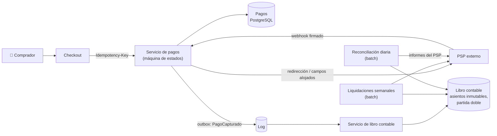

**Tiempo:** 60 minutos · **Referencia después de tu intento:** Alex Xu vol. 2, *Payment system* y *Digital wallet* · Stripe Engineering, *Designing robust and predictable APIs with idempotency*.

## Enunciado

Un marketplace (compradores y vendedores, como una tienda de entradas de segunda mano o de artesanía) necesita:

- **Cobrar** a los compradores con tarjeta (a través de un PSP).
- Retener el dinero y **pagar a los vendedores** semanalmente, descontando la comisión del marketplace.
- **Reembolsos** totales y parciales.
- Saldos por vendedor consultables en todo momento.
- Todo **auditable**: cada céntimo debe poder explicarse.

**Carga:** 1 millón de pedidos al día, 100.000 vendedores.

## Tu diseño

```respuesta id="f8-caso-08-diseno" titulo="Tu diseño"
Sigue el método: requisitos, estimación, API, datos, arquitectura, profundizar, fallos. 60 minutos, sin mirar.
```

## Pistas escalonadas

<details>
<summary>Pista 1 · Corrección antes que escala</summary>

1 millón de pedidos al día son ~12/s. La escala no es el problema. ¿Qué es lo que **no** puede fallar nunca?

</details>

<details>
<summary>Pista 2 · Contabilidad</summary>

¿Guardas "saldo del vendedor = 1.250 €" y lo actualizas, o guardas movimientos? ¿Qué es la partida doble y por qué la usa la contabilidad desde hace siglos?

</details>

<details>
<summary>Pista 3 · El PSP</summary>

Tu registro dice "pago pendiente" y el PSP dice "cobrado". ¿Quién tiene razón y cómo te enteras de la discrepancia?

</details>

## Solución de referencia

<details>
<summary>Abrir solución</summary>

### Características

**Corrección** (ni un céntimo creado ni perdido), **auditabilidad**, **durabilidad**, idempotencia. Rendimiento y escala, secundarios.

### Arquitectura



### Profundizar: máquina de estados del pago

`creado → autorizado → capturado → (reembolsado parcial/total)`, con `fallido` y `desconocido`. Cada transición:

- **Idempotente** (clave de idempotencia del cliente y claves derivadas hacia el PSP, [Fase 4](/fase-4/05-entrega-e-idempotencia/)).
- Guardada con su **evento** en la misma transacción (outbox).
- Un timeout con el PSP lleva a `desconocido`, **nunca** a `fallido`: se resuelve consultando al PSP.
- Nunca se tocan datos de tarjeta: campos alojados del PSP (PCI DSS mínimo).

### Profundizar: libro contable por partida doble

Cada movimiento de dinero es un **asiento** con al menos dos **apuntes** que **suman cero** (lo que sale de una cuenta entra en otra):

| Asiento | Cuenta | Debe | Haber |
|---|---|---|---|
| Captura del pedido 42 (100 €) | Efectivo en el PSP | 100,00 | |
| | Pendiente de pagar al vendedor V7 | | 90,00 |
| | Comisiones del marketplace | | 10,00 |
| Liquidación a V7 | Pendiente de pagar al vendedor V7 | 90,00 | |
| | Efectivo en el PSP | | 90,00 |

- Los asientos son **inmutables** (append-only): un error se corrige con un asiento inverso, nunca editando. Es event sourcing en su forma más antigua ([Fase 6](/fase-6/03-cdc-event-sourcing-cqrs/#event-sourcing)).
- El **saldo** de una cuenta es la suma de sus apuntes (con saldos materializados por rendimiento, verificables).
- Invariante comprobable: **la suma de todos los apuntes es cero**. Si no, hay un bug.
- Importes en **enteros** (céntimos) y con moneda; nunca `float`.
- Base de datos relacional con transacciones: cada asiento se inserta con todos sus apuntes en una transacción, con una restricción que verifica que suman cero.

### Profundizar: reconciliación

Cada día, comparar el libro contable con los **informes del PSP** (lo que el PSP dice que cobró, reembolsó y pagó) y con los extractos bancarios. Las discrepancias (webhooks perdidos, pagos en `desconocido`, comisiones del PSP) se listan para resolverlas, automáticamente o a mano. Es la última red de seguridad: **asume que algo se habrá desincronizado** y compruébalo.

### Fallos y evolución

- Webhook perdido: la reconciliación (y consultas periódicas de los pagos en `autorizado` o `desconocido`) lo detecta.
- Liquidación que falla a mitad: cada pago a un vendedor es una operación idempotente con su propia clave; se reanuda.
- Multimoneda: cuentas por moneda y asientos de cambio explícitos.

</details>

## Autoevaluación

Guarda tu [panel de revisión](/guia/panel-de-revision/) en `docs/katas/caso-08-pagos.md`. ¿Guardaste saldos que se actualizan o movimientos inmutables? ¿Tenías un proceso que asume que algo irá mal y lo busca?
