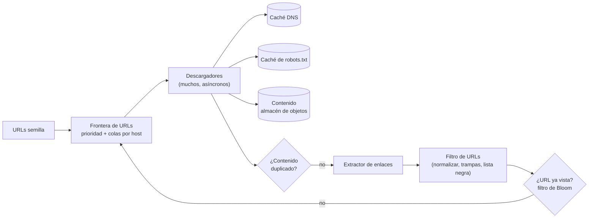

**Tiempo:** 60 minutos · **Referencia después de tu intento:** Alex Xu vol. 1, *Design a web crawler*.

## Enunciado

Un rastreador que descarga páginas web para alimentar un buscador:

- Parte de unas URLs semilla y sigue los enlaces.
- **1.000 millones de páginas al mes.**
- Debe ser **cortés**: no saturar ningún servidor y respetar `robots.txt`.
- Evitar descargar dos veces la misma página y detectar contenido duplicado.
- Volver a rastrear las páginas que cambian a menudo.
- Resistente a trampas (calendarios infinitos, URLs generadas sin fin).

## Tu diseño

```respuesta id="f8-caso-09-diseno" titulo="Tu diseño"
Sigue el método: requisitos, estimación, API, datos, arquitectura, profundizar, fallos. 60 minutos, sin mirar.
```

## Pistas escalonadas

<details>
<summary>Pista 1 · Estimación</summary>

10⁹ páginas/mes, ~500 KB por página (HTML). ¿Páginas por segundo? ¿Almacenamiento al mes?

</details>

<details>
<summary>Pista 2 · Cortesía</summary>

Si metes todas las URLs en una única cola FIFO, ¿qué pasa cuando las 1.000 siguientes son del mismo dominio?

</details>

<details>
<summary>Pista 3 · ¿Ya la he visto?</summary>

Miles de millones de URLs: ¿cómo compruebas si una URL ya está en la frontera sin consultar una base de datos en cada enlace?

</details>

## Solución de referencia

<details>
<summary>Abrir solución</summary>

### Estimación

- 10⁹ / 2,5 × 10⁶ s ≈ **400 páginas/s** (pico ~800/s).
- 10⁹ × 500 KB = **500 TB/mes** de HTML en bruto → almacenamiento de objetos, comprimido.
- Cada página tiene decenas de enlaces: miles de URLs nuevas por segundo a deduplicar.

### Arquitectura



### Profundizar: la frontera

Dos niveles de colas (el diseño clásico del crawler Mercator):

1. **Colas de prioridad** (delante): la URL entra en una cola según su prioridad (popularidad del dominio, PageRank, frecuencia de cambio).
2. **Colas por host** (detrás): cada host tiene **su** cola, y un planificador saca de cada una respetando un **intervalo mínimo** entre peticiones al mismo host (cortesía) y el `Crawl-delay` de su `robots.txt`.

Cada descargador trabaja con un conjunto de hosts (asignados por **hash del host**), así la cortesía por host se controla en un solo sitio, sin coordinación.

### Profundizar: deduplicación

- **URLs:** normalizar (minúsculas en el host, quitar fragmentos `#`, ordenar parámetros, quitar parámetros de seguimiento) y comprobar contra un **filtro de Bloom** (miles de millones de URLs en pocos GB de memoria; falsos positivos pequeños y aceptables: alguna URL nueva no se rastrea).
- **Contenido:** hash del contenido para duplicados exactos; *SimHash* o similares para **casi duplicados** (la misma página con un banner distinto).

### Profundizar: trampas y robustez

- Límite de **profundidad** y de **páginas por dominio**; límite de longitud de URL.
- Detección de patrones repetitivos en rutas (`/a/b/a/b/a/b…`, calendarios infinitos).
- Timeouts de descarga y tamaño máximo de página.
- Todo el HTML se trata como **no confiable** (el extractor corre aislado).

### Recrawl

Volver a visitar cada página con una frecuencia adaptada a **cuánto cambia**: si en las últimas visitas cambió, acortar el intervalo; si no, alargarlo. Las peticiones condicionales (`If-Modified-Since`, `ETag`) ahorran descargas.

### Fallos y evolución

- La frontera es el estado crítico: persistida en disco (la mayor parte), con la parte caliente en memoria. Si un descargador cae, sus hosts se reasignan.
- Páginas con JavaScript: renderizado con navegadores sin interfaz, mucho más caro: solo para los dominios que lo necesitan.

</details>

## Autoevaluación

Guarda tu [panel de revisión](/guia/panel-de-revision/) en `docs/katas/caso-09-crawler.md`. ¿Tu frontera garantizaba la cortesía por host sin coordinación entre descargadores?
