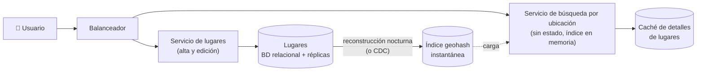

**Tiempo:** 60 minutos · **Referencia después de tu intento:** Alex Xu vol. 2, *Proximity service* y *Nearby friends*.

## Enunciado

**Parte A.** Un servicio de búsqueda de lugares cercanos (restaurantes, recintos de conciertos, tiendas):

- Dada una posición y un radio (500 m, 1 km, 5 km), devolver los lugares cercanos, filtrables por tipo.
- Los propietarios dan de alta y editan sus lugares; los cambios pueden tardar hasta un día en aparecer.
- 100 millones de usuarios activos diarios, 5 búsquedas al día cada uno. 200 millones de lugares.

**Parte B (extensión).** Mostrar en tiempo real los **repartidores** cercanos a un restaurante; cada repartidor envía su posición cada 5 segundos. 1 millón de repartidores activos.

## Tu diseño

```respuesta id="f8-caso-10-diseno" titulo="Tu diseño"
Sigue el método: requisitos, estimación, API, datos, arquitectura, profundizar, fallos. 60 minutos, sin mirar.
```

## Pistas escalonadas

<details>
<summary>Pista 1 · Por qué no SQL sin más</summary>

`WHERE lat BETWEEN … AND lon BETWEEN …` con dos índices separados: ¿cuántas filas intermedias recorre para una ciudad densa?

</details>

<details>
<summary>Pista 2 · Índices geoespaciales</summary>

Convierte dos dimensiones en una: divide el mapa en celdas con identificadores que compartan prefijo cuando están cerca (geohash). ¿Qué pasa en los bordes de una celda?

</details>

<details>
<summary>Pista 3 · Parte B</summary>

1 millón de posiciones cada 5 s = 200.000 escrituras/s de datos que caducan enseguida. ¿Van a la misma base de datos que los restaurantes?

</details>

## Solución de referencia

<details>
<summary>Abrir solución</summary>

### Estimación (parte A)

- Búsquedas: 5 × 10⁸/día ≈ **6.000/s** (pico ~20.000/s). **Lectura intensiva.**
- Escrituras de lugares: pocas, y tolera 1 día de retraso.
- Índice: 200 M lugares × (ID 8 B + geohash 8 B) ≈ **3–4 GB**: cabe en la memoria de **una** máquina.

### Índices geoespaciales

| Técnica | Idea | Notas |
|---|---|---|
| **Geohash** | Divide el mundo en una rejilla recursiva; cada celda tiene una cadena (base32) y las celdas cercanas **suelen** compartir prefijo | Simple, se indexa como texto. **Bordes**: dos puntos a 1 m pueden tener prefijos distintos → buscar siempre en la celda **y sus 8 vecinas** |
| **Quadtree** | Árbol que divide cada región en 4 hasta que cada hoja tiene como mucho N lugares | Se adapta a la densidad (celdas pequeñas en ciudades, grandes en el campo). Vive en memoria |
| **S2 / H3** | Celdas sobre la esfera (curva de Hilbert / hexágonos) | Más precisas; usadas por Google y Uber |
| Índices espaciales de BD | PostGIS (R-tree/GiST) | Muy válido si el volumen lo permite |

### Arquitectura (parte A)



- La búsqueda calcula el geohash de la posición con la precisión adecuada al radio, consulta la celda y sus 8 vecinas en el **índice en memoria**, filtra por distancia real y por tipo, ordena y devuelve IDs; los detalles salen de una caché.
- **Réplicas** del servicio de búsqueda (cada una con el índice entero) para el throughput. Sin particionar: 4 GB caben.
- Como los cambios toleran un día, el índice se **reconstruye** periódicamente (o se actualiza por CDC) y se publica como instantánea.

### Parte B: objetos en movimiento

Las posiciones de los repartidores son un problema **distinto**: muchas escrituras, datos efímeros, consultas en tiempo real.

- Las posiciones van a un almacén **en memoria** (Redis con índices geo: `GEOADD`/`GEOSEARCH`, o una rejilla propia), con **TTL** (un repartidor que deja de informar desaparece).
- Particionado **por región geográfica** (celda de geohash de baja precisión o ciudad): 200.000 escrituras/s repartidas.
- El panel del restaurante se **suscribe** a las celdas de su zona (pub/sub, SSE o WebSocket) y recibe los cambios, en lugar de consultar en bucle.
- No se guarda cada posición en la base de datos principal; si hace falta historial, va a un log y a un almacén de series temporales.

### Fallos y evolución

- Parte A: si falla la reconstrucción del índice, se sirve el anterior (tolerable).
- Parte B: perder unos segundos de posiciones es aceptable (el siguiente envío llega en 5 s). Disponibilidad antes que consistencia.
- Zonas muy densas (el centro de una gran ciudad): celdas más pequeñas o quadtree adaptativo.

</details>

## Autoevaluación

Guarda tu [panel de revisión](/guia/panel-de-revision/) en `docs/katas/caso-10-proximidad.md`. ¿Trataste los bordes de las celdas? ¿Separaste lugares (estáticos, lectura) de repartidores (dinámicos, escritura)?
