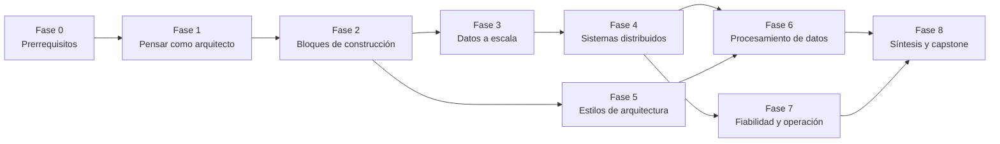

> **Para quién:** alguien que sabe programar y ha construido alguna aplicación, pero nunca ha diseñado un sistema pensando en escala, fallos o trade-offs.
> **Duración orientativa:** ~40 semanas a 6–8 h/semana. Se puede comprimir; no conviene saltarse la práctica.
> **Resultado final:** ser capaz de diseñar un sistema a partir de unos requisitos, justificar cada decisión con sus trade-offs, documentarla (C4 + ADR) y detectar sus puntos de fallo antes de que lleguen a producción.

---

## 1. Fuentes

### Primarias (el esqueleto del temario)

| Fuente                                                                                                                                                                                                                                         | Para qué la usamos                                                                                                                                    | Cómo leerla                                                                                                                                                                                                                                                  |
| ---------------------------------------------------------------------------------------------------------------------------------------------------------------------------------------------------------------------------------------------- | ----------------------------------------------------------------------------------------------------------------------------------------------------- | ------------------------------------------------------------------------------------------------------------------------------------------------------------------------------------------------------------------------------------------------------------ |
| [**Designing Data-Intensive Applications**](<https://0-lucas.github.io/digital-garden/99.-Books/Martin-Kleppmann---Designing-Data-Intensive-Applications_-O%E2%80%99Reilly-Media-(2017).pdf>) — Martin Kleppmann (2ª ed., con Chris Riccomini) | Datos, almacenamiento, replicación, particionado, transacciones, consistencia, consenso, batch y streaming. El núcleo técnico.                        | **Por capítulos y en el momento justo**, nunca de corrido. Cada fase indica qué capítulo toca. La numeración cambia entre la 1ª y la 2ª edición, así que aquí los capítulos se citan por **tema**. La 1ª ed. (2017) sigue siendo válida si es la que tienes. |
| **Fundamentals of Software Architecture** — Mark Richards & Neal Ford (2ª ed.)                                                                                                                                                                 | Pensamiento arquitectónico, características de arquitectura (las "-ilities"), modularidad, estilos de arquitectura, decisiones y habilidades blandas. | En orden, más ligero que DDIA. Las partes I y II son el núcleo y la parte III se lee en paralelo con la práctica.                                                                                                                                            |
| **System Design Primer** — github.com/donnemartin/system-design-primer                                                                                                                                                                         | El mapa general: bloques de construcción (DNS, CDN, balanceadores, caché, colas…) y problemas de diseño resueltos.                                    | Como **índice y repaso**. Cada bloque se lee junto al tema de la fase y se amplía con las otras fuentes.                                                                                                                                                     |
| **c4model.com** — Simon Brown                                                                                                                                                                                                                  | Cómo diagramar sistemas en niveles (Contexto, Contenedores, Componentes, Código).                                                                     | Se estudia en la **Fase 1** y a partir de ahí se usa en todos los ejercicios.                                                                                                                                                                                |

### Complementarias (amplían y rellenan huecos)

**Puertas de entrada (más fáciles que las primarias):**

- _Understanding Distributed Systems_, Roberto Vitillo. La mejor introducción corta a sistemas distribuidos. Conviene leerla **antes** de las partes duras de DDIA.
- _Head First Software Architecture_, Gandhi, Richards & Ford. Un primer contacto visual antes de FoSA.

**Fundamentos de base:**

- _High Performance Browser Networking_, Ilya Grigorik (gratis en hpbn.co). TCP, TLS, HTTP/1.1, HTTP/2 y HTTP/3 con foco en latencia.
- _Operating Systems: Three Easy Pieces_ (OSTEP, gratis). Procesos, concurrencia, E/S y sistemas de ficheros.
- Curso **CMU 15-445 Database Systems** (Andy Pavlo, vídeos gratis). Cómo funciona una base de datos por dentro.

**Profundización:**

- _Database Internals_, Alex Petrov. Motores de almacenamiento y algoritmos distribuidos.
- _Software Architecture: The Hard Parts_, Ford, Richards, Sadalage & Dehghani. Cómo descomponer sistemas, datos distribuidos, sagas y contratos.
- _Learning Domain-Driven Design_, Vlad Khononov. Bounded contexts y cómo trazar fronteras de servicio.
- _Building Microservices_ (2ª ed.) y _Monolith to Microservices_, Sam Newman.
- _Patterns of Distributed Systems_, Unmesh Joshi (también en martinfowler.com). Patrones como write-ahead log, quorum, leader/follower y high-water mark.
- _Release It!_ (2ª ed.), Michael Nygard. Patrones de estabilidad y antipatrones de producción.
- _Site Reliability Engineering_ y _The SRE Workbook_, Google (gratis en sre.google). SLOs, error budgets y operación.
- _Observability Engineering_, Majors, Fong-Jones & Miranda.
- **Amazon Builders' Library**. Artículos cortos y excelentes sobre timeouts, reintentos con jitter, load shedding, etc.
- **microservices.io**, Chris Richardson. Catálogo de patrones: saga, outbox, API gateway, CQRS…

**Práctica:**

- _System Design Interview_ vol. 1 y 2, Alex Xu. Casos de estudio resueltos paso a paso.
- **Fly.io Gossip Glomers**. Retos de sistemas distribuidos sobre Maelstrom (broadcast, contadores, Kafka simplificado).
- **MIT 6.5840 Distributed Systems**. Los labs (MapReduce, Raft y un KV tolerante a fallos) son el nivel máximo de práctica.
- **jepsen.io**. Análisis reales de cómo fallan las bases de datos distribuidas.

**Documentación de arquitectura:**

- ADRs: el post original de Michael Nygard, _Documenting Architecture Decisions_ (2011), y adr.github.io.
- **arc42**, plantilla de documentación de arquitectura (combina bien con C4).
- **Structurizr DSL**, para escribir diagramas C4 como código.

**Papers clásicos (Fase 4 en adelante):** Lamport, _Time, Clocks, and the Ordering of Events_ (1978) · Google File System (2003) · MapReduce (2004) · Bigtable (2006) · Amazon Dynamo (2007) · Kafka (2011) · Spanner (2012) · Raft, _In Search of an Understandable Consensus Algorithm_ (2014).

---

## 2. Principios de aprendizaje del roadmap

Estos principios se aplican en **todas** las fases. Son lo que convierte la lectura en capacidad real.

1. **Trade-offs, no respuestas.** En diseño casi nada es "correcto": es "adecuado para estos requisitos". Cada respuesta que empiece por "depende" tiene que terminar diciendo _de qué_ depende. Es la **Primera Ley** de FoSA: _todo en arquitectura de software es un trade-off_.
2. **Números antes que opiniones.** Antes de elegir tecnología, estima: peticiones por segundo, almacenamiento, ancho de banda, latencias. Hay que memorizar la tabla de _latency numbers every programmer should know_ y las potencias de 2.
3. **Diagrama todo, siempre en C4.** A partir de la Fase 1 cada ejercicio de diseño se entrega con al menos un diagrama de Contexto y uno de Contenedores.
4. **Decide por escrito.** Cada decisión relevante se documenta en un ADR (contexto → decisión → consecuencias). Obliga a nombrar el trade-off.
5. **Construye para entender.** Lo que se implementa en pequeño (una caché LRU, un KV store con log append-only, un rate limiter, Raft) se entiende de verdad. Leer sobre replicación no es lo mismo que depurar un split-brain.
6. **Recuperación activa y repetición espaciada.** Releer engaña: da sensación de dominio sin darlo. Cada lección termina con preguntas para responder sin mirar y con tarjetas para repasar a 1, 3, 7 y 21 días.
7. **Intercala.** Los repasos mezclan temas de fases anteriores. Diseñar un sistema real nunca pide "solo caché" ni "solo colas".
8. **Explícalo (técnica Feynman).** Si no lo puedes explicar en voz alta, con un diagrama y sin jerga, no lo dominas todavía.
9. **Just-in-time sobre just-in-case.** DDIA y los papers se leen cuando la fase los necesita, no "por si acaso".
10. **Revisión con rúbrica.** Todo diseño se evalúa con el mismo panel de revisión (requisitos, estimación, arquitectura, datos, escalado, fallos, operación, seguridad, trade-offs). Así se ve el progreso.

---

## 3. Mapa de fases

| Fase | Tema                                                                     | Semanas | Fuente primaria dominante                                                          |
| ---- | ------------------------------------------------------------------------ | ------- | ---------------------------------------------------------------------------------- |
| 0    | Prerrequisitos: redes, SO, bases de datos                                | 3       | Primer (Communication) + HPBN + OSTEP                                              |
| 1    | Pensar como arquitecto: requisitos, características, estimación, C4, ADR | 3       | FoSA parte I + c4model.com                                                         |
| 2    | Bloques de construcción                                                  | 5       | System Design Primer                                                               |
| 3    | Datos a escala                                                           | 6       | DDIA (modelos, almacenamiento, encoding, replicación, particionado, transacciones) |
| 4    | Sistemas distribuidos                                                    | 5       | DDIA (problemas de sistemas distribuidos, consistencia y consenso)                 |
| 5    | Estilos de arquitectura y modularidad                                    | 5       | FoSA parte II                                                                      |
| 6    | Procesamiento de datos: batch, streaming y eventos                       | 4       | DDIA (batch, streaming)                                                            |
| 7    | Fiabilidad, operación y seguridad                                        | 4       | SRE book + Release It! + Primer                                                    |
| 8    | Síntesis: casos de estudio y capstone                                    | 5       | Todas + Alex Xu                                                                    |

Las fases 3–4 y la 5 pueden solaparse: la 5 es más ligera y alterna bien con la densidad de DDIA.

### Hilo conductor: **"Taquilla", un sistema de venta de entradas**

Es un proyecto que evoluciona en cada fase ([enunciado completo](/guia/taquilla/)). Se ha elegido porque obliga a enfrentarse a casi todo: picos de tráfico cuando sale un concierto, concurrencia (no vender el mismo asiento dos veces), transacciones, pagos idempotentes, caché del catálogo, colas de espera, notificaciones, búsqueda y analítica.

---

## 4. Las fases en detalle

Cada fase tiene: **objetivo**, **conceptos**, **lecturas**, **práctica**, **entregable** y **criterios de dominio** (cómo sabes que puedes pasar a la siguiente).

---

### Fase 0 — Prerrequisitos (3 semanas)

**Lecciones:** [Fase 0](/fase-0/), con el mini-curso [Go para sistemas](/go/) en paralelo (los ejercicios de código del temario son en Go).

**Objetivo:** tener el vocabulario y los modelos mentales mínimos de redes, sistema operativo y bases de datos para no tropezar después.

**Conceptos:**

- Redes: modelo de capas, IP, TCP vs UDP (handshake, control de congestión, head-of-line blocking), DNS (resolución, TTL, registros A/CNAME), HTTP/1.1 → HTTP/2 → HTTP/3 (QUIC), TLS (handshake y coste en latencia), WebSockets.
- Sistema operativo: procesos vs hilos, concurrencia, locks, E/S bloqueante vs no bloqueante, memoria vs disco (page cache, fsync).
- Bases de datos: modelo relacional, SQL, índices (qué son y por qué aceleran), transacciones ACID a nivel intuitivo, normalización.
- Números: latencias típicas (L1, RAM, SSD, red en el datacenter, entre continentes) y potencias de 2 (KB, MB, GB, TB, PB).

**Lecturas:**

- Primer: _Communication_ (TCP, UDP, RPC, REST) y el apéndice (_Powers of two_, _Latency numbers_).
- HPBN: capítulos de TCP, TLS y HTTP/2.
- OSTEP: la parte de concurrencia (threads, locks) a nivel introductorio.
- CMU 15-445: primeras clases (modelo relacional, almacenamiento) si la base de datos es un punto débil.

**Práctica:**

- Traza con `dig`, `curl -v` y las devtools qué pasa desde que escribes una URL hasta que ves la página. Escríbelo paso a paso.
- Escribe un servidor TCP de eco y después uno HTTP mínimo, sin framework.
- Crea una tabla con un millón de filas, mide una consulta sin índice y con índice, y usa `EXPLAIN`.

**Entregable:** documento "¿Qué pasa cuando escribo una URL?" con un diagrama de secuencia.

**Criterios de dominio:**

- [ ] Explicas por qué HTTP/2 mejora sobre HTTP/1.1 y qué problema resuelve HTTP/3.
- [ ] Sabes cuántos órdenes de magnitud separan leer de RAM, de SSD y de otra región.
- [ ] Explicas qué hace un índice B-tree y cuándo no ayuda.

---

### Fase 1 — Pensar como arquitecto (3 semanas)

**Lecciones:** [Fase 1](/fase-1/)

**Objetivo:** aprender el _proceso_ del diseño: pasar de un problema vago a requisitos, características priorizadas, estimaciones y una arquitectura documentada.

**Conceptos:**

- Requisitos funcionales y no funcionales.
- **Características de arquitectura** (FoSA): operacionales (disponibilidad, escalabilidad, rendimiento, recuperabilidad), estructurales (mantenibilidad, extensibilidad, portabilidad) y transversales (seguridad, accesibilidad, legal). Explícitas e implícitas. **Elegir pocas**: "la arquitectura menos mala".
- **Fiabilidad, escalabilidad y mantenibilidad** (DDIA, capítulos iniciales). Describir la carga, percentiles de latencia (p50, p95, p99), tail latency.
- Estimación _back-of-the-envelope_: DAU → QPS medio y pico → almacenamiento a 5 años → ancho de banda.
- Rendimiento vs escalabilidad y latencia vs throughput (Primer).
- **C4**: Contexto, Contenedores, Componentes, Código. Diagramas complementarios (landscape, dinámico, despliegue). Notación: título, leyenda, tecnologías en los contenedores, relaciones con verbo.
- **ADRs**: formato, estados (propuesto, aceptado, reemplazado) y cuándo escribir uno.
- El proceso de diseño en 4 pasos: entender y acotar → diseño de alto nivel → profundizar → cerrar (cuellos de botella, fallos, evolución).

**Lecturas:**

- FoSA: los capítulos de pensamiento arquitectónico, características de arquitectura (definición, identificación, medición y gobierno) y _architecture quantum_.
- DDIA: los capítulos iniciales (trade-offs y requisitos no funcionales en la 2ª ed.; _Reliable, Scalable and Maintainable Applications_ en la 1ª).
- c4model.com completo. Es corto.
- Primer: _Performance vs scalability_, _Latency vs throughput_, _How to approach a system design interview question_.
- Nygard, _Documenting Architecture Decisions_.

**Práctica:**

- Toma una app que conozcas bien (tu proyecto, o Spotify, Wallapop…) y dibuja su diagrama de Contexto y de Contenedores en C4 con Structurizr DSL o Mermaid.
- Estima tráfico y almacenamiento para: un acortador de URLs, un Twitter simplificado y **Taquilla**.
- Para Taquilla: lista requisitos, identifica las 3 características de arquitectura prioritarias y justifica por qué esas y no otras.

**Entregable (Taquilla v0):** documento de requisitos + estimaciones + C4 Contexto + primer ADR ("por qué empezamos con un monolito").

**Criterios de dominio:**

- [ ] Conviertes un enunciado vago en requisitos y preguntas de clarificación.
- [ ] Haces una estimación de QPS y almacenamiento en menos de 5 minutos, sin calculadora.
- [ ] Explicas por qué la media de latencia engaña y qué te dice el p99.
- [ ] Tus diagramas C4 se entienden sin que tú los expliques.

---

### Fase 2 — Bloques de construcción (5 semanas)

**Lecciones:** [Fase 2](/fase-2/)

**Objetivo:** conocer cada pieza estándar de un sistema: qué problema resuelve, cómo funciona por dentro lo justo y qué trade-offs introduce.

**Conceptos:**

- **DNS** como balanceo (round-robin, geo-DNS) y sus límites (caché, TTL).
- **CDN**: push vs pull, qué cachear, invalidación.
- **Balanceadores de carga**: L4 vs L7, algoritmos (round-robin, least connections, hashing consistente), health checks, sesiones pegajosas y por qué evitarlas.
- **Reverse proxy y API gateway.**
- **Escalado** vertical vs horizontal. Servicios _stateless_ como requisito del escalado horizontal.
- **Caché**: dónde (cliente, CDN, aplicación, base de datos) y estrategias (cache-aside, read-through, write-through, write-behind, refresh-ahead). Expiración y desalojo (LRU, LFU, TTL). Problemas: invalidación, _thundering herd_ / _cache stampede_, consistencia caché-BD, hot keys.
- **Bases de datos**: SQL vs NoSQL (clave-valor, documental, columnar ancha, grafo). Cuándo cada una. Réplicas de lectura (introducción), federación, desnormalización.
- **Asincronía**: colas de mensajes vs colas de tareas, _back pressure_, productor/consumidor.
- **APIs**: REST (recursos, verbos, idempotencia, paginación, versionado), gRPC, GraphQL, WebSockets / SSE / long polling. Cuándo usar cada una.
- **Almacenamiento de objetos** (tipo S3) para blobs.
- **IDs únicos** en sistemas distribuidos (autoincrement, UUID, Snowflake, ULID).

**Lecturas:**

- Primer: DNS, CDN, Load balancer, Reverse proxy, Application layer, Database, Cache, Asynchronism, Communication. Todo el bloque central.
- Amazon Builders' Library: _Caching challenges and strategies_.
- Alex Xu vol. 1: los capítulos _Scale from zero to millions of users_ y _Design a unique ID generator_.

**Práctica:**

- Implementa una **caché LRU** con TTL (hash map + lista doblemente enlazada).
- Pon Nginx o HAProxy delante de 3 instancias de una app mínima, mata una y observa los health checks.
- Añade cache-aside con Redis a un endpoint lento y mide antes y después. Provoca un _stampede_ y mitígalo (lock o _request coalescing_).
- Implementa un generador de IDs estilo Snowflake.

**Entregable (Taquilla v1):** C4 de Contenedores con balanceador, app stateless, BD, caché del catálogo, CDN para imágenes y cola para emails. Un ADR por cada pieza añadida.

**Criterios de dominio:**

- [ ] Para cada bloque sabes decir qué problema resuelve y qué problema nuevo introduce.
- [ ] Eliges estrategia de caché y de invalidación según el patrón de lectura/escritura.
- [ ] Justificas SQL vs NoSQL para un caso concreto sin caer en "NoSQL escala mejor".

---

### Fase 3 — Datos a escala (6 semanas)

**Lecciones:** [Fase 3](/fase-3/)

**Objetivo:** entender en profundidad cómo se almacenan, codifican, replican, reparten y protegen los datos. Es el corazón de DDIA y de la mayoría de decisiones difíciles.

**Conceptos:**

- **Modelos de datos**: relacional, documental, grafo. Impedance mismatch. Esquema en escritura vs esquema en lectura.
- **Motores de almacenamiento**: log append-only, hash index, SSTables y **LSM-trees** vs **B-trees**. Amplificación de escritura y de lectura. OLTP vs OLAP y almacenamiento columnar.
- **Codificación y evolución**: JSON, Protobuf, Avro. Compatibilidad hacia atrás y hacia delante. Evolución de esquemas en despliegues graduales.
- **Replicación**: líder-seguidor (síncrona vs asíncrona), _replication lag_ y sus anomalías (read-your-writes, lecturas monotónicas, prefijo consistente), multi-líder (conflictos, resolución), sin líder (quórums `w + r > n`, sloppy quorum, hinted handoff, read repair, anti-entropy).
- **Particionado / sharding**: por rango vs por hash, **hashing consistente**, hot spots, índices secundarios (locales vs globales), rebalanceo, enrutamiento de peticiones.
- **Transacciones**: ACID de verdad. Niveles de aislamiento: read committed, snapshot isolation / MVCC, serializable. Anomalías: dirty read/write, read skew, lost update, write skew, phantoms. Implementaciones: 2PL, SSI, ejecución serial.

**Lecturas:**

- DDIA: modelos de datos, almacenamiento y recuperación, codificación y evolución, replicación, particionado (_sharding_ en la 2ª ed.) y transacciones. Un capítulo cada ~5 días.
- Primer: _Database_ (master-slave, master-master, federation, sharding, denormalization).
- _Database Internals_ (Petrov), la parte I, como apoyo si quieres más detalle de B-trees y LSM.
- Paper de **Dynamo** (2007), junto al capítulo de replicación sin líder.
- Alex Xu vol. 1: _Design consistent hashing_ y _Design a key-value store_.

**Práctica:**

- Construye un **KV store** mínimo: log append-only + índice hash en memoria → compactación → SSTable ordenada. (Es el ejemplo de DDIA hecho código.)
- Implementa **hashing consistente** con nodos virtuales y mide la redistribución al añadir o quitar nodos.
- Reproduce en PostgreSQL un _lost update_ y un _write skew_ con dos sesiones concurrentes. Arréglalos con `SELECT … FOR UPDATE`, con aislamiento `SERIALIZABLE` y con restricciones.
- Monta una réplica de lectura de PostgreSQL y provoca una lectura obsoleta.

**Entregable (Taquilla v2):** diseño del modelo de datos, estrategia para **no vender dos veces un asiento** (compara lock pesimista, optimista con versión y reserva con TTL, en un ADR), plan de réplicas de lectura y, cuando haga falta, estrategia de sharding.

**Criterios de dominio:**

- [ ] Explicas cuándo un LSM-tree gana a un B-tree y al revés.
- [ ] Dado un escenario de concurrencia, identificas qué anomalía ocurre y qué nivel de aislamiento la evita.
- [ ] Explicas qué garantiza y qué no garantiza un quórum.
- [ ] Eliges clave de partición justificando el patrón de acceso y los hot spots.

---

### Fase 4 — Sistemas distribuidos (5 semanas)

**Lecciones:** [Fase 4](/fase-4/)

**Objetivo:** interiorizar que en un sistema distribuido **todo falla de forma parcial y ambigua**, y conocer las herramientas para razonar y construir a pesar de ello.

**Conceptos:**

- **Fallos parciales**: redes no fiables (paquetes perdidos o retrasados, particiones), timeouts como única herramienta de detección, pausas de proceso (GC), relojes no fiables (deriva, NTP, reloj monotónico vs de pared).
- **Orden y tiempo**: relojes de Lamport, vector clocks, relación _happens-before_, causalidad.
- **Modelos de consistencia**: linearizabilidad, consistencia causal y eventual. **CAP** bien entendido (y sus límites) y **PACELC**.
- **Consenso**: por qué hace falta (elección de líder, locks, unicidad), FLP a nivel intuitivo, **Raft** (elección, replicación del log, seguridad), _fencing tokens_, ZooKeeper/etcd como servicios de coordinación.
- **Semánticas de entrega**: at-most-once, at-least-once, "exactly-once" = at-least-once + **idempotencia**. Claves de idempotencia.
- **Transacciones distribuidas**: 2PC y sus problemas, **sagas** (orquestación vs coreografía, compensaciones), patrón **outbox transaccional**.

**Lecturas:**

- _Understanding Distributed Systems_ (Vitillo): partes de comunicación, coordinación y replicación. **Léelo primero**; hace digerible lo que viene.
- DDIA: los capítulos de problemas de sistemas distribuidos y de consistencia y consenso. Son los más difíciles del libro; tómate tu tiempo.
- Primer: _CAP theorem_, _Consistency patterns_, _Availability patterns_.
- Papers: Lamport 1978 y **Raft** (2014), con la visualización en raft.github.io.
- microservices.io: _Saga_ y _Transactional outbox_.
- _Patterns of Distributed Systems_ (Joshi): Write-Ahead Log, Leader and Followers, Heartbeat, Quorum, Generation Clock, High-Water Mark.
- 2–3 análisis de **Jepsen** de bases de datos que conozcas.

**Práctica:**

- **Gossip Glomers** (Fly.io): Echo → Unique IDs → Broadcast → Grow-only counter → Kafka-style log.
- Opcional pero muy recomendable: el lab de Raft de **MIT 6.5840**.
- Implementa un endpoint de pagos idempotente con clave de idempotencia y pruébalo con reintentos concurrentes.
- Implementa el patrón outbox: tabla outbox + relay a una cola.

**Entregable (Taquilla v3):** flujo de compra como **saga** (reservar asiento → cobrar → emitir entrada → notificar) con sus compensaciones, garantía de idempotencia en el pago y un análisis de "qué pasa si falla cada paso". Diagrama dinámico C4 o de secuencia.

**Criterios de dominio:**

- [ ] Explicas por qué un timeout no distingue "el nodo ha muerto" de "el nodo va lento".
- [ ] Explicas CAP sin caer en "elige 2 de 3".
- [ ] Describes cómo Raft elige líder y por qué no puede haber dos líderes en el mismo término.
- [ ] Diseñas un flujo "exactly-once" de extremo a extremo y señalas dónde está la idempotencia.

---

### Fase 5 — Estilos de arquitectura y modularidad (5 semanas)

**Lecciones:** [Fase 5](/fase-5/)

**Objetivo:** saber estructurar un sistema a nivel de aplicación, elegir un estilo de arquitectura por sus características y trazar fronteras de módulos y servicios.

**Conceptos:**

- **Modularidad**: cohesión, acoplamiento (aferente/eferente), abstracción, inestabilidad, distancia a la secuencia principal, **connascence**.
- **Pensamiento en componentes**: particionado técnico vs **de dominio**.
- **Architecture quantum**: la unidad desplegable con alta cohesión funcional y sus características propias.
- **Estilos** (FoSA): en capas, **monolito modular**, pipeline, microkernel, basado en servicios, **orientado a eventos** (broker vs mediador), space-based, SOA orquestada y **microservicios**. Comparativa por características (las tablas de estrellas de FoSA).
- **DDD estratégico**: dominio y subdominios (core, soporte, genérico), **bounded contexts**, context mapping y lenguaje ubicuo.
- **Descomposición**: cuándo _no_ usar microservicios. Estrangulamiento (_strangler fig_). Datos por servicio vs compartidos.
- **Comunicación entre servicios**: síncrona vs asíncrona, coreografía vs orquestación, contratos.

**Lecturas:**

- FoSA: modularidad, pensamiento en componentes, toda la parte de estilos y "elegir el estilo adecuado".
- _Learning Domain-Driven Design_ (Khononov): parte I (diseño estratégico).
- _Software Architecture: The Hard Parts_: descomposición arquitectónica y granularidad de servicios.
- Primer: _Application layer_ (microservices, service discovery).
- Sam Newman, _Monolith to Microservices_: patrones de migración.

**Práctica:**

- Haz un _event storming_ ligero de Taquilla y sácale los bounded contexts (catálogo, reservas, pagos, entradas, notificaciones…).
- Evalúa 3 estilos para Taquilla con una tabla de características priorizadas (la técnica de FoSA).
- Refactoriza tu Taquilla a un **monolito modular** con fronteras explícitas y dependencias verificadas, por ejemplo con tests de arquitectura (ArchUnit o un equivalente).

**Entregable (Taquilla v4):** mapa de contextos, elección de estilo justificada en un ADR, C4 de Componentes del módulo de reservas y plan de evolución: qué módulo extraerías primero a servicio y por qué.

**Criterios de dominio:**

- [ ] Para cada estilo sabes decir en qué características destaca y en cuáles sufre.
- [ ] Argumentas por qué un monolito modular es a menudo la mejor primera elección.
- [ ] Trazas bounded contexts a partir de un dominio y justificas las fronteras.
- [ ] Identificas un "monolito distribuido" cuando lo ves.

---

### Fase 6 — Procesamiento de datos: batch, streaming y eventos (4 semanas)

**Lecciones:** [Fase 6](/fase-6/)

**Objetivo:** entender cómo fluyen los datos entre sistemas y los patrones que convierten eventos en la fuente de verdad.

**Conceptos:**

- **Batch**: la filosofía Unix, MapReduce, joins en batch, dataflow engines (Spark). Salidas inmutables y reprocesables.
- **Streaming**: logs particionados (Kafka), consumer groups, offsets, orden por partición, retención y compactación.
- **Brokers de mensajes** (tipo RabbitMQ) vs **logs** (tipo Kafka): cuándo cada uno.
- **Change Data Capture** (CDC), **event sourcing** y **CQRS**.
- Tiempo de evento vs de procesamiento, ventanas, watermarks, eventos tardíos.
- Joins de streams, estado en stream processors y exactly-once en streaming.
- Arquitecturas Lambda vs Kappa. Pipelines ETL/ELT y almacenes analíticos (OLAP).

**Lecturas:**

- DDIA: batch processing y stream processing, más el capítulo final sobre el futuro de los sistemas de datos (ideas de _unbundling_ de la base de datos).
- Papers: **MapReduce** (2004) y **Kafka** (2011).
- microservices.io: _Event sourcing_ y _CQRS_.
- Jay Kreps, _The Log: What every software engineer should know about real-time data's unifying abstraction_ (artículo).

**Práctica:**

- Monta Kafka (o Redpanda) en local, produce y consume con varios consumer groups, y mata un consumidor para observar el rebalanceo.
- Configura CDC con Debezium desde PostgreSQL a Kafka y construye una vista de lectura derivada.
- Implementa un contador de ventas por evento en ventanas de 1 minuto.

**Entregable (Taquilla v5):** pipeline de eventos (`EntradaVendida`, `ReservaExpirada`…), vista de disponibilidad en tiempo real vía CQRS, analítica de ventas en batch y ADR sobre "broker vs log".

**Criterios de dominio:**

- [ ] Explicas por qué un log particionado garantiza orden solo dentro de la partición y cómo elegir la clave.
- [ ] Distingues event sourcing de "publicar eventos" y conoces el coste real de event sourcing.
- [ ] Explicas qué problema resuelve CDC frente a la escritura dual.

---

### Fase 7 — Fiabilidad, operación y seguridad (4 semanas)

**Lecciones:** [Fase 7](/fase-7/)

**Objetivo:** diseñar sistemas que sobreviven en producción: que se observan, degradan con elegancia, se despliegan sin miedo y no se abren a atacantes.

**Conceptos:**

- **SLI, SLO y SLA**, error budgets y la disponibilidad en "nueves" (disponibilidad en serie vs en paralelo, del Primer).
- **Observabilidad**: logs estructurados, métricas (RED, USE), trazas distribuidas (OpenTelemetry), alertas sobre síntomas, no sobre causas.
- **Patrones de estabilidad**: timeouts, **reintentos con backoff exponencial y jitter**, circuit breaker, bulkhead, **rate limiting** (token bucket, leaky bucket, ventana deslizante), load shedding, back pressure, degradación elegante.
- **Antipatrones**: fallos en cascada, reintentos que amplifican, dependencias síncronas en cadena, recursos sin límite.
- **Despliegue**: blue/green, canary, feature flags, migraciones de esquema compatibles (expand/contract), rollback.
- **Capacidad y coste**: planificación de capacidad, autoscaling y sus límites, coste como característica de arquitectura.
- **Recuperación**: backups, RPO/RTO, multi-región (activo-pasivo vs activo-activo).
- **Seguridad**: autenticación vs autorización, OAuth 2.0 / OIDC, JWT y sus trampas, TLS/mTLS, gestión de secretos, principio de mínimo privilegio, OWASP Top 10 a nivel de diseño, modelado de amenazas (STRIDE).

**Lecturas:**

- _Site Reliability Engineering_ (Google): los capítulos de SLOs, monitorización de sistemas distribuidos, cascading failures y handling overload.
- _Release It!_ (Nygard): patrones y antipatrones de estabilidad.
- Amazon Builders' Library: _Timeouts, retries, and backoff with jitter_, _Using load shedding to avoid overload_ y _Avoiding insurmountable queue backlogs_.
- Primer: _Availability patterns_, _Security_.
- Alex Xu vol. 1: _Design a rate limiter_.

**Práctica:**

- Implementa un **rate limiter** token bucket, primero en memoria y luego distribuido con Redis (script Lua atómico).
- Instrumenta Taquilla con OpenTelemetry (trazas + métricas) y crea un dashboard RED.
- Inyecta fallos (latencia y errores en una dependencia) y comprueba que timeouts, reintentos con jitter y circuit breaker contienen el daño.
- Define SLOs para el flujo de compra y calcula el error budget mensual.
- Haz un modelado de amenazas STRIDE del flujo de pago.

**Entregable (Taquilla v6):** plan de operación con SLOs, alertas, estrategia de despliegue, cola virtual para el pico de salida de entradas (load shedding + rate limiting), RPO/RTO, modelo de amenazas y C4 de Despliegue.

**Criterios de dominio:**

- [ ] Explicas por qué los reintentos sin jitter pueden tumbar un sistema.
- [ ] Defines un SLO útil, sabes qué hacer cuando se agota el error budget y calculas la disponibilidad compuesta de una cadena de dependencias.
- [ ] Eliges algoritmo de rate limiting según el caso.

---

### Fase 8 — Síntesis: casos de estudio y capstone (5 semanas)

**Lecciones:** [Fase 8](/fase-8/)

**Objetivo:** integrar todo aplicando el proceso completo a problemas variados, bajo tiempo limitado y con revisión.

**Casos de estudio (uno o dos por semana, intercalados):**

1. Acortador de URLs
2. Rate limiter distribuido
3. News feed / timeline (fan-out on write vs on read)
4. Chat en tiempo real (presencia, orden, entrega)
5. Sistema de notificaciones multicanal
6. Autocompletado de búsqueda
7. Almacenamiento y streaming de vídeo
8. Sistema de pagos / ledger
9. Web crawler
10. Proximidad / servicio de geolocalización

**Método por caso** (sesiones de 45–60 min, cronometradas):

1. Requisitos y preguntas de clarificación (5 min)
2. Estimaciones (5 min)
3. API y modelo de datos (10 min)
4. Diseño de alto nivel en C4 (10 min)
5. Profundizar en 2 componentes críticos (15 min)
6. Fallos, cuellos de botella y evolución (10 min)
7. **Autoevaluación con el panel de revisión** y comparación con una solución de referencia (Alex Xu, Primer o las que se incluyan en el temario)

**Lecturas:**

- Primer: _System design interview questions with solutions_.
- Alex Xu vol. 1 y 2: los capítulos correspondientes, **siempre después** de tu intento, nunca antes.
- FoSA: los capítulos de decisiones de arquitectura, análisis de riesgo (_risk storming_), diagramar y presentar.
- Blogs de ingeniería (Netflix, Uber, Discord, Stripe, Cloudflare, Figma): un post por semana sobre un sistema real.

**Capstone:** documento de arquitectura final de **Taquilla** con estructura **arc42**: los diagramas C4 de todos los niveles, todos los ADRs, análisis de riesgos, fitness functions propuestas y un plan de evolución a 10× y 100× la carga. Opcional: presentarlo en 15 minutos como si fuera un design review real.

**Criterios de dominio (del roadmap completo):**

- [ ] Resuelves un caso de estudio nuevo en 60 minutos con un resultado que puntúa "sólido" en todas las dimensiones del panel de revisión.
- [ ] Ante cualquier decisión de tu diseño sabes nombrar la alternativa descartada y por qué.
- [ ] Sabes qué partes de tu diseño fallarán primero cuando la carga crezca.

---

## 5. Panel de revisión (rúbrica común)

Versión completa con descriptores por nivel en [Panel de revisión](/guia/panel-de-revision/). Todos los diseños se evalúan con estas dimensiones, cada una de 1 a 4 (1 = ausente, 2 = superficial, 3 = sólido, 4 = excelente):

| Dimensión         | Qué se busca                                                                                |
| ----------------- | ------------------------------------------------------------------------------------------- |
| **Requisitos**    | Funcionales y no funcionales claros, alcance acotado, preguntas de clarificación relevantes |
| **Estimación**    | Números razonables que _influyen_ en las decisiones posteriores                             |
| **Arquitectura**  | C4 legible, componentes con responsabilidad clara, estilo justificado                       |
| **Datos**         | Modelo, almacenamiento, clave de partición, consistencia y aislamiento elegidos con razones |
| **Escalabilidad** | Cuellos de botella identificados y plan para escalar cada uno                               |
| **Fiabilidad**    | Modos de fallo analizados, idempotencia, reintentos, degradación                            |
| **Operación**     | Observabilidad, SLOs, despliegue, coste                                                     |
| **Seguridad**     | Authn/authz, datos sensibles, superficie de ataque                                          |
| **Trade-offs**    | Alternativas nombradas, decisiones en ADR, consecuencias asumidas                           |
| **Comunicación**  | Se entiende sin el autor delante                                                            |

---

## 6. Cómo usar este roadmap

- **Ritmo semanal tipo (6–8 h):** 2–3 h de lectura activa (con notas y preguntas) · 3–4 h de práctica o de Taquilla · 30 min de repaso espaciado · 30 min de explicarle a alguien (o a mí) lo aprendido.
- **No avances de fase** hasta marcar los criterios de dominio. Si alguno no sale, repite la práctica, no la lectura.
- **Si una lectura se atasca**, baja un nivel (Vitillo antes que DDIA, Head First antes que FoSA) y vuelve.
- **Mantén un repositorio** con tus ADRs, diagramas y código de práctica. Al final es tu portfolio.
